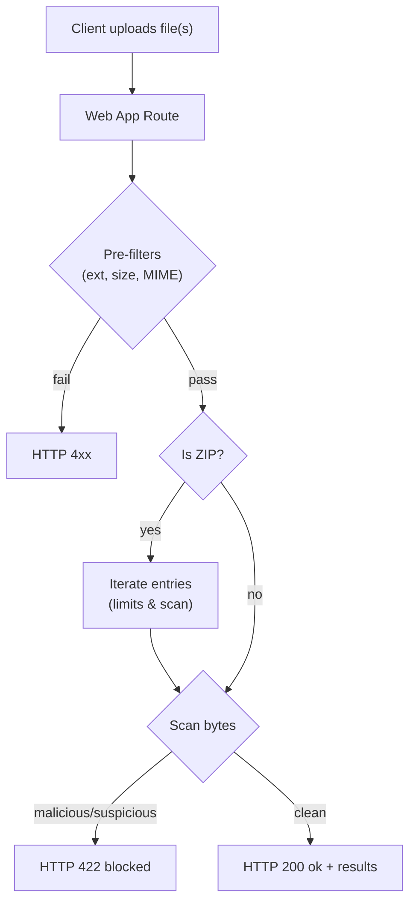
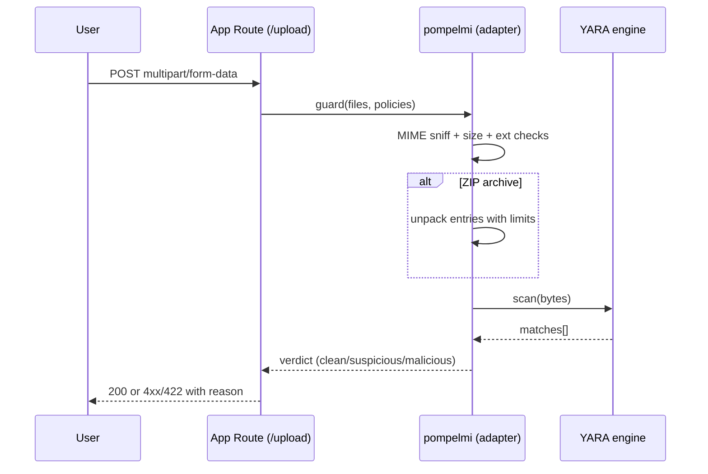
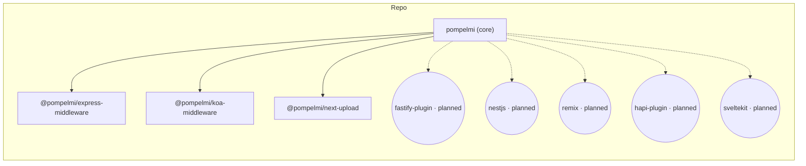

<div align="center">

<!-- Language Selector -->
<p>
  <strong>Read this in other languages:</strong><br/>
  <a href="docs/i18n/README.it.md">🇮🇹 Italiano</a> •
  <a href="docs/i18n/README.fr.md">🇫🇷 Français</a> •
  <a href="docs/i18n/README.es.md">🇪🇸 Español</a> •
  <a href="docs/i18n/README.de.md">🇩🇪 Deutsch</a> •
  <a href="docs/i18n/README.ja.md">🇯🇵 日本語</a> •
  <a href="docs/i18n/README.zh-CN.md">🇨🇳 简体中文</a> •
  <a href="docs/i18n/README.ko.md">🇰🇷 한국어</a> •
  <a href="docs/i18n/README.pt-BR.md">🇧🇷 Português</a> •
  <a href="docs/i18n/README.ru.md">🇷🇺 Русский</a> •
  <a href="docs/i18n/README.tr.md">🇹🇷 Türkçe</a>
</p>

> 💡 **Translation Note:** Help improve translations by opening a PR. The English README is the source of truth.

</div>

---

<!-- HERO START -->

<p align="center">

<br/>
<a href="https://www.producthunt.com/products/pompelmi?embed=true&utm_source=badge-pompelmi&utm_medium=badge" target="_blank"></a>
<br/>
  <a href="https://github.com/pompelmi/pompelmi" target="_blank" rel="noopener noreferrer">
    
  </a>
  <br/>
  <a href="https://www.detectionengineering.net/p/det-eng-weekly-issue-124-the-defcon"></a>
  <a href="https://nodeweekly.com/issues/594"></a>
  <a href="https://bytes.dev/archives/429"></a>
  <a href="https://dev.to/sonotommy/secure-nodejs-file-uploads-in-minutes-with-pompelmi-3jfe"></a>
  <br/>
  <a href="https://github.com/sorrycc/awesome-javascript"></a>
  <a href="https://github.com/dzharii/awesome-typescript"></a>
  <br/>
  
</p>

<h1 align="center">pompelmi</h1>

<p align="center">
  <strong>Fast, Private, and Powerful File Malware Scanning for Node.js</strong>
</p>

<p align="center">
  ⚡ Zero-config setup • 🔒 Privacy-first • 🧩 Composable scanners • 📦 Deep ZIP inspection • 🎯 Framework adapters
</p>

<p align="center">
  <strong>YARA</strong> integration • <strong>ZIP bomb</strong> protection • Drop-in middleware for <strong>Express</strong>, <strong>Koa</strong>, <strong>Fastify</strong>, and <strong>Next.js</strong>
</p>

<p align="center">
  <em>Scan files before they hit disk. Keep user data private. Ship with confidence.</em>
</p>

**Keywords:** file upload security · malware detection · YARA · Node.js middleware · Express · Koa · Next.js · ZIP bomb protection

---

<div align="center">

## ⚡ **Quick Start (Cloud)**

**Running on Serverless or can't install ClamAV?**  
Use the **[Official Hosted API on RapidAPI](https://rapidapi.com/SonoTommy/api/pompelmi-malware-scanner)** →

✅ **Zero Setup** • No binaries to install  
✅ **Serverless-Ready** • Works on AWS Lambda, Vercel, Netlify  
✅ **Auto-Scaled** • No RAM/CPU overhead  
✅ **Built-in Protection** • Automatic ZIP-bomb detection

[**→ Get Started on RapidAPI**](https://rapidapi.com/SonoTommy/api/pompelmi-malware-scanner)

</div>

---

<p align="center">
  <a href="https://www.npmjs.com/package/pompelmi"></a>
  <a href="https://rapidapi.com/SonoTommy/api/pompelmi-malware-scanner"></a>
  <a href="https://www.npmjs.com/package/pompelmi"></a>
  <a href="https://www.npmjs.com/package/pompelmi"></a>
  <a href="https://www.npmjs.com/package/pompelmi"></a>
  
  <a href="https://snyk.io/test/github/pompelmi/pompelmi"></a>
</p>

<p align="center">
  
  
  
  <a href="https://github.com/pompelmi/pompelmi/blob/main/LICENSE"></a>
</p>

<p align="center">
  <a href="https://github.com/pompelmi/pompelmi/actions/workflows/ci-release-publish.yml"></a>
  <a href="https://codecov.io/gh/pompelmi/pompelmi"></a>
  <a href="https://securityscorecards.dev/viewer/?uri=github.com/pompelmi/pompelmi"></a>
  <a href="https://bestpractices.coreinfrastructure.org/projects/9999"></a>
</p>

<p align="center">
  <a href="https://github.com/pompelmi/pompelmi/stargazers"></a>
  <a href="https://github.com/pompelmi/pompelmi/network/members"></a>
  <a href="https://github.com/pompelmi/pompelmi/watchers"></a>
  <a href="https://github.com/pompelmi/pompelmi/issues"></a>
  
  <a href="https://github.com/pompelmi/pompelmi/commits/main"></a>
  <a href="https://github.com/pompelmi/pompelmi/graphs/contributors"></a>
</p>

<p align="center">
  <strong>
    <a href="https://pompelmi.github.io/pompelmi/">📚 Documentation</a> •
    <a href="#installation">💾 Install</a> •
    <a href="#quick-start">⚡ Quick Start</a> •
    <a href="#adapters">🧩 Adapters</a> •
    <a href="#yara-getting-started">🧬 YARA</a> •
    <a href="#github-action">🤖 CI/CD</a> •
    <a href="#faq">❓ FAQ</a>
  </strong>
</p>

<p align="center"><em>Coverage badge reflects core library (<code>src/**</code>); adapters are measured separately.</em></p>

<!-- HERO END -->

---

<div align="center">

### 🎯 Why Choose pompelmi?

</div>

| 🔒 Privacy First | ⚡ Lightning Fast | 🎨 Developer Friendly |
| --- | --- | --- |
| All scanning happens in-process. No cloud calls, no data leaks. Your files never leave your infrastructure. | In-process scanning with zero network latency. Configurable concurrency for high-throughput scenarios. | TypeScript-first, zero-config defaults, drop-in middleware. Get started in under 5 minutes. |

---

## Table of Contents

- [Overview](#overview)
- [Highlights](#highlights)
- [Why pompelmi](#why-pompelmi)
- [How it compares](#how-it-compares)
- [What Developers Say](#what-developers-say)
- [What Makes pompelmi Special](#what-makes-pompelmi-special)
- [Use Cases](#use-cases)
- [Installation](#installation)
- [Quick Start](#quick-start)
  - [Minimal Node usage](#minimal-node-usage)
  - [Express](#express)
  - [Koa](#koa)
  - [Next.js (App Router)](#nextjs-app-router)
- [Adapters](#adapters)
- [GitHub Action](#github-action)
- [Configuration](#configuration)
- [YARA Getting Started](#yara-getting-started)
- [Security Notes](#security-notes)

- [Testing & Development](#testing--development)
- [FAQ](#faq)
- [Contributing](#contributing)
- [License](#license)

---

## 🌍 Translations

pompelmi documentation is available in multiple languages to help developers worldwide:

- 🇮🇹 **[Italiano (Italian)](docs/i18n/README.it.md)** — Documentazione completa in italiano
- 🇫🇷 **[Français (French)](docs/i18n/README.fr.md)** — Documentation complète en français
- 🇪🇸 **[Español (Spanish)](docs/i18n/README.es.md)** — Documentación completa en español
- 🇩🇪 **[Deutsch (German)](docs/i18n/README.de.md)** — Vollständige Dokumentation auf Deutsch
- 🇯🇵 **[日本語 (Japanese)](docs/i18n/README.ja.md)** — 日本語による完全なドキュメント
- 🇨🇳 **[简体中文 (Simplified Chinese)](docs/i18n/README.zh-CN.md)** — 完整的简体中文文档
- 🇰🇷 **[한국어 (Korean)](docs/i18n/README.ko.md)** — 완전한 한국어 문서
- 🇧🇷 **[Português (Brasil)](docs/i18n/README.pt-BR.md)** — Documentação completa em português
- 🇷🇺 **[Русский (Russian)](docs/i18n/README.ru.md)** — Полная документация на русском
- 🇹🇷 **[Türkçe (Turkish)](docs/i18n/README.tr.md)** — Türkçe tam dokümantasyon

**Help improve translations:** We welcome contributions to improve and maintain translations. The English README is the authoritative source. To contribute, please open a Pull Request with your improvements.

---

## 🚀 Overview

**pompelmi** scans untrusted file uploads **before** they hit disk. A tiny, TypeScript-first toolkit for Node.js with composable scanners, deep ZIP inspection, and optional signature engines.

### 🎯 Key Features

**🔒 Private by design** — no outbound calls; bytes never leave your process

**🧩 Composable scanners** — mix heuristics + signatures; set `stopOn` and timeouts

**📦 ZIP hardening** — traversal/bomb guards, polyglot & macro hints

**🔌 Drop-in adapters** — Express, Koa, Fastify, Next.js

**📘 Typed & tiny** — modern TS, minimal surface, tree-shakeable

**⚡ Zero dependencies** — core library has minimal deps, fast installation

## ✨ Highlights

**🛡️ Block risky uploads early** — classify uploads as _clean_, _suspicious_, or _malicious_ and stop them at the edge.

**✅ Real guards** — extension allow‑list, server‑side MIME sniff (magic bytes), per‑file size caps, and **deep ZIP** traversal with anti‑bomb limits.

**🔍 Built‑in scanners** — drop‑in **CommonHeuristicsScanner** (PDF risky actions, Office macros, PE header) and **Zip‑bomb Guard**; add your own or YARA via a tiny `{ scan(bytes) }` contract.

**⚙️ Compose scanning** — run multiple scanners in parallel or sequentially with timeouts and short‑circuiting via `composeScanners()`.

**☁️ Zero cloud** — scans run in‑process. Keep bytes private. Perfect for GDPR/HIPAA compliance.

**👨‍💻 DX first** — TypeScript types, ESM/CJS builds, tiny API, adapters for popular web frameworks.

> **SEO Keywords:** file upload security, malware detection, virus scanner, Node.js security, Express middleware, YARA integration, ZIP bomb protection, file validation, upload sanitization, threat detection, security scanner, antivirus Node.js, file scanning library, TypeScript security, Next.js security, Koa middleware, server-side validation, file integrity check, malware prevention, secure file upload

## 🧠 Why pompelmi?

- **On‑device, private scanning** – no outbound calls, no data sharing.
- **Blocks early** – runs _before_ you write to disk or persist anything.
- **Fits your stack** – drop‑in adapters for Express, Koa, Next.js (Fastify plugin in alpha).
- **Defense‑in‑depth** – ZIP traversal limits, ratio caps, server‑side MIME sniffing, size caps.
- **Pluggable detection** – bring your own engine (e.g., YARA) via a tiny `{ scan(bytes) }` contract.

### Who is it for?

- Teams who can’t send uploads to third‑party AV APIs.
- Apps that need predictable, low‑latency decisions inline.
- Developers who want simple, typed building blocks instead of a daemon.

## 🔍 How it compares

| Capability | pompelmi | ClamAV / node‑clam | Cloud AV APIs |
| --- | --- | --- | --- |
| Runs fully in‑process | ✅ | ❌ (separate daemon) | ❌ (network calls) |
| Bytes stay private | ✅ | ✅ | ❌ |
| Deep ZIP limits & MIME sniff | ✅ | ✅ (archive scan) | ❓ varies |
| YARA integration | ✅ optional | ❌* | ❓ varies |
| Framework adapters | ✅ Express/Koa/Next.js | ❌ | ❌ |
| Works in CI on artifacts | ✅ | ✅ | ❓ varies |
| Licensing | MIT | GPL (engine) | Proprietary |

\* You can run YARA alongside ClamAV, but it’s not built‑in.

---
## ☁️ Library vs Cloud API

Choosing between the local library and the hosted Cloud API? Here's a detailed comparison:

| Feature | **Local Library** | **☁️ Cloud API** |
| --- | --- | --- |
| **Setup Time** | Complex (install ClamAV/YARA binaries) | **Instant** (just API key) |
| **Deployment** | Requires native dependencies | **Zero dependencies** |
| **RAM Usage** | High (ClamAV daemon ~500MB+) | **Zero** (runs on our infra) |
| **CPU Usage** | High during scans | **Zero** (offloaded) |
| **Serverless Support** | Hard (binary compilation issues) | **Native** (HTTP-only) |
| **AWS Lambda** | Difficult (custom layers needed) | **Perfect fit** |
| **Vercel / Netlify** | Not supported (no binaries) | **Fully supported** |
| **Heroku** | Requires buildpacks | **Plug-and-play** |
| **ZIP-Bomb Protection** | Manual configuration | **Auto-enabled** |
| **Traversal Guards** | Manual setup | **Built-in** |
| **Signature Updates** | Manual (ClamAV freshclam) | **Auto-updated** |
| **YARA Rules** | Custom integration needed | **Managed for you** |
| **Heuristics** | Configure yourself | **Pre-configured** |
| **Data Privacy** | 100% on-premise | Scans via API |
| **GDPR/HIPAA** | ✅ Full control | Depends on use-case |
| **Latency** | ~0ms (in-process) | ~100-500ms (network) |
| **Throughput** | Limited by your server | **Auto-scaled** |
| **Maintenance** | You manage updates | **We handle it** |
| **Cost** | Infrastructure + DevOps time | **Pay-per-scan** |
| **Ideal For** | On-premise, privacy-critical apps | Serverless, quick prototypes, SaaS |

### 🎯 Decision Guide

**Choose the Local Library if:**
- You need 100% data privacy (healthcare, finance, government)
- You run on VMs or dedicated servers with full control
- You want to customize YARA rules or add custom scanners
- You have DevOps resources to maintain ClamAV/YARA

**Choose the Cloud API if:**
- You're deploying on **AWS Lambda, Vercel, or Netlify**
- You want to **ship fast** without DevOps overhead
- You need **auto-scaling** for traffic spikes
- You want **zero maintenance** and always-updated signatures

[**→ Try Cloud API on RapidAPI**](https://rapidapi.com/SonoTommy/api/pompelmi-malware-scanner)

---
## 💬 What Developers Say

> "pompelmi made it incredibly easy to add malware scanning to our Express API. The TypeScript support is fantastic!"
> — Developer using pompelmi in production

> "Finally, a file scanning solution that doesn't require sending our users' data to third parties. Perfect for GDPR compliance."
> — Security Engineer at a healthcare startup

> "The YARA integration is seamless. We went from prototype to production in less than a week."
> — DevSecOps Engineer

_Want to share your experience? [Open a discussion](https://github.com/pompelmi/pompelmi/discussions)!_

---

## 🌟 What Makes pompelmi Special?

### 🎯 Developer Experience

Built with developers in mind from day one. Simple API, comprehensive TypeScript types, and excellent documentation mean you can integrate secure file scanning in minutes, not days. Hot module replacement support and detailed error messages make debugging a breeze.

### 🚀 Performance First

Optimized for high-throughput scenarios with configurable concurrency, streaming support, and minimal memory overhead. Process thousands of files without breaking a sweat. Scans run in-process with no IPC overhead.

### 🔐 Security Without Compromise

Multi-layered defense including MIME type verification (magic bytes), extension validation, size limits, ZIP bomb protection, and optional YARA integration. Each layer is configurable to match your threat model.

### 🌍 Privacy Guaranteed

Your data never leaves your infrastructure. No telemetry, no cloud dependencies, no third-party API calls. Perfect for regulated industries (healthcare, finance, government) and privacy-conscious applications.

---

## 💡 Use Cases

pompelmi is trusted across diverse industries and use cases:

### 🏥 Healthcare (HIPAA Compliance)

Scan patient document uploads without sending PHI to third-party services. Keep medical records and imaging files secure on your infrastructure.

### 🏦 Financial Services (PCI DSS)

Validate customer document uploads (ID verification, tax forms) without exposing sensitive financial data to external APIs.

### 🎓 Education Platforms

Protect learning management systems from malicious file uploads while maintaining student privacy.

### 🏢 Enterprise Document Management

Scan files at ingestion time for corporate file sharing platforms, wikis, and collaboration tools.

### 🎨 Media & Creative Platforms

Validate user-generated content uploads (images, videos, documents) before processing and storage.

---

## 🔧 Installation

### 🚀 Option A: Cloud API (Recommended for Serverless)

**Perfect for:** AWS Lambda, Vercel, Netlify, Heroku, or any environment where installing native binaries (like ClamAV) is difficult or impossible.

**Benefits:**
- ✅ **Instant setup** – No binaries, no configuration
- ✅ **Zero RAM/CPU usage** – Offload scanning to our infrastructure
- ✅ **Auto-scaled** – Handle traffic spikes without provisioning
- ✅ **Built-in protections** – ZIP-bomb, traversal, and heuristics included

#### Step 1: Get Your API Key

Sign up at **[RapidAPI](https://rapidapi.com/SonoTommy/api/pompelmi-malware-scanner)** and subscribe to get your API key.

#### Step 2: Scan Files via HTTP

```javascript
// Using fetch (Node 18+)
const scanFile = async (fileBuffer, filename) => {
  const formData = new FormData();
  formData.append('file', new Blob([fileBuffer]), filename);

  const response = await fetch('https://pompelmi-malware-scanner.p.rapidapi.com/scan', {
    method: 'POST',
    headers: {
      'X-RapidAPI-Key': process.env.RAPIDAPI_KEY,
      'X-RapidAPI-Host': 'pompelmi-malware-scanner.p.rapidapi.com'
    },
    body: formData
  });

  const result = await response.json();
  return result; // { verdict: 'clean' | 'suspicious' | 'malicious', ... }
};
```

```javascript
// Using axios
const axios = require('axios');
const FormData = require('form-data');

const scanFile = async (fileBuffer, filename) => {
  const form = new FormData();
  form.append('file', fileBuffer, filename);

  const { data } = await axios.post(
    'https://pompelmi-malware-scanner.p.rapidapi.com/scan',
    form,
    {
      headers: {
        ...form.getHeaders(),
        'X-RapidAPI-Key': process.env.RAPIDAPI_KEY,
        'X-RapidAPI-Host': 'pompelmi-malware-scanner.p.rapidapi.com'
      }
    }
  );

  return data; // { verdict: 'clean' | 'suspicious' | 'malicious', ... }
};
```

[**→ View Full API Documentation**](https://rapidapi.com/SonoTommy/api/pompelmi-malware-scanner)

---

### 🏠 Option B: Local Library (Requires Native Dependencies)

**Perfect for:** On-premise deployments, VMs, dedicated servers, or when you need complete control and privacy.

**Requirements:**
- Node.js 18+
- Optional: ClamAV binaries (for signature-based scanning)
- Optional: YARA libraries (for custom rules)

<table>
<tr>
<td><b>npm</b></td>
<td><code>npm install pompelmi</code></td>
</tr>
<tr>
<td><b>pnpm</b></td>
<td><code>pnpm add pompelmi</code></td>
</tr>
<tr>
<td><b>yarn</b></td>
<td><code>yarn add pompelmi</code></td>
</tr>
<tr>
<td><b>bun</b></td>
<td><code>bun add pompelmi</code></td>
</tr>
</table>

#### 📦 Optional Framework Adapters

```bash
# Express
npm i @pompelmi/express-middleware

# Koa
npm i @pompelmi/koa-middleware

# Next.js
npm i @pompelmi/next-upload

# Fastify (alpha)
npm i @pompelmi/fastify-plugin
```

> **Note:** Core library works standalone. Install adapters only if using specific frameworks.

> Optional dev deps used in the examples:
>
> ```bash
> npm i -D tsx express multer @koa/router @koa/multer koa next
> ```

---

## ⚡ Quick‑start

**At a glance (policy + scanners)**

```ts
// Compose built‑in scanners (no EICAR). Optionally add your own/YARA.
import { CommonHeuristicsScanner, createZipBombGuard, composeScanners } from 'pompelmi';

export const policy = {
  includeExtensions: ['zip','png','jpg','jpeg','pdf'],
  allowedMimeTypes: ['application/zip','image/png','image/jpeg','application/pdf','text/plain'],
  maxFileSizeBytes: 20 * 1024 * 1024,
  timeoutMs: 5000,
  concurrency: 4,
  failClosed: true,
  onScanEvent: (ev: unknown) => console.log('[scan]', ev)
};

export const scanner = composeScanners(
  [
    ['zipGuard', createZipBombGuard({ maxEntries: 512, maxTotalUncompressedBytes: 100 * 1024 * 1024, maxCompressionRatio: 12 })],
    ['heuristics', CommonHeuristicsScanner],
    // ['yara', YourYaraScanner],
  ],
  { parallel: false, stopOn: 'suspicious', timeoutMsPerScanner: 1500, tagSourceName: true }
);
```

### Minimal Node usage

```ts
import { scanFile } from 'pompelmi';

const res = await scanFile('path/to/file.zip'); // or any file
console.log(res.verdict); // "clean" | "suspicious" | "malicious"
```

> See `examples/scan-one-file.ts` for a runnable script:
>
> ```bash
> pnpm tsx examples/scan-one-file.ts ./path/to/file
> ```

### Express

```ts
import express from 'express';
import multer from 'multer';
import { createUploadGuard } from '@pompelmi/express-middleware';
import { policy, scanner } from './security'; // the snippet above

const app = express();
const upload = multer({ storage: multer.memoryStorage(), limits: { fileSize: policy.maxFileSizeBytes } });

app.post('/upload', upload.any(), createUploadGuard({ ...policy, scanner }), (req, res) => {
  res.json({ ok: true, scan: (req as any).pompelmi ?? null });
});

app.listen(3000, () => console.log('http://localhost:3000'));
```

### Koa

```ts
import Koa from 'koa';
import Router from '@koa/router';
import multer from '@koa/multer';
import { createKoaUploadGuard } from '@pompelmi/koa-middleware';
import { policy, scanner } from './security';

const app = new Koa();
const router = new Router();
const upload = multer({ storage: multer.memoryStorage(), limits: { fileSize: policy.maxFileSizeBytes } });

router.post('/upload', upload.any(), createKoaUploadGuard({ ...policy, scanner }), (ctx) => {
  ctx.body = { ok: true, scan: (ctx as any).pompelmi ?? null };
});

app.use(router.routes()).use(router.allowedMethods());
app.listen(3003, () => console.log('http://localhost:3003'));
```

### Next.js (App Router)

```ts
// app/api/upload/route.ts
import { createNextUploadHandler } from '@pompelmi/next-upload';
import { policy, scanner } from '@/lib/security';

export const runtime = 'nodejs';
export const dynamic = 'force-dynamic';

export const POST = createNextUploadHandler({ ...policy, scanner });
```

---

## 🤖 GitHub Action

Run **pompelmi** in CI to scan repository files or built artifacts.

**Minimal usage**
```yaml
name: Security scan (pompelmi)
on: [push, pull_request]

jobs:
  scan:
    runs-on: ubuntu-latest
    steps:
      - uses: actions/checkout@v4

      - name: Scan repository with pompelmi
        uses: pompelmi/pompelmi/.github/actions/pompelmi-scan@v1
        with:
          path: .
          deep_zip: true
          fail_on_detect: true
```

**Scan a single artifact**
```yaml
- uses: pompelmi/pompelmi/.github/actions/pompelmi-scan@v1
  with:
    artifact: build.zip
    deep_zip: true
    fail_on_detect: true
```

**Inputs**
| Input | Default | Description |
| --- | --- | --- |
| `path` | `.` | Directory to scan. |
| `artifact` | `""` | Single file/archive to scan. |
| `yara_rules` | `""` | Glob path to YARA rules (e.g. `rules/*.yar`). |
| `deep_zip` | `true` | Enable deep nested-archive inspection. |
| `max_depth` | `3` | Max nested-archive depth. |
| `fail_on_detect` | `true` | Fail the job if detections occur. |

> The Action lives in this repo at `.github/actions/pompelmi-scan`. When published to the Marketplace, consumers can copy the snippets above as-is.

---

## 🧩 Adapters

Use the adapter that matches your web framework. All adapters share the same policy options and scanning contract.

<p align="center">
  
  
  
  
  
  
  
  
</p>

| Framework | Package | Status |
| --- | --- | --- |
| Express | `@pompelmi/express-middleware` | ✅ alpha |
| Koa | `@pompelmi/koa-middleware` | ✅ alpha |
| Next.js (App Router) | `@pompelmi/next-upload` | ✅ alpha |
| Fastify | `@pompelmi/fastify-plugin` | 🚧 alpha |
| NestJS | nestjs | 📋 planned |
| Remix | remix | 📋 planned |
| hapi | hapi plugin | 📋 planned |
| SvelteKit | sveltekit | 📋 planned |

---

## 🗺️ Diagrams

### Upload scanning flow

<details>
<summary>Mermaid source</summary>


</details>

### Sequence (App ↔ pompelmi ↔ YARA)

<details>
<summary>Mermaid source</summary>


</details>

### Components (monorepo)

<details>
<summary>Mermaid source</summary>


</details>

---

## ⚙️ Configuration

All adapters accept a common set of options:

| Option | Type (TS) | Purpose |
| --- | --- | --- |
| `scanner` | `{ scan(bytes: Uint8Array): Promise<Match[]> }` | Your scanning engine. Return `[]` when clean; non‑empty to flag. |
| `includeExtensions` | `string[]` | Allow‑list of file extensions. Evaluated case‑insensitively. |
| `allowedMimeTypes` | `string[]` | Allow‑list of MIME types after magic‑byte sniffing. |
| `maxFileSizeBytes` | `number` | Per‑file size cap. Oversize files are rejected early. |
| `timeoutMs` | `number` | Per‑file scan timeout; guards against stuck scanners. |
| `concurrency` | `number` | How many files to scan in parallel. |
| `failClosed` | `boolean` | If `true`, errors/timeouts block the upload. |
| `onScanEvent` | `(event: unknown) => void` | Optional telemetry hook for logging/metrics. |

**Common recipes**

Allow only images up to 5 MB:

```ts
includeExtensions: ['png','jpg','jpeg','webp'],
allowedMimeTypes: ['image/png','image/jpeg','image/webp'],
maxFileSizeBytes: 5 * 1024 * 1024,
failClosed: true,
```

---

## ✅ Production checklist

- [ ] **Limit file size** aggressively (`maxFileSizeBytes`).
- [ ] **Restrict extensions & MIME** to what your app truly needs.
- [ ] **Set `failClosed: true` in production** to block on timeouts/errors.
- [ ] **Handle ZIPs carefully** (enable deep ZIP, keep nesting low, cap entry sizes).
- [ ] **Compose scanners** with `composeScanners()` and enable `stopOn` to fail fast on early detections.
- [ ] **Log scan events** (`onScanEvent`) and monitor for spikes.
- [ ] **Run scans in a separate process/container** for defense‑in‑depth when possible.
- [ ] **Sanitize file names and paths** if you persist uploads.
- [ ] **Prefer memory storage + post‑processing**; avoid writing untrusted bytes before policy passes.
- [ ] **Add CI scanning** with the GitHub Action to catch bad files in repos/artifacts.

---

## 🧬 YARA Getting Started

YARA lets you detect suspicious or malicious content using pattern‑matching rules.  
**pompelmi** treats YARA matches as signals that you can map to your own verdicts  
(e.g., mark high‑confidence rules as `malicious`, heuristics as `suspicious`).

> **Status:** Optional. You can run without YARA. If you adopt it, keep your rules small, time‑bound, and tuned to your threat model.

### Starter rules

Below are three example rules you can adapt:

`rules/starter/eicar.yar`
```yar
rule EICAR_Test_File
{
    meta:
        description = "EICAR antivirus test string (safe)"
        reference   = "https://www.eicar.org"
        confidence  = "high"
        verdict     = "malicious"
    strings:
        $eicar = "X5O!P%@AP[4\\PZX54(P^)7CC)7}$EICAR-STANDARD-ANTIVIRUS-TEST-FILE!$H+H*"
    condition:
        $eicar
}
```

`rules/starter/pdf_js.yar`
```yar
rule PDF_JavaScript_Embedded
{
    meta:
        description = "PDF contains embedded JavaScript (heuristic)"
        confidence  = "medium"
        verdict     = "suspicious"
    strings:
        $magic = { 25 50 44 46 } // "%PDF"
        $js1 = "/JavaScript" ascii
        $js2 = "/JS" ascii
        $open = "/OpenAction" ascii
        $aa = "/AA" ascii
    condition:
        uint32(0) == 0x25504446 and ( $js1 or $js2 ) and ( $open or $aa )
}
```

`rules/starter/office_macros.yar`
```yar
rule Office_Macro_Suspicious_Words
{
    meta:
        description = "Heuristic: suspicious VBA macro keywords"
        confidence  = "medium"
        verdict     = "suspicious"
    strings:
        $s1 = /Auto(Open|Close)/ nocase
        $s2 = "Document_Open" nocase ascii
        $s3 = "CreateObject(" nocase ascii
        $s4 = "WScript.Shell" nocase ascii
        $s5 = "Shell(" nocase ascii
        $s6 = "Sub Workbook_Open()" nocase ascii
    condition:
        2 of ($s*)
}
```

> These are **examples**. Expect some false positives; tune to your app.

### Minimal integration (adapter contract)

If you use a YARA binding (e.g., `@automattic/yara`), wrap it behind the `scanner` contract:

```ts
// Example YARA scanner adapter (pseudo‑code)
import * as Y from '@automattic/yara';

// Compile your rules from disk at boot (recommended)
// const sources = await fs.readFile('rules/starter/*.yar', 'utf8');
// const compiled = await Y.compile(sources);

export const YourYaraScanner = {
  async scan(bytes: Uint8Array) {
    // const matches = await compiled.scan(bytes, { timeout: 1500 });
    const matches = []; // plug your engine here
    // Map to the structure your app expects; return [] when clean.
    return matches.map((m: any) => ({
      rule: m.rule,
      meta: m.meta ?? {},
      tags: m.tags ?? [],
    }));
  }
};
```

Then include it in your composed scanner:

```ts
import { composeScanners, CommonHeuristicsScanner } from 'pompelmi';
// import { YourYaraScanner } from './yara-scanner';

export const scanner = composeScanners(
  [
    ['heuristics', CommonHeuristicsScanner],
    // ['yara', YourYaraScanner],
  ],
  { parallel: false, stopOn: 'suspicious', timeoutMsPerScanner: 1500, tagSourceName: true }
);
```

### Policy suggestion (mapping matches → verdict)

- **malicious**: high‑confidence rules (e.g., `EICAR_Test_File`)
- **suspicious**: heuristic rules (e.g., PDF JavaScript, macro keywords)
- **clean**: no matches

Combine YARA with MIME sniffing, ZIP safety limits, and strict size/time caps.

## 🧪 Quick test (no EICAR)

Use the examples above, then send a **minimal PDF** that contains risky tokens (this triggers the built‑in heuristics).

**1) Create a tiny PDF with risky actions**

Linux:
```bash
printf '%%PDF-1.7\n1 0 obj\n<< /OpenAction 1 0 R /AA << /JavaScript (alert(1)) >> >>\nendobj\n%%EOF\n' > risky.pdf
```

macOS:
```bash
printf '%%PDF-1.7\n1 0 obj\n<< /OpenAction 1 0 R /AA << /JavaScript (alert(1)) >> >>\nendobj\n%%EOF\n' > risky.pdf
```

**2) Send it to your endpoint**

Express (default from the Quick‑start):
```bash
curl -F "file=@risky.pdf;type=application/pdf" http://localhost:3000/upload -i
```

You should see an HTTP **422 Unprocessable Entity** (blocked by policy). Clean files return **200 OK**. Pre‑filter failures (size/ext/MIME) should return a **4xx**. Adapt these conventions to your app as needed.

---

## 🔒 Security notes

- The library **reads** bytes; it never executes files.
- YARA detections depend on the **rules you provide**; expect some false positives/negatives.
- ZIP scanning applies limits (entries, per‑entry size, total uncompressed, nesting) to reduce archive‑bomb risk.
- Prefer running scans in a **dedicated process/container** for defense‑in‑depth.

---

##  Releases & security

- **Changelog / releases:** see [GitHub Releases](https://github.com/pompelmi/pompelmi/releases).
- **Security disclosures:** please use [GitHub Security Advisories](https://github.com/pompelmi/pompelmi/security/advisories). We’ll coordinate a fix before public disclosure.
- **Production users:** open a [Discussion](https://github.com/pompelmi/pompelmi/discussions) to share requirements or request adapters.

## ⭐ Star history

[](https://star-history.com/#pompelmi/pompelmi&Date)

---

## 🏆 Community & Recognition

pompelmi has been featured in leading developer publications and is trusted by teams worldwide for secure file upload handling.

<p align="center">
  
  
  
</p>

### 🤝 Join the Community

- 💬 [GitHub Discussions](https://github.com/pompelmi/pompelmi/discussions) — Ask questions, share ideas
- 🐛 [Issue Tracker](https://github.com/pompelmi/pompelmi/issues) — Report bugs, request features
- 📖 [Documentation](https://pompelmi.github.io/pompelmi/) — Comprehensive guides and API reference
- 🔒 [Security](https://github.com/pompelmi/pompelmi/security) — Report security vulnerabilities privately

---

## 💬 FAQ

**Do I need YARA?**  
No. `scanner` is pluggable. The examples use a minimal scanner for clarity; you can call out to a YARA engine or any other detector you prefer.

**Where do the results live?**  
In the examples, the guard attaches scan data to the request context (e.g. `req.pompelmi` in Express, `ctx.pompelmi` in Koa). In Next.js, include the results in your JSON response as you see fit.

**Why 422 for blocked files?**  
Using **422** to signal a policy violation keeps it distinct from transport errors; it’s a common pattern. Use the codes that best match your API guidelines.

**Are ZIP bombs handled?**  
Archives are traversed with limits to reduce archive‑bomb risk. Keep your size limits conservative and prefer `failClosed: true` in production.

---

## 🧪 Tests & Coverage

Run tests locally with coverage:

```bash
pnpm vitest run --coverage --passWithNoTests
```

The badge tracks the **core library** (`src/**`). Adapters and engines are reported separately for now and will be folded into global coverage as their suites grow.

If you integrate Codecov in CI, upload `coverage/lcov.info` and you can use this Codecov badge:

```md
[](https://codecov.io/gh/pompelmi/pompelmi)
```

## 🤝 Contributing

PRs and issues welcome! Start with:

```bash
pnpm -r build
pnpm -r lint
```

See [CONTRIBUTING.md](./CONTRIBUTING.md) for detailed guidelines.

### 🎖️ Contributors

Thanks to all the amazing contributors who have helped make pompelmi better!

<!-- Add contributor images here in the future -->

---

## 🎓 Learning Resources

### 📚 Documentation

- [Official Docs](https://pompelmi.github.io/pompelmi/) — Complete API reference and guides
- [Examples](./examples/) — Real-world integration examples
- [Security Guide](./SECURITY.md) — Security best practices and disclosure policy

### 🎥 Tutorials & Articles

- **File Upload Security in Node.js** — Best practices guide (coming soon)
- **Integrating YARA with pompelmi** — Advanced detection setup (coming soon)
- **Zero-Trust File Uploads** — Architecture patterns (coming soon)

### 🛠️ Tools & Integrations

- [GitHub Action](https://github.com/pompelmi/pompelmi/tree/main/.github/actions/pompelmi-scan) — CI/CD scanning
- [Docker Images](https://hub.docker.com/r/pompelmi/pompelmi) — Containerized scanning (coming soon)
- [Cloud Functions](https://github.com/pompelmi/cloud-functions) — Serverless examples (coming soon)

---

## 📊 Project Stats

<p align="center">
  
</p>

---

## 🙏 Acknowledgments

pompelmi stands on the shoulders of giants. Special thanks to:

- The YARA project for powerful pattern matching
- The Node.js community for excellent tooling
- All our contributors and users

---

## 📞 Support

Need help? We're here for you!

- 📖 [Documentation](https://pompelmi.github.io/pompelmi/)
- 💬 [GitHub Discussions](https://github.com/pompelmi/pompelmi/discussions)
- 🐛 [Issue Tracker](https://github.com/pompelmi/pompelmi/issues)
- 🔒 [Security](https://github.com/pompelmi/pompelmi/security) (for vulnerabilities)

For commercial support and consulting, contact the maintainers.

---

<p align="right"><a href="#pompelmi">↑ Back to top</a></p>

## 📜 License

[MIT](./LICENSE) © 2025‑present pompelmi contributors
