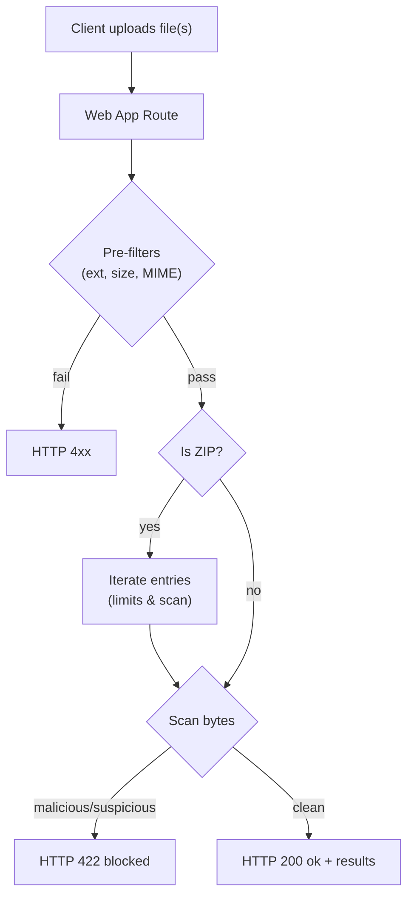
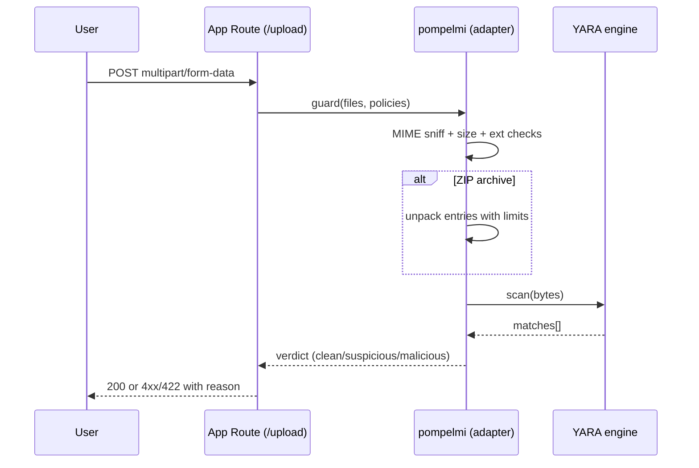
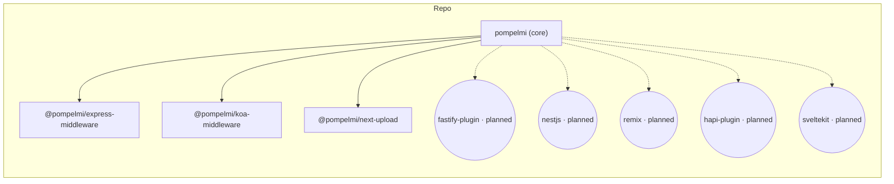

<p align="center">
  <a href="https://github.com/pompelmi/pompelmi" target="_blank" rel="noopener noreferrer">
    
  </a>
</p>

<h1 align="center">pompelmi</h1>

<p align="center">
  Lightweight file upload scanner with optional <strong>YARA</strong> rules.<br/>
  Works out‑of‑the‑box on <strong>Node.js</strong>; supports <strong>browser</strong> via a simple HTTP “remote engine”.
</p>

<!--
<p align="center">
  
  
  
  
  
  
  
  
  
</p>

<p align="center">
  
  
  
  
  
</p>


-->

<p align="center">
  <a href="https://www.npmjs.com/package/pompelmi">
    
  </a>
  <a href="https://www.npmjs.com/package/pompelmi">
    
  </a>
  <a href="https://github.com/pompelmi/pompelmi/blob/main/LICENSE">
    
  </a>
  
  
  
</p>

## Installation

```bash
# core library
npm i pompelmi

# typical dev deps used in examples (optional)
npm i -D tsx express multer cors
```

<p align="center">
  <a href="#why-pompelmi">Why</a> •
  <a href="#installation">Installation</a> •
  <a href="#technologies--tools">Technologies & Tools</a> •
  <a href="#features">Features</a> •
  <a href="#packages">Packages</a> •
  <a href="#quickstart">Quickstart</a> •
  <a href="#framework-adapters">Framework Adapters</a> •
  <a href="#architecture--uml">Architecture & UML</a> •
  <a href="#api-overview">API</a> •
  <a href="#security--disclaimer">Security</a> •
  <a href="#license">License</a>
</p>

---

## Technologies & Tools

| Technology | Badge | Link | Description |
| --- | --- | --- | --- |
| Node.js |  | [nodejs.org](https://nodejs.org/) | Runtime used by all adapters and the core engine. |
| TypeScript |  | [typescriptlang.org](https://www.typescriptlang.org/) | Typed development and bundled type definitions. |
| Express |  | [expressjs.com](https://expressjs.com/) | Middleware adapter `@pompelmi/express-middleware`. |
| Koa |  | [koajs.com](https://koajs.com/) | Middleware adapter `@pompelmi/koa-middleware`. |
| Next.js |  | [nextjs.org](https://nextjs.org/) | App Router upload handler `@pompelmi/next-upload`. |
| Fastify *(planned)* |  | [fastify.dev](https://fastify.dev/) | Planned plugin with identical policies and ZIP handling. |
| NestJS *(planned)* |  | [nestjs.com](https://nestjs.com/) | Planned interceptor/guard for file uploads. |
| Remix *(planned)* |  | [remix.run](https://remix.run/) | Planned helpers to scan `FormData` in actions/loaders. |
| SvelteKit *(planned)* |  | [kit.svelte.dev](https://kit.svelte.dev/) | Planned utilities for `+server.ts` and actions. |
| pnpm |  | [pnpm.io](https://pnpm.io/) | Monorepo/workspace package manager. |
| npm |  | [npmjs.com](https://www.npmjs.com/) | Registry and install scripts. |
| Vitest |  | [vitest.dev](https://vitest.dev/) | Test runner for future E2E and unit tests. |
| ESLint |  | [eslint.org](https://eslint.org/) | Linting. |
| Prettier |  | [prettier.io](https://prettier.io/) | Code formatting. |
| YARA |  | [virustotal.github.io/yara](https://virustotal.github.io/yara/) | Optional rule engine for advanced detections. |
| file-type |  | [sindresorhus/file-type](https://github.com/sindresorhus/file-type) | MIME sniffing (magic bytes) on buffers. |
| unzipper |  | [ZJONSSON/node-unzipper](https://github.com/ZJONSSON/node-unzipper) | ZIP processing with anti‑bomb limits and nested scan. |
| Multer |  | [expressjs/multer](https://github.com/expressjs/multer) | In‑memory file buffers for Express/Koa demos. |

---

## Why pompelmi?

- **Stop risky uploads**: quickly tells you if a file looks **clean**, **suspicious**, or **malicious**—and blocks it when needed.
- **Easy to adopt**: drop‑in middlewares/handlers for popular frameworks (Express, Koa, Next.js, more coming).
- **YARA when you need it**: plug your YARA rules for advanced detections, or start with a simple matcher.
- **Real file checks**: extension whitelist, **MIME sniffing with fallback**, file size caps, and ZIP inspection with anti‑bomb limits.
- **Local & private**: scans run in your app process. No cloud calls required.
- **Typed and tiny**: TypeScript types included, ESM & CJS builds.

---

## Features

- **Node-first scanning** with optional **YARA** engine (native binaries are auto‑pulled by platform packages; no brew/apt for consumers).
- **ZIP aware**: inspects archive contents with limits on entries, per‑entry size, total uncompressed size, and nesting depth.
- **Policy filters**:
  - allowed extensions
  - allowed MIME types (with extension fallback)
  - max file size per upload
- **Clear responses**:
  - success (200) with scan results
  - 4xx for policy violations (415/413)
  - 422 when verdict is suspicious/malicious
  - 503 on fail‑closed errors
- **Observability**: structured `onScanEvent` callbacks (start/end/blocked/errors/archive_*).
- **Browser support** via a **Remote Engine** (HTTP endpoint) that compiles rules and runs scans for you.

---

## Packages

This is a monorepo. The following packages are included:

| Package | NPM | Description |
| --- | --- | --- |
| **`pompelmi`** | <a href="https://www.npmjs.com/package/pompelmi"></a> | Core scanning library (Node + Remote Engine for browsers). |
| **`@pompelmi/express-middleware`** | *(alpha)* | Express middleware that scans uploads and enforces policies. |
| **`@pompelmi/koa-middleware`** | *(alpha)* | Koa middleware compatible with `@koa/multer`/`koa-body`. |
| **`@pompelmi/next-upload`** | *(alpha)* | Next.js (App Router) `POST` handler factory for `/api/upload`. |
| **(Planned)** `@pompelmi/fastify-plugin` | — | Fastify plugin with the same policies and ZIP support. |
| **(Planned)** `@pompelmi/nestjs` | — | NestJS Guard/Interceptor module for uploads. |
| **(Planned)** `@pompelmi/remix` | — | Remix helpers to scan `FormData` in actions/loaders. |
| **(Planned)** `@pompelmi/hapi-plugin` | — | Hapi plugin with `onPreHandler`. |
| **(Planned)** `@pompelmi/sveltekit` | — | SvelteKit utilities for `+server.ts` and actions. |

> Status: **alpha** — expect minor API refinements before a stable `0.2.0`.

---

## Quickstart

### Express (middleware)

```ts
import express from 'express';
import multer from 'multer';
import { createUploadGuard } from '@pompelmi/express-middleware';

const app = express();
const upload = multer({ storage: multer.memoryStorage(), limits: { fileSize: 20 * 1024 * 1024 } });

// Simple demo scanner (replace with YARA rules in production)
const SimpleEicarScanner = {
  async scan(bytes: Uint8Array) {
    const text = Buffer.from(bytes).toString('utf8');
    if (text.includes('EICAR-STANDARD-ANTIVIRUS-TEST-FILE')) return [{ rule: 'eicar_test' }];
    return [];
  }
};

app.post(
  '/upload',
  upload.any(),
  createUploadGuard({
    scanner: SimpleEicarScanner,
    includeExtensions: ['txt','png','jpg','jpeg','pdf','zip'],
    allowedMimeTypes: ['text/plain','image/png','image/jpeg','application/pdf','application/zip'],
    maxFileSizeBytes: 20 * 1024 * 1024,
    timeoutMs: 5000,
    concurrency: 4,
    failClosed: true,
    onScanEvent: (ev) => console.log('[scan]', ev)
  }),
  (req, res) => {
    res.json({ ok: true, scan: (req as any).pompelmi ?? null });
  }
);

app.listen(3000, () => console.log('demo on http://localhost:3000'));
```

### Koa (middleware)

```ts
import Koa from 'koa';
import Router from '@koa/router';
import multer from '@koa/multer';
import { createKoaUploadGuard } from '@pompelmi/koa-middleware';

const app = new Koa();
const router = new Router();
const upload = multer({ storage: multer.memoryStorage(), limits: { fileSize: 20 * 1024 * 1024 } });

const SimpleEicarScanner = { /* same as above */ };

router.post(
  '/upload',
  upload.any(),
  createKoaUploadGuard({
    scanner: SimpleEicarScanner,
    includeExtensions: ['txt','png','jpg','jpeg','pdf','zip'],
    allowedMimeTypes: ['text/plain','image/png','image/jpeg','application/pdf','application/zip'],
    maxFileSizeBytes: 20 * 1024 * 1024,
    timeoutMs: 5000,
    concurrency: 4,
    failClosed: true,
    onScanEvent: (ev) => console.log('[scan]', ev)
  }),
  (ctx) => { ctx.body = { ok: true, scan: (ctx as any).pompelmi ?? null }; }
);

app.use(router.routes()).use(router.allowedMethods());
app.listen(3003, () => console.log('demo on http://localhost:3003'));
```

### Next.js (App Router)

```ts
// app/api/upload/route.ts
import { createNextUploadHandler } from '@pompelmi/next-upload';

export const runtime = 'nodejs';          // Next: Node runtime (not Edge)
export const dynamic = 'force-dynamic';   // optional: avoid route cache

const SimpleEicarScanner = { /* same as above */ };

export const POST = createNextUploadHandler({
  scanner: SimpleEicarScanner,
  includeExtensions: ['txt','png','jpg','jpeg','pdf','zip'],
  allowedMimeTypes: ['text/plain','image/png','image/jpeg','application/pdf','application/zip'],
  maxFileSizeBytes: 20 * 1024 * 1024,
  timeoutMs: 5000,
  concurrency: 4,
  failClosed: true,
  onScanEvent: (ev) => console.log('[scan]', ev)
});
```

---

## Framework Adapters

The adapters share the same behavior and defaults:

- **Extension whitelist**
- **MIME sniffing with extension fallback**
- **Max file size**
- **ZIP scanning** (entry count / per‑entry size / total uncompressed / depth)
- **Timeout & concurrency** controls
- **Fail‑closed** and **report‑only** modes
- **Structured events** via `onScanEvent`

**HTTP status codes**

- `200` — accepted, includes `{ scan: { results: [...] } }`
- `415` — `extension_not_allowed`, `mime_mismatch`, or `mime_not_allowed`
- `413` — `file_too_large`
- `422` — `blocked` with `verdict: suspicious|malicious`
- `503` — `scanner_init_error` / `scan_error` (when `failClosed: true`)

---

## Architecture & UML

> **Note:** Diagrams are embedded as images via mermaid.ink so they render on GitHub, npm, and other Markdown viewers. The Mermaid source is included below each image.
> **Tip:** To avoid parser issues across renderers, labels use quotes inside node shapes (e.g., `A["text"]`, `C{"text"}`) when they include parentheses, slashes, or other symbols.


### Upload scanning flow
<p align="center">
  
</p>

<details>
<summary>Mermaid source</summary>


</details>

### Sequence (App ↔ pompelmi ↔ YARA)
<p align="center">
  
</p>

<details>
<summary>Mermaid source</summary>


</details>

### Components (monorepo)
<p align="center">
  
</p>

<details>
<summary>Mermaid source</summary>


</details>

---

## API Overview

### Core (Node)

```ts
import { scanDir } from 'pompelmi';
import { resolve } from 'node:path';

const opts = {
  enableYara: true,
  yaraRulesPath: resolve(process.cwd(), 'rules/demo.yar'),
  includeExtensions: ['.txt', '.bin'],
  maxFileSizeBytes: 10 * 1024 * 1024,
  yaraAsync: true,
};

for await (const entry of scanDir('./some-folder', opts)) {
  console.log(entry.path, entry.yara?.verdict);
}
```

**NodeScanOptions**

```ts
type NodeScanOptions = {
  enableYara?: boolean;
  yaraRules?: string;
  yaraRulesPath?: string;
  includeExtensions?: string[];
  maxFileSizeBytes?: number;
  yaraAsync?: boolean;
  yaraPreferBuffer?: boolean;
  yaraSampleBytes?: number;
};
```

### Browser (Remote Engine)

```ts
import { createRemoteEngine } from 'pompelmi';

const RULES = `
rule demo_contains_virus_literal {
  strings: $a = "virus" ascii nocase
  condition: $a
}`;

async function scanFileInBrowser(file: File) {
  const engine = await createRemoteEngine({
    endpoint: 'http://localhost:8787/api/yara/scan',
    mode: 'json-base64',
    rulesAsBase64: true,
  });
  const compiled = await engine.compile(RULES);
  const bytes = new Uint8Array(await file.arrayBuffer());
  const matches = await compiled.scan(bytes);
  console.log('REMOTE MATCHES:', matches);
}
```

---

## Security & Disclaimer

- The library **reads** bytes; it does not execute files.
- YARA detections depend on the **rules you supply**. Expect false positives/negatives.
- Always run scanning in a controlled environment with appropriate security controls.
- ZIP scanning enforces limits (entries, per‑entry size, total uncompressed, nesting) to reduce archive‑bomb risk.

---

## Contributing

PRs and issues are welcome!

- Run build & smoke tests:
  ```bash
  npm run build
  npm run yara:int:smoke
  ```
- Keep commits focused and well described.
- For new features, please add or adjust tests.

---

## Versioning

Channel: **`0.3.5`**  
Expect minor API changes before a stable `0.3.5`.

Suggested publish:
```bash
npm version 0.3.5
npm publish --tag next
```

---

## License

[MIT](./LICENSE) © 2025‑present pompelmi contributors