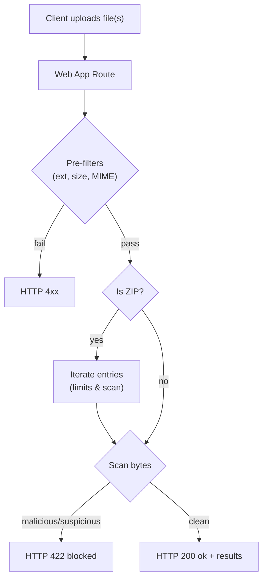
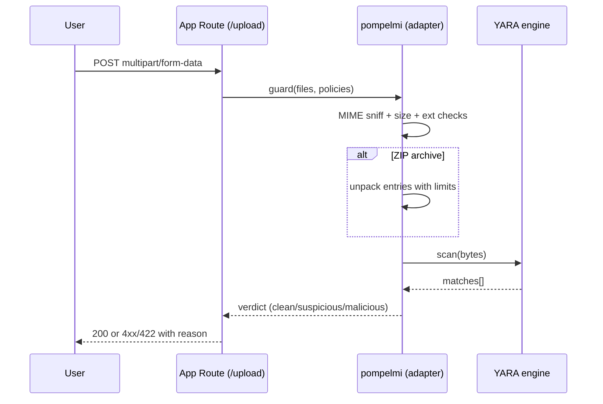
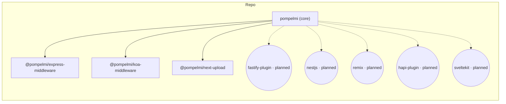

<p align="center">
  <a href="https://github.com/pompelmi/pompelmi" target="_blank" rel="noopener noreferrer">
    
  </a>
  <br/>
  <a href="https://www.detectionengineering.net/p/det-eng-weekly-issue-124-the-defcon"></a>
</p>

<h1 align="center">pompelmi</h1>

<p align="center"><strong>Fast file‑upload malware scanning for Node.js</strong> — with optional <strong>YARA</strong>, ZIP deep‑inspection, and drop‑in adapters for <em>Express</em>, <em>Koa</em>, and <em>Next.js</em>. Private by design. Typed. Tiny.</p>

<p align="center">
  <a href="https://www.npmjs.com/package/pompelmi"></a>
  <a href="https://www.npmjs.com/package/pompelmi"></a>
  
  
  <a href="https://github.com/pompelmi/pompelmi/blob/main/LICENSE"></a>
  <a href="https://app.codecov.io/gh/pompelmi/pompelmi"></a>
  <a href="https://github.com/pompelmi/pompelmi/stargazers"></a>
  <a href="https://github.com/pompelmi/pompelmi/actions/workflows/ci-release-publish.yml"></a>
  <a href="https://github.com/pompelmi/pompelmi/issues"></a>
  
</p>

<p align="center">
  <a href="https://pompelmi.github.io/pompelmi/">Documentation</a> ·
  <a href="#installation">Install</a> ·
  <a href="#quickstart">Quickstart</a> ·
  <a href="#adapters">Adapters</a> ·
  <a href="#diagrams">Diagrams</a> ·
  <a href="#configuration">Config</a> ·
  <a href="#quick-test-eicar">Quick test</a> ·
  <a href="#security-notes">Security</a> ·
  <a href="#packages">Packages</a> ·
  <a href="#faq">FAQ</a>
</p>

---

## Installation

```bash
# core library
npm i pompelmi
# or
pnpm add pompelmi
```

## Why pompelmi?

- **Block risky uploads at the edge** — mark files as <em>clean</em>, <em>suspicious</em>, or <em>malicious</em> and stop them early.
- **YARA when you need it** — plug in your rules; start simple and iterate.
- **Real checks** — extension allow‑list, MIME sniffing (magic bytes), file size caps, and **ZIP** traversal with anti‑bomb limits.
- **No cloud required** — scans run in‑process. Keep bytes private.
- **DX first** — TypeScript types, ESM/CJS builds, minimal API.

> Keywords: file upload security, malware scanning, YARA, Node.js, Express, Koa, Next.js, ZIP scanning

---


Optional dev deps used in examples:

```bash
npm i -D tsx express multer @koa/router @koa/multer koa next
```

---

## Quickstart

### Express

```ts
import express from 'express';
import multer from 'multer';
import { createUploadGuard } from '@pompelmi/express-middleware';

const app = express();
const upload = multer({ storage: multer.memoryStorage(), limits: { fileSize: 20 * 1024 * 1024 } });

const SimpleEicarScanner = {
  async scan(bytes: Uint8Array) {
    const text = Buffer.from(bytes).toString('utf8');
    if (text.includes('EICAR-STANDARD-ANTIVIRUS-TEST-FILE')) return [{ rule: 'eicar_test' }];
    return [];
  }
};

app.post(
  '/upload',
  upload.any(),
  createUploadGuard({
    scanner: SimpleEicarScanner,
    includeExtensions: ['txt','png','jpg','jpeg','pdf','zip'],
    allowedMimeTypes: ['text/plain','image/png','image/jpeg','application/pdf','application/zip'],
    maxFileSizeBytes: 20 * 1024 * 1024,
    timeoutMs: 5000,
    concurrency: 4,
    failClosed: true,
    onScanEvent: (ev) => console.log('[scan]', ev)
  }),
  (req, res) => res.json({ ok: true, scan: (req as any).pompelmi ?? null })
);

app.listen(3000, () => console.log('http://localhost:3000'));
```

### Koa

```ts
import Koa from 'koa';
import Router from '@koa/router';
import multer from '@koa/multer';
import { createKoaUploadGuard } from '@pompelmi/koa-middleware';

const app = new Koa();
const router = new Router();
const upload = multer({ storage: multer.memoryStorage(), limits: { fileSize: 20 * 1024 * 1024 } });

const SimpleEicarScanner = { async scan(b: Uint8Array){
  return Buffer.from(b).toString('utf8').includes('EICAR') ? [{ rule: 'eicar_test' }] : [];
}};

router.post(
  '/upload',
  upload.any(),
  createKoaUploadGuard({
    scanner: SimpleEicarScanner,
    includeExtensions: ['txt','png','jpg','jpeg','pdf','zip'],
    allowedMimeTypes: ['text/plain','image/png','image/jpeg','application/pdf','application/zip'],
    maxFileSizeBytes: 20 * 1024 * 1024,
    timeoutMs: 5000,
    concurrency: 4,
    failClosed: true,
    onScanEvent: (ev) => console.log('[scan]', ev)
  }),
  (ctx) => { ctx.body = { ok: true, scan: (ctx as any).pompelmi ?? null }; }
);

app.use(router.routes()).use(router.allowedMethods());
app.listen(3003, () => console.log('http://localhost:3003'));
```

### Next.js (App Router)

```ts
// app/api/upload/route.ts
import { createNextUploadHandler } from '@pompelmi/next-upload';

export const runtime = 'nodejs';
export const dynamic = 'force-dynamic';

const SimpleEicarScanner = { async scan(b: Uint8Array){
  return Buffer.from(b).toString('utf8').includes('EICAR') ? [{ rule: 'eicar_test' }] : [];
}};

export const POST = createNextUploadHandler({
  scanner: SimpleEicarScanner,
  includeExtensions: ['txt','png','jpg','jpeg','pdf','zip'],
  allowedMimeTypes: ['text/plain','image/png','image/jpeg','application/pdf','application/zip'],
  maxFileSizeBytes: 20 * 1024 * 1024,
  timeoutMs: 5000,
  concurrency: 4,
  failClosed: true,
  onScanEvent: (ev) => console.log('[scan]', ev)
});
```

---

## Adapters

Use the adapter that matches your web framework. All adapters share the same policy options and scanning contract.

| Framework | Package | Status |
| --- | --- | --- |
| Express | `@pompelmi/express-middleware` | alpha |
| Koa | `@pompelmi/koa-middleware` | alpha |
| Next.js (App Router) | `@pompelmi/next-upload` | alpha |
| Fastify | fastify plugin — planned |
| NestJS | nestjs — planned |
| Remix | remix — planned |
| hapi | hapi plugin — planned |
| SvelteKit | sveltekit — planned |

---

## Diagrams

### Upload scanning flow
<p align="center">
  
</p>

<details>
<summary>Mermaid source</summary>


</details>

### Sequence (App ↔ pompelmi ↔ YARA)
<p align="center">
  
</p>

<details>
<summary>Mermaid source</summary>


</details>

### Components (monorepo)
<p align="center">
  
</p>

<details>
<summary>Mermaid source</summary>


</details>

## Packages

| Package | NPM | Description |
| --- | --- | --- |
| **`pompelmi`** | <a href="https://www.npmjs.com/package/pompelmi"></a> | Core scanner (Node + Remote Engine for browsers). |
| **`@pompelmi/express-middleware`** | *(alpha)* | Express middleware to scan uploads & enforce policies. |
| **`@pompelmi/koa-middleware`** | *(alpha)* | Koa middleware compatible with `@koa/multer`/`koa-body`. |
| **`@pompelmi/next-upload`** | *(alpha)* | Next.js App Router `POST` handler factory. |

> Status: **alpha** — small API refinements may happen before a stable milestone.

---

## Configuration

All adapters accept a common set of options:

| Option | Type (TS) | Purpose |
| --- | --- | --- |
| `scanner` | `{ scan(bytes: Uint8Array): Promise<Match[]> }` | Your scanning engine. Return `[]` when clean; non‑empty to flag. |
| `includeExtensions` | `string[]` | Allow‑list of file extensions. Evaluated case‑insensitively. |
| `allowedMimeTypes` | `string[]` | Allow‑list of MIME types after magic‑byte sniffing. |
| `maxFileSizeBytes` | `number` | Per‑file size cap. Oversize files are rejected early. |
| `timeoutMs` | `number` | Per‑file scan timeout; guards against stuck scanners. |
| `concurrency` | `number` | How many files to scan in parallel. |
| `failClosed` | `boolean` | If `true`, errors/timeouts block the upload. |
| `onScanEvent` | `(event: unknown) => void` | Optional telemetry hook for logging/metrics. |

**Common recipes**

Allow only images up to 5 MB:

```ts
includeExtensions: ['png','jpg','jpeg','webp'],
allowedMimeTypes: ['image/png','image/jpeg','image/webp'],
maxFileSizeBytes: 5 * 1024 * 1024,
failClosed: true,
```

---

## Quick test (EICAR)

Use the Express/Koa/Next examples above, then send the standard EICAR test file to verify that blocking works end‑to‑end.

**1) Generate the EICAR file (safe test string)**

Linux:

```bash
echo 'WDVPIVAlQEFQWzRcUFpYNTQoUF4pN0NDKTd9JEVJQ0FSLVNUQU5EQVJELUFOVElWSVJVUy1URVNULUZJTEUhJEgrSCo=' | base64 -d > eicar.txt
```

macOS:

```bash
echo 'WDVPIVAlQEFQWzRcUFpYNTQoUF4pN0NDKTd9JEVJQ0FSLVNUQU5EQVJELUFOVElWSVJVUy1URVNULUZJTEUhJEgrSCo=' | base64 -D > eicar.txt
```

**2) Send it to your endpoint**

Express (default from the Quickstart):

```bash
curl -F "file=@eicar.txt;type=text/plain" http://localhost:3000/upload -i
```

You should see an HTTP **422 Unprocessable Entity** (blocked by policy). Clean files return **200 OK**. Pre‑filter failures (size/ext/MIME) should return a **4xx**. Adapt these conventions to your app as needed.

---

## Security notes

- The library **reads** bytes; it never executes files.
- YARA detections depend on the **rules you provide**; expect some false positives/negatives.
- ZIP scanning applies limits (entries, per‑entry size, total uncompressed, nesting) to reduce archive‑bomb risk.
- Prefer running scans in a **dedicated process/container** for defense‑in‑depth.

---

## Star history

[](https://star-history.com/#pompelmi/pompelmi&Date)

---

## FAQ

**Do I need YARA?**  
No. `scanner` is pluggable. The examples use a minimal scanner for clarity; you can call out to a YARA engine or any other detector you prefer.

**Where do the results live?**  
In the examples, the guard attaches scan data to the request context (e.g. `req.pompelmi` in Express, `ctx.pompelmi` in Koa). In Next.js, include the results in your JSON response as you see fit.

**Why 422 for blocked files?**  
Using **422** to signal a policy violation keeps it distinct from transport errors; it’s a common pattern. Use the codes that best match your API guidelines.

**Are ZIP bombs handled?**  
Archives are traversed with limits to reduce archive‑bomb risk. Keep your size limits conservative and prefer `failClosed: true` in production.

---

## Contributing

PRs and issues welcome! Start with:

```bash
pnpm -r build
pnpm -r lint
```

---

## License

[MIT](./LICENSE) © 2025‑present pompelmi contributors