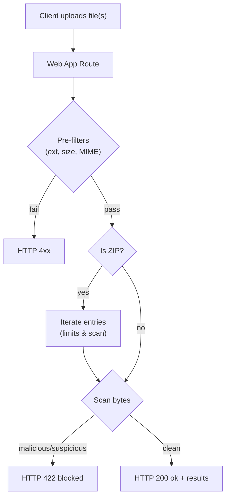
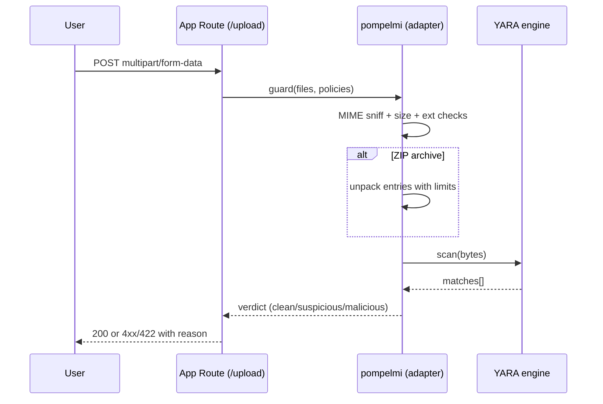
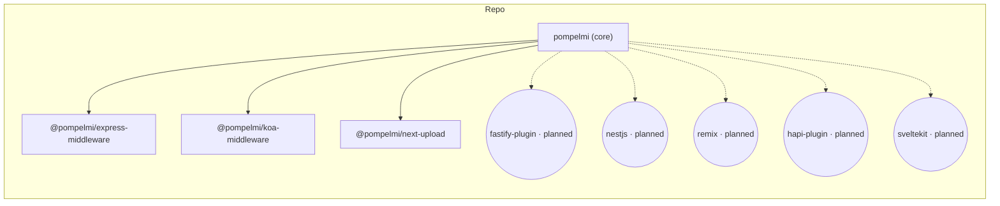

<!-- HERO START -->

<p align="center">

<br/>
<a href="https://www.producthunt.com/products/pompelmi?embed=true&utm_source=badge-pompelmi&utm_medium=badge" target="_blank"></a>
<br/>
  <a href="https://github.com/pompelmi/pompelmi" target="_blank" rel="noopener noreferrer">
    
  </a>
  <br/>
  <a href="https://www.detectionengineering.net/p/det-eng-weekly-issue-124-the-defcon"></a>
  <a href="https://nodeweekly.com/issues/594"></a>
  <a href="https://bytes.dev/archives/429"></a>
  <br/>
  
</p>

<h1 align="center">pompelmi</h1>


<p align="center">

<strong>Fast file‑upload malware scanning for Node.js</strong> — optional <strong>YARA</strong> integration, ZIP deep‑inspection, and drop‑in adapters for <em>Express</em>, <em>Koa</em>, and <em>Next.js</em>. Private by design. Typed. Tiny.
</p>


<p align="center">
  <a href="https://www.npmjs.com/package/pompelmi"></a>
  <a href="https://www.npmjs.com/package/pompelmi"></a>
  
  
  <a href="https://github.com/pompelmi/pompelmi/blob/main/LICENSE"></a>
    <a href="https://codecov.io/gh/pompelmi/pompelmi"></a>
  <a href="https://github.com/pompelmi/pompelmi/stargazers"></a>
  <a href="https://github.com/pompelmi/pompelmi/actions/workflows/ci-release-publish.yml"></a>
  <a href="https://github.com/pompelmi/pompelmi/issues"></a>
  
</p>

<p align="center"><em>Coverage badge reflects core library (<code>src/**</code>); adapters are measured separately.</em></p>

<p align="center"><a href="https://pompelmi.github.io/pompelmi/">Documentation</a> ·
  <a href="#installation">Install</a> ·
  <a href="#quick-start">Quick‑start</a> ·
  <a href="#github-action">GitHub Action</a> ·
  <a href="#adapters">Adapters</a> ·
  <a href="#diagrams">Diagrams</a> ·
  <a href="#configuration">Config</a> ·
  <a href="#production-checklist">Production checklist</a> ·
  <a href="#yara-getting-started">YARA</a> ·
  <a href="#quick-test-no-eicar">Quick test</a> ·
  <a href="#security-notes">Security</a> ·
  <a href="#faq">FAQ</a>
</p>

<!-- HERO END -->

---

<details>
<summary><strong>Table of contents</strong></summary>

- [Install](#installation)
- [Quick‑start](#quick-start)
- [GitHub Action](#github-action)
- [Adapters](#adapters)
- [Diagrams](#diagrams)
- [Config](#configuration)
- [Production checklist](#production-checklist)
- [YARA](#yara-getting-started)
- [Quick test](#quick-test-no-eicar)
- [Security](#security-notes)
- [FAQ](#faq)
</details>

## 🚀 Overview

**pompelmi** scans untrusted file uploads **before** they hit disk. A tiny, TypeScript-first toolkit for Node.js with composable scanners, deep ZIP inspection, and optional signature engines.

- **Private by design** — no outbound calls; bytes never leave your process
- **Composable scanners** — mix heuristics + signatures; set `stopOn` and timeouts
- **ZIP hardening** — traversal/bomb guards, polyglot & macro hints
- **Drop-in adapters** — Express, Koa, Fastify, Next.js
- **Typed & tiny** — modern TS, minimal surface

## ✨ Highlights

- **Block risky uploads early** — classify uploads as _clean_, _suspicious_, or _malicious_ and stop them at the edge.
- **Real guards** — extension allow‑list, server‑side MIME sniff (magic bytes), per‑file size caps, and **deep ZIP** traversal with anti‑bomb limits.
- **Built‑in scanners** — drop‑in **CommonHeuristicsScanner** (PDF risky actions, Office macros, PE header) and **Zip‑bomb Guard**; add your own or YARA via a tiny `{ scan(bytes) }` contract.
- **Compose scanning** — run multiple scanners in parallel or sequentially with timeouts and short‑circuiting via `composeScanners()`.
- **Zero cloud** — scans run in‑process. Keep bytes private.
- **DX first** — TypeScript types, ESM/CJS builds, tiny API, adapters for popular web frameworks.

> Keywords: file upload security, malware scanning, YARA, Node.js, Express, Koa, Next.js, ZIP scanning, ZIP bomb, PDF JavaScript, Office macros

## 🧠 Why pompelmi?

- **On‑device, private scanning** – no outbound calls, no data sharing.
- **Blocks early** – runs *before* you write to disk or persist anything.
- **Fits your stack** – drop‑in adapters for Express, Koa, Next.js (Fastify plugin in alpha).
- **Defense‑in‑depth** – ZIP traversal limits, ratio caps, server‑side MIME sniffing, size caps.
- **Pluggable detection** – bring your own engine (e.g., YARA) via a tiny `{ scan(bytes) }` contract.

### Who is it for?

- Teams who can’t send uploads to third‑party AV APIs.
- Apps that need predictable, low‑latency decisions inline.
- Developers who want simple, typed building blocks instead of a daemon.

## 🔍 How it compares

| Capability | pompelmi | ClamAV / node‑clam | Cloud AV APIs |
| --- | --- | --- | --- |
| Runs fully in‑process | ✅ | ❌ (separate daemon) | ❌ (network calls) |
| Bytes stay private | ✅ | ✅ | ❌ |
| Deep ZIP limits & MIME sniff | ✅ | ✅ (archive scan) | ❓ varies |
| YARA integration | ✅ optional | ❌* | ❓ varies |
| Framework adapters | ✅ Express/Koa/Next.js | ❌ | ❌ |
| Works in CI on artifacts | ✅ | ✅ | ❓ varies |
| Licensing | MIT | GPL (engine) | Proprietary |

\* You can run YARA alongside ClamAV, but it’s not built‑in.

---

## 🔧 Installation

```bash
# core library
npm i pompelmi
# or
pnpm add pompelmi
# or
yarn add pompelmi
```

> Optional dev deps used in the examples:
>
> ```bash
> npm i -D tsx express multer @koa/router @koa/multer koa next
> ```

---

## ⚡ Quick‑start

**At a glance (policy + scanners)**

```ts
// Compose built‑in scanners (no EICAR). Optionally add your own/YARA.
import { CommonHeuristicsScanner, createZipBombGuard, composeScanners } from 'pompelmi';

export const policy = {
  includeExtensions: ['zip','png','jpg','jpeg','pdf'],
  allowedMimeTypes: ['application/zip','image/png','image/jpeg','application/pdf','text/plain'],
  maxFileSizeBytes: 20 * 1024 * 1024,
  timeoutMs: 5000,
  concurrency: 4,
  failClosed: true,
  onScanEvent: (ev: unknown) => console.log('[scan]', ev)
};

export const scanner = composeScanners(
  [
    ['zipGuard', createZipBombGuard({ maxEntries: 512, maxTotalUncompressedBytes: 100 * 1024 * 1024, maxCompressionRatio: 12 })],
    ['heuristics', CommonHeuristicsScanner],
    // ['yara', YourYaraScanner],
  ],
  { parallel: false, stopOn: 'suspicious', timeoutMsPerScanner: 1500, tagSourceName: true }
);
```

### Express

```ts
import express from 'express';
import multer from 'multer';
import { createUploadGuard } from '@pompelmi/express-middleware';
import { policy, scanner } from './security'; // the snippet above

const app = express();
const upload = multer({ storage: multer.memoryStorage(), limits: { fileSize: policy.maxFileSizeBytes } });

app.post('/upload', upload.any(), createUploadGuard({ ...policy, scanner }), (req, res) => {
  res.json({ ok: true, scan: (req as any).pompelmi ?? null });
});

app.listen(3000, () => console.log('http://localhost:3000'));
```

### Koa

```ts
import Koa from 'koa';
import Router from '@koa/router';
import multer from '@koa/multer';
import { createKoaUploadGuard } from '@pompelmi/koa-middleware';
import { policy, scanner } from './security';

const app = new Koa();
const router = new Router();
const upload = multer({ storage: multer.memoryStorage(), limits: { fileSize: policy.maxFileSizeBytes } });

router.post('/upload', upload.any(), createKoaUploadGuard({ ...policy, scanner }), (ctx) => {
  ctx.body = { ok: true, scan: (ctx as any).pompelmi ?? null };
});

app.use(router.routes()).use(router.allowedMethods());
app.listen(3003, () => console.log('http://localhost:3003'));
```

### Next.js (App Router)

```ts
// app/api/upload/route.ts
import { createNextUploadHandler } from '@pompelmi/next-upload';
import { policy, scanner } from '@/lib/security';

export const runtime = 'nodejs';
export const dynamic = 'force-dynamic';

export const POST = createNextUploadHandler({ ...policy, scanner });
```

---

## 🤖 GitHub Action

Run **pompelmi** in CI to scan repository files or built artifacts.

**Minimal usage**
```yaml
name: Security scan (pompelmi)
on: [push, pull_request]

jobs:
  scan:
    runs-on: ubuntu-latest
    steps:
      - uses: actions/checkout@v4

      - name: Scan repository with pompelmi
        uses: pompelmi/pompelmi/.github/actions/pompelmi-scan@v1
        with:
          path: .
          deep_zip: true
          fail_on_detect: true
```

**Scan a single artifact**
```yaml
- uses: pompelmi/pompelmi/.github/actions/pompelmi-scan@v1
  with:
    artifact: build.zip
    deep_zip: true
    fail_on_detect: true
```

**Inputs**
| Input | Default | Description |
| --- | --- | --- |
| `path` | `.` | Directory to scan. |
| `artifact` | `""` | Single file/archive to scan. |
| `yara_rules` | `""` | Glob path to YARA rules (e.g. `rules/*.yar`). |
| `deep_zip` | `true` | Enable deep nested-archive inspection. |
| `max_depth` | `3` | Max nested-archive depth. |
| `fail_on_detect` | `true` | Fail the job if detections occur. |

> The Action lives in this repo at `.github/actions/pompelmi-scan`. When published to the Marketplace, consumers can copy the snippets above as-is.

---

## 🧩 Adapters

Use the adapter that matches your web framework. All adapters share the same policy options and scanning contract.

| Framework | Package | Status |
| --- | --- | --- |
| Express | `@pompelmi/express-middleware` | alpha |
| Koa | `@pompelmi/koa-middleware` | alpha |
| Next.js (App Router) | `@pompelmi/next-upload` | alpha |
| Fastify | `@pompelmi/fastify-plugin` | alpha |
| NestJS | nestjs — planned |
| Remix | remix — planned |
| hapi | hapi plugin — planned |
| SvelteKit | sveltekit — planned |

---

## 🗺️ Diagrams

### Upload scanning flow

<details>
<summary>Mermaid source</summary>


</details>

### Sequence (App ↔ pompelmi ↔ YARA)

<details>
<summary>Mermaid source</summary>


</details>

### Components (monorepo)

<details>
<summary>Mermaid source</summary>


</details>

---

## ⚙️ Configuration

All adapters accept a common set of options:

| Option | Type (TS) | Purpose |
| --- | --- | --- |
| `scanner` | `{ scan(bytes: Uint8Array): Promise<Match[]> }` | Your scanning engine. Return `[]` when clean; non‑empty to flag. |
| `includeExtensions` | `string[]` | Allow‑list of file extensions. Evaluated case‑insensitively. |
| `allowedMimeTypes` | `string[]` | Allow‑list of MIME types after magic‑byte sniffing. |
| `maxFileSizeBytes` | `number` | Per‑file size cap. Oversize files are rejected early. |
| `timeoutMs` | `number` | Per‑file scan timeout; guards against stuck scanners. |
| `concurrency` | `number` | How many files to scan in parallel. |
| `failClosed` | `boolean` | If `true`, errors/timeouts block the upload. |
| `onScanEvent` | `(event: unknown) => void` | Optional telemetry hook for logging/metrics. |

**Common recipes**

Allow only images up to 5 MB:

```ts
includeExtensions: ['png','jpg','jpeg','webp'],
allowedMimeTypes: ['image/png','image/jpeg','image/webp'],
maxFileSizeBytes: 5 * 1024 * 1024,
failClosed: true,
```

---

## ✅ Production checklist

- [ ] **Limit file size** aggressively (`maxFileSizeBytes`).
- [ ] **Restrict extensions & MIME** to what your app truly needs.
- [ ] **Set `failClosed: true` in production** to block on timeouts/errors.
- [ ] **Handle ZIPs carefully** (enable deep ZIP, keep nesting low, cap entry sizes).
- [ ] **Compose scanners** with `composeScanners()` and enable `stopOn` to fail fast on early detections.
- [ ] **Log scan events** (`onScanEvent`) and monitor for spikes.
- [ ] **Run scans in a separate process/container** for defense‑in‑depth when possible.
- [ ] **Sanitize file names and paths** if you persist uploads.
- [ ] **Prefer memory storage + post‑processing**; avoid writing untrusted bytes before policy passes.
- [ ] **Add CI scanning** with the GitHub Action to catch bad files in repos/artifacts.

---

## 🧬 YARA Getting Started

YARA lets you detect suspicious or malicious content using pattern‑matching rules.  
**pompelmi** treats YARA matches as signals that you can map to your own verdicts  
(e.g., mark high‑confidence rules as `malicious`, heuristics as `suspicious`).

> **Status:** Optional. You can run without YARA. If you adopt it, keep your rules small, time‑bound, and tuned to your threat model.

### Starter rules

Below are three example rules you can adapt:

`rules/starter/eicar.yar`
```yar
rule EICAR_Test_File
{
    meta:
        description = "EICAR antivirus test string (safe)"
        reference   = "https://www.eicar.org"
        confidence  = "high"
        verdict     = "malicious"
    strings:
        $eicar = "X5O!P%@AP[4\\PZX54(P^)7CC)7}$EICAR-STANDARD-ANTIVIRUS-TEST-FILE!$H+H*"
    condition:
        $eicar
}
```

`rules/starter/pdf_js.yar`
```yar
rule PDF_JavaScript_Embedded
{
    meta:
        description = "PDF contains embedded JavaScript (heuristic)"
        confidence  = "medium"
        verdict     = "suspicious"
    strings:
        $magic = { 25 50 44 46 } // "%PDF"
        $js1 = "/JavaScript" ascii
        $js2 = "/JS" ascii
        $open = "/OpenAction" ascii
        $aa = "/AA" ascii
    condition:
        uint32(0) == 0x25504446 and ( $js1 or $js2 ) and ( $open or $aa )
}
```

`rules/starter/office_macros.yar`
```yar
rule Office_Macro_Suspicious_Words
{
    meta:
        description = "Heuristic: suspicious VBA macro keywords"
        confidence  = "medium"
        verdict     = "suspicious"
    strings:
        $s1 = /Auto(Open|Close)/ nocase
        $s2 = "Document_Open" nocase ascii
        $s3 = "CreateObject(" nocase ascii
        $s4 = "WScript.Shell" nocase ascii
        $s5 = "Shell(" nocase ascii
        $s6 = "Sub Workbook_Open()" nocase ascii
    condition:
        2 of ($s*)
}
```

> These are **examples**. Expect some false positives; tune to your app.

### Minimal integration (adapter contract)

If you use a YARA binding (e.g., `@automattic/yara`), wrap it behind the `scanner` contract:

```ts
// Example YARA scanner adapter (pseudo‑code)
import * as Y from '@automattic/yara';

// Compile your rules from disk at boot (recommended)
// const sources = await fs.readFile('rules/starter/*.yar', 'utf8');
// const compiled = await Y.compile(sources);

export const YourYaraScanner = {
  async scan(bytes: Uint8Array) {
    // const matches = await compiled.scan(bytes, { timeout: 1500 });
    const matches = []; // plug your engine here
    // Map to the structure your app expects; return [] when clean.
    return matches.map((m: any) => ({
      rule: m.rule,
      meta: m.meta ?? {},
      tags: m.tags ?? [],
    }));
  }
};
```

Then include it in your composed scanner:

```ts
import { composeScanners, CommonHeuristicsScanner } from 'pompelmi';
// import { YourYaraScanner } from './yara-scanner';

export const scanner = composeScanners(
  [
    ['heuristics', CommonHeuristicsScanner],
    // ['yara', YourYaraScanner],
  ],
  { parallel: false, stopOn: 'suspicious', timeoutMsPerScanner: 1500, tagSourceName: true }
);
```

### Policy suggestion (mapping matches → verdict)

- **malicious**: high‑confidence rules (e.g., `EICAR_Test_File`)
- **suspicious**: heuristic rules (e.g., PDF JavaScript, macro keywords)
- **clean**: no matches

Combine YARA with MIME sniffing, ZIP safety limits, and strict size/time caps.

## 🧪 Quick test (no EICAR)

Use the examples above, then send a **minimal PDF** that contains risky tokens (this triggers the built‑in heuristics).

**1) Create a tiny PDF with risky actions**

Linux:
```bash
printf '%%PDF-1.7\n1 0 obj\n<< /OpenAction 1 0 R /AA << /JavaScript (alert(1)) >> >>\nendobj\n%%EOF\n' > risky.pdf
```

macOS:
```bash
printf '%%PDF-1.7\n1 0 obj\n<< /OpenAction 1 0 R /AA << /JavaScript (alert(1)) >> >>\nendobj\n%%EOF\n' > risky.pdf
```

**2) Send it to your endpoint**

Express (default from the Quick‑start):
```bash
curl -F "file=@risky.pdf;type=application/pdf" http://localhost:3000/upload -i
```

You should see an HTTP **422 Unprocessable Entity** (blocked by policy). Clean files return **200 OK**. Pre‑filter failures (size/ext/MIME) should return a **4xx**. Adapt these conventions to your app as needed.

---

## 🔒 Security notes

- The library **reads** bytes; it never executes files.
- YARA detections depend on the **rules you provide**; expect some false positives/negatives.
- ZIP scanning applies limits (entries, per‑entry size, total uncompressed, nesting) to reduce archive‑bomb risk.
- Prefer running scans in a **dedicated process/container** for defense‑in‑depth.

---

[...]

## 🔔 Releases & security

- **Changelog / releases:** see [GitHub Releases](https://github.com/pompelmi/pompelmi/releases).
- **Security disclosures:** please use [GitHub Security Advisories](https://github.com/pompelmi/pompelmi/security/advisories). We’ll coordinate a fix before public disclosure.
- **Production users:** open a [Discussion](https://github.com/pompelmi/pompelmi/discussions) to share requirements or request adapters.

## ⭐ Star history

[](https://star-history.com/#pompelmi/pompelmi&Date)

---

## 💬 FAQ

**Do I need YARA?**  
No. `scanner` is pluggable. The examples use a minimal scanner for clarity; you can call out to a YARA engine or any other detector you prefer.

**Where do the results live?**  
In the examples, the guard attaches scan data to the request context (e.g. `req.pompelmi` in Express, `ctx.pompelmi` in Koa). In Next.js, include the results in your JSON response as you see fit.

**Why 422 for blocked files?**  
Using **422** to signal a policy violation keeps it distinct from transport errors; it’s a common pattern. Use the codes that best match your API guidelines.

**Are ZIP bombs handled?**  
Archives are traversed with limits to reduce archive‑bomb risk. Keep your size limits conservative and prefer `failClosed: true` in production.

---

## 🧪 Tests & Coverage

Run tests locally with coverage:

```bash
pnpm vitest run --coverage --passWithNoTests
```

The badge tracks the **core library** (`src/**`). Adapters and engines are reported separately for now and will be folded into global coverage as their suites grow.

If you integrate Codecov in CI, upload `coverage/lcov.info` and you can use this Codecov badge:

```md
[](https://codecov.io/gh/pompelmi/pompelmi)
```

## 🤝 Contributing

PRs and issues welcome! Start with:

```bash
pnpm -r build
pnpm -r lint
```

---

<p align="right"><a href="#pompelmi">↑ Back to top</a></p>

## 📜 License

[MIT](./LICENSE) © 2025‑present pompelmi contributors
