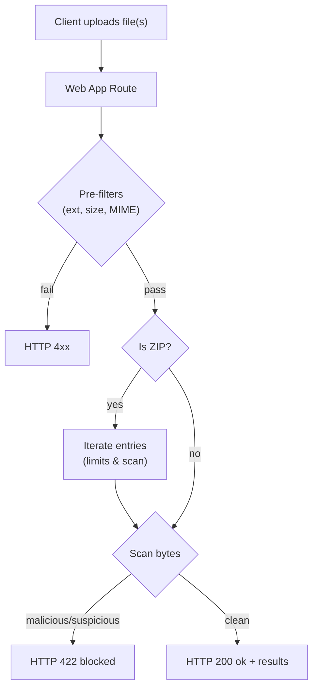
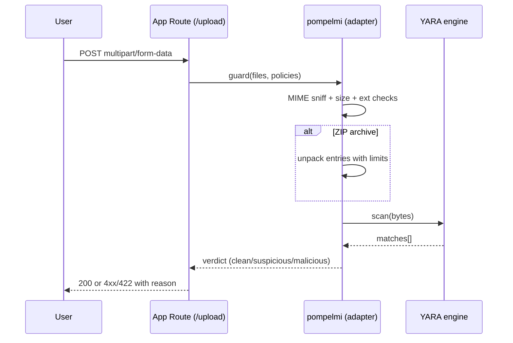
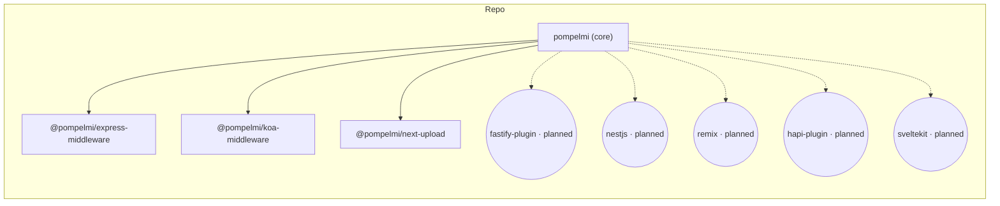

<div align="center">

<!-- Language Selector -->
<p>
  <strong>Read this in other languages:</strong><br/>
  <a href="docs/i18n/README.it.md">🇮🇹 Italiano</a> •
  <a href="docs/i18n/README.fr.md">🇫🇷 Français</a> •
  <a href="docs/i18n/README.es.md">🇪🇸 Español</a> •
  <a href="docs/i18n/README.de.md">🇩🇪 Deutsch</a> •
  <a href="docs/i18n/README.ja.md">🇯🇵 日本語</a> •
  <a href="docs/i18n/README.zh-CN.md">🇨🇳 简体中文</a> •
  <a href="docs/i18n/README.ko.md">🇰🇷 한국어</a> •
  <a href="docs/i18n/README.pt-BR.md">🇧🇷 Português</a> •
  <a href="docs/i18n/README.ru.md">🇷🇺 Русский</a> •
  <a href="docs/i18n/README.tr.md">🇹🇷 Türkçe</a>
</p>

> 💡 **Translation Note:** Help improve translations by opening a PR. The English README is the source of truth.

</div>

---

<!-- HERO START -->

<p align="center">
  <br/>
  <!-- Responsive logo using picture element -->
  <picture>
    <source media="(prefers-color-scheme: dark)" srcset="https://raw.githubusercontent.com/pompelmi/pompelmi/refs/heads/main/assets/logo.svg">
    <source media="(prefers-color-scheme: light)" srcset="https://raw.githubusercontent.com/pompelmi/pompelmi/refs/heads/main/assets/logo.svg">
    
  </picture>
  <br/>
  <a href="https://www.producthunt.com/products/pompelmi"></a>
  <br/>
  <a href="https://www.helpnetsecurity.com/2026/02/02/pompelmi-open-source-secure-file-upload-scanning-node-js/"></a>
  <a href="https://snyk.io/test/github/pompelmi/pompelmi"></a>
  <br/>
  <a href="https://github.com/sorrycc/awesome-javascript"></a>
  <a href="https://github.com/dzharii/awesome-typescript"></a>
  <a href="https://github.com/sbilly/awesome-security"></a>
  <a href="https://github.com/sindresorhus/awesome-nodejs"></a>
  <br/><br/>
</p>

<h1 align="center">pompelmi</h1>

<p align="center">
  <strong>Secure File Upload Scanning for Node.js</strong>
</p>

<p align="center">
  <em>Privacy-first malware detection with YARA, ZIP bomb protection, and framework adapters</em>
</p>

<p align="center">
  Scan files before they hit disk • <strong>Keep user data private</strong> • <strong>Zero cloud dependencies</strong>
</p>

---

<!-- Badges Section -->
<p align="center">
  <a href="https://www.npmjs.com/package/pompelmi"></a>
  <a href="https://www.npmjs.com/package/pompelmi"></a>
  <a href="https://github.com/pompelmi/pompelmi/blob/main/LICENSE"></a>
  
  <a href="https://github.com/pompelmi/pompelmi/actions/workflows/ci.yml"></a>
</p>

<p align="center">
  <a href="https://codecov.io/gh/pompelmi/pompelmi"></a>
  
  
  <a href="https://snyk.io/test/github/pompelmi/pompelmi"></a>
  <a href="https://securityscorecards.dev/viewer/?uri=github.com/pompelmi/pompelmi"></a>
</p>

<p align="center">
  <a href="https://github.com/pompelmi/pompelmi/stargazers"></a>
  <a href="https://github.com/pompelmi/pompelmi/network/members"></a>
  <a href="https://github.com/pompelmi/pompelmi/watchers"></a>
  <a href="https://github.com/pompelmi/pompelmi/issues"></a>
  <a href="https://github.com/sponsors/pompelmi"></a>
</p>

<p align="center">
  <strong>
    <a href="https://pompelmi.github.io/pompelmi/">📚 Documentation</a> •
    <a href="#-installation">💾 Install</a> •
    <a href="#-quickstart">⚡ Quickstart</a> •
    <a href="#-adapters">🧩 Adapters</a> •
    <a href="#-yara-getting-started">🧬 YARA</a> •
    <a href="#-github-action">🤖 CI/CD</a>
  </strong>
</p>

<p align="center"><em>Coverage badge reflects core library (<code>src/**</code>); adapters are measured separately.</em></p>

<!-- HERO END -->

---

## 📦 Installation

```bash
npm install pompelmi
```

> Node.js 18+ required. No daemon, no cloud API keys, no configuration files needed to get started.

---

## ⚡ Quickstart

Scan a file and act on the result in three lines:

```ts
import { scanFile } from 'pompelmi';

const result = await scanFile('path/to/upload.pdf');
// result.verdict → "clean" | "suspicious" | "malicious"

if (result.verdict !== 'clean') {
  console.error('Blocked:', result.verdict, result.reasons);
} else {
  console.log('Safe to process.');
}
```

That's it. No server required, no framework dependency — works standalone in any Node.js script or service.

---

## 🎬 Demo


**Want to try it now?** Check out our [live examples](./examples/) or install and run locally:

```bash
npm i pompelmi @pompelmi/express-middleware
```

---

## ✨ Features

**pompelmi** provides enterprise-grade file scanning for Node.js applications:

- **🔒 Privacy-First Architecture** — All scanning happens in-process. **No cloud calls, no data leaks.** Your files never leave your infrastructure.
- **⚡ Lightning Fast** — In-process scanning with **zero network latency**. Configurable concurrency for high-throughput scenarios.
- **🧩 Composable Scanners** — Mix heuristics + signatures; set `stopOn` and timeouts. Bring your own YARA rules.
- **📦 Deep ZIP Inspection** — Traversal/bomb guards, polyglot & macro hints, nested archive scanning with configurable depth limits.
- **🔌 Framework Adapters** — Drop-in middleware for Express, Koa, Fastify, Next.js, Nuxt/Nitro, and **NestJS** with first-class TypeScript support.
- **🌊 Stream-Based Processing** — Memory-efficient scanning with configurable buffer limits. Scan large files without loading them entirely into memory.
- **🔍 Polyglot Detection** — Advanced magic bytes analysis detects mixed-format files and embedded scripts with **30+ file signatures**.
- **⚙️ CLI for CI/CD** — Standalone command-line tool for scanning files and directories with watch mode and multiple output formats.
- **📘 TypeScript-First** — Complete type definitions, modern ESM/CJS builds, minimal surface, tree-shakeable.
- **⚡ Zero Core Dependencies** — Core library has minimal deps for fast installation and reduced supply chain risk.

---

## Table of Contents

- [Installation](#-installation)
- [Quickstart](#-quickstart)
- [Demo](#-demo)
- [Features](#-features)
- [Why pompelmi?](#-why-pompelmi)
- [Use Cases](#-use-cases)
- [Getting Started](#-getting-started)
- [Code Examples](#-code-examples)
- [Adapters](#-adapters)
- [GitHub Action](#-github-action)
- [Diagrams](#️-diagrams)
- [Configuration](#️-configuration)
- [Production Checklist](#-production-checklist)
- [YARA Getting Started](#-yara-getting-started)
- [Security Notes](#-security-notes)
- [Releases & Security](#-releases--security)
- [Community & Recognition](#-community--recognition)
- [FAQ](#-faq)
- [Tests & Coverage](#-tests--coverage)
- [Contributing](#-contributing)
- [License](#-license)

---

## 🌍 Translations

pompelmi documentation is available in multiple languages to help developers worldwide:

- 🇮🇹 **[Italiano (Italian)](docs/i18n/README.it.md)** — Documentazione completa in italiano
- 🇫🇷 **[Français (French)](docs/i18n/README.fr.md)** — Documentation complète en français
- 🇪🇸 **[Español (Spanish)](docs/i18n/README.es.md)** — Documentación completa en español
- 🇩🇪 **[Deutsch (German)](docs/i18n/README.de.md)** — Vollständige Dokumentation auf Deutsch
- 🇯🇵 **[日本語 (Japanese)](docs/i18n/README.ja.md)** — 日本語による完全なドキュメント
- 🇨🇳 **[简体中文 (Simplified Chinese)](docs/i18n/README.zh-CN.md)** — 完整的简体中文文档
- 🇰🇷 **[한국어 (Korean)](docs/i18n/README.ko.md)** — 완전한 한국어 문서
- 🇧🇷 **[Português (Brasil)](docs/i18n/README.pt-BR.md)** — Documentação completa em português
- 🇷🇺 **[Русский (Russian)](docs/i18n/README.ru.md)** — Полная документация на русском
- 🇹🇷 **[Türkçe (Turkish)](docs/i18n/README.tr.md)** — Türkçe tam dokümantasyon

**Help improve translations:** We welcome contributions to improve and maintain translations. The English README is the authoritative source. To contribute, please open a Pull Request with your improvements.

---

## 🧠 Why pompelmi?

pompelmi delivers **Privacy-First** malware detection with **Zero Cloud Dependencies** — keeping your data secure and your latency zero.

### Why Choose Pompelmi?

- **On‑device, private scanning** – no outbound calls, no data sharing.
- **Blocks early** – runs _before_ you write to disk or persist anything.
- **Fits your stack** – drop‑in adapters for Express, Koa, Next.js, Nuxt/Nitro (Fastify plugin in alpha).
- **Defense‑in‑depth** – ZIP traversal limits, ratio caps, server‑side MIME sniffing, size caps.
- **Pluggable detection** – bring your own engine (e.g., YARA) via a tiny `{ scan(bytes) }` contract.

### Who is it for?

- Teams who can’t send uploads to third‑party AV APIs.
- Apps that need predictable, low‑latency decisions inline.
- Developers who want simple, typed building blocks instead of a daemon.

### Comparison Table

| Feature | **Pompelmi** | ClamAV | Cloud APIs (VirusTotal, etc.) |
|---------|-------------|---------|-------------------------------|
| **Setup Time** | ⚡ Seconds (`npm install`) | ⏱️ Complex (daemon setup) | ⏱️ API keys + integration |
| **Privacy** | ✅ **In-process** (data never leaves) | ✅ Local (separate daemon) | ❌ **External** (data sent to cloud) |
| **Latency** | ⚡ **Zero** (no network calls) | 🔄 IPC overhead | 🌐 **High** (network roundtrip) |
| **Cost** | 💰 **Free** (MIT license) | 💰 Free (GPL) | 💸 **Pay-per-scan** |
| **Framework Integration** | ✅ Express, Koa, Next.js, NestJS | ❌ Manual integration | ❌ Manual integration |
| **TypeScript Support** | ✅ First-class | ❌ Community types | ❓ Varies |
| **YARA Integration** | ✅ Built-in | ⚙️ Manual setup | ❓ Limited |

### 🎯 Developer Experience

Built with developers in mind from day one. Simple API, comprehensive TypeScript types, and excellent documentation mean you can integrate secure file scanning in minutes, not days.

### 🚀 Performance First

Optimized for high-throughput scenarios with configurable concurrency, streaming support, and minimal memory overhead. Scans run in-process with no IPC overhead.

### 🔐 Security Without Compromise

Multi-layered defense including MIME type verification (magic bytes), extension validation, size limits, ZIP bomb protection, and optional YARA integration. Each layer is configurable to match your threat model.

### 🌍 Privacy Guaranteed

Your data never leaves your infrastructure. No telemetry, no cloud dependencies, no third-party API calls. Perfect for regulated industries (healthcare, finance, government) and privacy-conscious applications.

---

## 💡 Use Cases

pompelmi is trusted across diverse industries and use cases:

### 🏥 Healthcare (HIPAA Compliance)

Scan patient document uploads without sending PHI to third-party services. Keep medical records and imaging files secure on your infrastructure.

### 🏦 Financial Services (PCI DSS)

Validate customer document uploads (ID verification, tax forms) without exposing sensitive financial data to external APIs.

### 🎓 Education Platforms

Protect learning management systems from malicious file uploads while maintaining student privacy.

### 🏢 Enterprise Document Management

Scan files at ingestion time for corporate file sharing platforms, wikis, and collaboration tools.

### 🎨 Media & Creative Platforms

Validate user-generated content uploads (images, videos, documents) before processing and storage.

---

## 🚀 Getting Started

Get secure file scanning running in under 5 minutes with pompelmi's zero-config defaults.

### Step 1: Create Security Policy

Create a reusable security policy and scanner configuration:

```ts
// lib/security.ts
import { CommonHeuristicsScanner, createZipBombGuard, composeScanners } from 'pompelmi';

export const policy = {
  includeExtensions: ['zip', 'png', 'jpg', 'jpeg', 'pdf', 'txt'],
  allowedMimeTypes: ['application/zip', 'image/png', 'image/jpeg', 'application/pdf', 'text/plain'],
  maxFileSizeBytes: 20 * 1024 * 1024, // 20MB
  timeoutMs: 5000,
  concurrency: 4,
  failClosed: true, // Block uploads on scanner errors
  onScanEvent: (event: unknown) => console.log('[scan]', event)
};

export const scanner = composeScanners(
  [
    ['zipGuard', createZipBombGuard({ 
      maxEntries: 512, 
      maxTotalUncompressedBytes: 100 * 1024 * 1024,
      maxCompressionRatio: 12 
    })],
    ['heuristics', CommonHeuristicsScanner],
    // Add your own scanners or YARA rules here
  ],
  { 
    parallel: false, 
    stopOn: 'suspicious', 
    timeoutMsPerScanner: 1500,
    tagSourceName: true 
  }
);
```

### Step 2: Choose Your Integration

Pick the integration that matches your framework:

#### Express

```ts
import express from 'express';
import multer from 'multer';
import { createUploadGuard } from '@pompelmi/express-middleware';
import { policy, scanner } from './lib/security';

const app = express();
const upload = multer({ 
  storage: multer.memoryStorage(),
  limits: { fileSize: policy.maxFileSizeBytes }
});

app.post('/upload', 
  upload.any(), 
  createUploadGuard({ ...policy, scanner }), 
  (req, res) => {
    // File is safe - proceed with your logic
    res.json({ 
      success: true, 
      verdict: (req as any).pompelmi?.verdict || 'clean'
    });
  }
);

app.listen(3000, () => console.log('🚀 Server running on http://localhost:3000'));
```

#### Next.js App Router

```ts
// app/api/upload/route.ts
import { createNextUploadHandler } from '@pompelmi/next-upload';
import { policy, scanner } from '@/lib/security';

export const runtime = 'nodejs';
export const dynamic = 'force-dynamic';

export const POST = createNextUploadHandler({ ...policy, scanner });
```

#### Koa

```ts
import Koa from 'koa';
import Router from '@koa/router';
import multer from '@koa/multer';
import { createKoaUploadGuard } from '@pompelmi/koa-middleware';
import { policy, scanner } from './lib/security';

const app = new Koa();
const router = new Router();
const upload = multer({ 
  storage: multer.memoryStorage(),
  limits: { fileSize: policy.maxFileSizeBytes }
});

router.post('/upload',
  upload.any(),
  createKoaUploadGuard({ ...policy, scanner }),
  (ctx) => {
    ctx.body = { 
      success: true, 
      verdict: (ctx as any).pompelmi?.verdict || 'clean'
    };
  }
);

app.use(router.routes()).use(router.allowedMethods());
app.listen(3003, () => console.log('🚀 Server running on http://localhost:3003'));
```

#### Standalone / Programmatic

```ts
import { scanFile } from 'pompelmi';

const result = await scanFile('path/to/file.zip');
console.log(result.verdict); // "clean" | "suspicious" | "malicious"

if (result.verdict === 'malicious') {
  console.error('⚠️ Malicious file detected!');
  console.error(result.reasons);
}
```

### Step 3: Test It

Upload a test file to verify everything works:

```bash
curl -X POST http://localhost:3000/upload \
  -F "file=@test.pdf"
```

✅ **Done!** Your app now has secure file upload scanning.

---

## 📘 Code Examples

### Example 1: Express with Custom Error Handling

```ts
import express from 'express';
import multer from 'multer';
import { createUploadGuard } from '@pompelmi/express-middleware';
import { policy, scanner } from './lib/security';

const app = express();
const upload = multer({ storage: multer.memoryStorage() });

app.post('/upload',
  upload.single('file'),
  createUploadGuard({ ...policy, scanner }),
  (req, res) => {
    const scanResult = (req as any).pompelmi;
    
    if (scanResult?.verdict === 'malicious') {
      return res.status(422).json({
        error: 'Malicious file detected',
        reasons: scanResult.reasons
      });
    }
    
    if (scanResult?.verdict === 'suspicious') {
      // Log for review but allow upload
      console.warn('Suspicious file uploaded:', req.file?.originalname);
    }
    
    // Process clean file
    res.json({ success: true, fileName: req.file?.originalname });
  }
);

app.listen(3000);
```

### Example 2: Next.js Route Handler with Custom Response

```ts
// app/api/scan/route.ts
import { NextRequest, NextResponse } from 'next/server';
import { scanBuffer } from 'pompelmi';
import { scanner } from '@/lib/security';

export async function POST(req: NextRequest) {
  const formData = await req.formData();
  const file = formData.get('file') as File;
  
  if (!file) {
    return NextResponse.json({ error: 'No file provided' }, { status: 400 });
  }
  
  const buffer = Buffer.from(await file.arrayBuffer());
  const result = await scanner.scan(buffer);
  
  return NextResponse.json({
    fileName: file.name,
    verdict: result.verdict,
    safe: result.verdict === 'clean',
    reasons: result.reasons || []
  });
}
```

### Example 3: NestJS Controller

```ts
// app.module.ts
import { Module } from '@nestjs/common';
import { PompelmiModule } from '@pompelmi/nestjs-integration';
import { CommonHeuristicsScanner } from 'pompelmi';

@Module({
  imports: [
    PompelmiModule.forRoot({
      includeExtensions: ['pdf', 'zip', 'png', 'jpg'],
      allowedMimeTypes: ['application/pdf', 'application/zip', 'image/png', 'image/jpeg'],
      maxFileSizeBytes: 10 * 1024 * 1024,
      scanners: [CommonHeuristicsScanner],
    }),
  ],
})
export class AppModule {}

// upload.controller.ts
import { Controller, Post, UploadedFile, UseInterceptors } from '@nestjs/common';
import { FileInterceptor } from '@nestjs/platform-express';
import { PompelmiInterceptor, PompelmiResult } from '@pompelmi/nestjs-integration';

@Controller('upload')
export class UploadController {
  @Post()
  @UseInterceptors(FileInterceptor('file'), PompelmiInterceptor)
  async uploadFile(@UploadedFile() file: Express.Multer.File & { pompelmi?: PompelmiResult }) {
    if (file.pompelmi?.verdict === 'malicious') {
      throw new BadRequestException('Malicious file detected');
    }
    
    return { 
      success: true, 
      verdict: file.pompelmi?.verdict,
      fileName: file.originalname
    };
  }
}
```

> 📖 **More examples:** Check the [examples/](./examples/) directory for complete working demos including Express, Koa, Next.js, Nuxt/Nitro, and more.

---

## 🤖 GitHub Action

Run **pompelmi** in CI to scan repository files or built artifacts.

**Minimal usage**
```yaml
name: Security scan (pompelmi)
on: [push, pull_request]

jobs:
  scan:
    runs-on: ubuntu-latest
    steps:
      - uses: actions/checkout@v4

      - name: Scan repository with pompelmi
        uses: pompelmi/pompelmi/.github/actions/pompelmi-scan@v1
        with:
          path: .
          deep_zip: true
          fail_on_detect: true
```

**Scan a single artifact**
```yaml
- uses: pompelmi/pompelmi/.github/actions/pompelmi-scan@v1
  with:
    artifact: build.zip
    deep_zip: true
    fail_on_detect: true
```

**Inputs**
| Input | Default | Description |
| --- | --- | --- |
| `path` | `.` | Directory to scan. |
| `artifact` | `""` | Single file/archive to scan. |
| `yara_rules` | `""` | Glob path to YARA rules (e.g. `rules/*.yar`). |
| `deep_zip` | `true` | Enable deep nested-archive inspection. |
| `max_depth` | `3` | Max nested-archive depth. |
| `fail_on_detect` | `true` | Fail the job if detections occur. |

> The Action lives in this repo at `.github/actions/pompelmi-scan`. When published to the Marketplace, consumers can copy the snippets above as-is.

---

## 🧩 Adapters

Use the adapter that matches your web framework. All adapters share the same policy options and scanning contract.

<p align="center">
  
  
  
  
  
  
  
  
  
</p>

### Available Adapters

| Framework | Package | Status | Install |
|-----------|---------|--------|---------|
| **Express** | `@pompelmi/express-middleware` | ✅ Stable | `npm i @pompelmi/express-middleware` |
| **Koa** | `@pompelmi/koa-middleware` | ✅ Stable | `npm i @pompelmi/koa-middleware` |
| **Next.js** | `@pompelmi/next-upload` | ✅ Stable | `npm i @pompelmi/next-upload` |
| **Nuxt/Nitro** | `pompelmi` (local) or remote API | ✅ Docs | [See guide](https://pompelmi.github.io/pompelmi/how-to/nuxt-nitro/) |
| **NestJS** | `@pompelmi/nestjs-integration` | ✅ Stable | `npm i @pompelmi/nestjs-integration` |
| **Fastify** | `@pompelmi/fastify-plugin` | 🔶 Alpha | `npm i @pompelmi/fastify-plugin` |
| **Remix** | - | 🔜 Planned | Coming soon |
| **SvelteKit** | - | 🔜 Planned | Coming soon |
| **hapi** | - | 🔜 Planned | Coming soon |

```bash
# Express
npm i @pompelmi/express-middleware

# Koa
npm i @pompelmi/koa-middleware

# Next.js
npm i @pompelmi/next-upload

# NestJS
npm i @pompelmi/nestjs-integration

# Fastify (alpha)
npm i @pompelmi/fastify-plugin

# Standalone CLI
npm i -g @pompelmi/cli
```

> **Note:** Core library works standalone. Install adapters only if using a specific framework.

See the [📘 Code Examples](#-code-examples) section above for integration examples.

👉 **[View adapter documentation →](https://pompelmi.github.io/pompelmi/)** | **[Browse all examples →](./examples/)**

---

## 🗺️ Diagrams

### Upload scanning flow

<details>
<summary>Mermaid source</summary>


</details>

### Sequence (App ↔ pompelmi ↔ YARA)

<details>
<summary>Mermaid source</summary>


</details>

### Components (monorepo)

<details>
<summary>Mermaid source</summary>


</details>

---

## ⚙️ Configuration

All adapters accept a common set of options:

| Option | Type (TS) | Purpose |
| --- | --- | --- |
| `scanner` | `{ scan(bytes: Uint8Array): Promise<Match[]> }` | Your scanning engine. Return `[]` when clean; non‑empty to flag. |
| `includeExtensions` | `string[]` | Allow‑list of file extensions. Evaluated case‑insensitively. |
| `allowedMimeTypes` | `string[]` | Allow‑list of MIME types after magic‑byte sniffing. |
| `maxFileSizeBytes` | `number` | Per‑file size cap. Oversize files are rejected early. |
| `timeoutMs` | `number` | Per‑file scan timeout; guards against stuck scanners. |
| `concurrency` | `number` | How many files to scan in parallel. |
| `failClosed` | `boolean` | If `true`, errors/timeouts block the upload. |
| `onScanEvent` | `(event: unknown) => void` | Optional telemetry hook for logging/metrics. |

**Common recipes**

Allow only images up to 5 MB:

```ts
includeExtensions: ['png','jpg','jpeg','webp'],
allowedMimeTypes: ['image/png','image/jpeg','image/webp'],
maxFileSizeBytes: 5 * 1024 * 1024,
failClosed: true,
```

---

## ✅ Production checklist

- [ ] **Limit file size** aggressively (`maxFileSizeBytes`).
- [ ] **Restrict extensions & MIME** to what your app truly needs.
- [ ] **Set `failClosed: true` in production** to block on timeouts/errors.
- [ ] **Handle ZIPs carefully** (enable deep ZIP, keep nesting low, cap entry sizes).
- [ ] **Compose scanners** with `composeScanners()` and enable `stopOn` to fail fast on early detections.
- [ ] **Log scan events** (`onScanEvent`) and monitor for spikes.
- [ ] **Run scans in a separate process/container** for defense‑in‑depth when possible.
- [ ] **Sanitize file names and paths** if you persist uploads.
- [ ] **Prefer memory storage + post‑processing**; avoid writing untrusted bytes before policy passes.
- [ ] **Add CI scanning** with the GitHub Action to catch bad files in repos/artifacts.

---

## 🧬 YARA Getting Started

YARA lets you detect suspicious or malicious content using pattern‑matching rules.  
**pompelmi** treats YARA matches as signals that you can map to your own verdicts  
(e.g., mark high‑confidence rules as `malicious`, heuristics as `suspicious`).

> **Status:** Optional. You can run without YARA. If you adopt it, keep your rules small, time‑bound, and tuned to your threat model.

### Starter rules

Below are three example rules you can adapt:

`rules/starter/eicar.yar`
```yar
rule EICAR_Test_File
{
    meta:
        description = "EICAR antivirus test string (safe)"
        reference   = "https://www.eicar.org"
        confidence  = "high"
        verdict     = "malicious"
    strings:
        $eicar = "X5O!P%@AP[4\\PZX54(P^)7CC)7}$EICAR-STANDARD-ANTIVIRUS-TEST-FILE!$H+H*"
    condition:
        $eicar
}
```

`rules/starter/pdf_js.yar`
```yar
rule PDF_JavaScript_Embedded
{
    meta:
        description = "PDF contains embedded JavaScript (heuristic)"
        confidence  = "medium"
        verdict     = "suspicious"
    strings:
        $magic = { 25 50 44 46 } // "%PDF"
        $js1 = "/JavaScript" ascii
        $js2 = "/JS" ascii
        $open = "/OpenAction" ascii
        $aa = "/AA" ascii
    condition:
        uint32(0) == 0x25504446 and ( $js1 or $js2 ) and ( $open or $aa )
}
```

`rules/starter/office_macros.yar`
```yar
rule Office_Macro_Suspicious_Words
{
    meta:
        description = "Heuristic: suspicious VBA macro keywords"
        confidence  = "medium"
        verdict     = "suspicious"
    strings:
        $s1 = /Auto(Open|Close)/ nocase
        $s2 = "Document_Open" nocase ascii
        $s3 = "CreateObject(" nocase ascii
        $s4 = "WScript.Shell" nocase ascii
        $s5 = "Shell(" nocase ascii
        $s6 = "Sub Workbook_Open()" nocase ascii
    condition:
        2 of ($s*)
}
```

> These are **examples**. Expect some false positives; tune to your app.

### Minimal integration (adapter contract)

If you use a YARA binding (e.g., `@automattic/yara`), wrap it behind the `scanner` contract:

```ts
// Example YARA scanner adapter (pseudo‑code)
import * as Y from '@automattic/yara';

// Compile your rules from disk at boot (recommended)
// const sources = await fs.readFile('rules/starter/*.yar', 'utf8');
// const compiled = await Y.compile(sources);

export const YourYaraScanner = {
  async scan(bytes: Uint8Array) {
    // const matches = await compiled.scan(bytes, { timeout: 1500 });
    const matches = []; // plug your engine here
    // Map to the structure your app expects; return [] when clean.
    return matches.map((m: any) => ({
      rule: m.rule,
      meta: m.meta ?? {},
      tags: m.tags ?? [],
    }));
  }
};
```

Then include it in your composed scanner:

```ts
import { composeScanners, CommonHeuristicsScanner } from 'pompelmi';
// import { YourYaraScanner } from './yara-scanner';

export const scanner = composeScanners(
  [
    ['heuristics', CommonHeuristicsScanner],
    // ['yara', YourYaraScanner],
  ],
  { parallel: false, stopOn: 'suspicious', timeoutMsPerScanner: 1500, tagSourceName: true }
);
```

### Policy suggestion (mapping matches → verdict)

- **malicious**: high‑confidence rules (e.g., `EICAR_Test_File`)
- **suspicious**: heuristic rules (e.g., PDF JavaScript, macro keywords)
- **clean**: no matches

Combine YARA with MIME sniffing, ZIP safety limits, and strict size/time caps.

## 🧪 Quick test (no EICAR)

Use the examples above, then send a **minimal PDF** that contains risky tokens (this triggers the built‑in heuristics).

**1) Create a tiny PDF with risky actions**

Linux:
```bash
printf '%%PDF-1.7\n1 0 obj\n<< /OpenAction 1 0 R /AA << /JavaScript (alert(1)) >> >>\nendobj\n%%EOF\n' > risky.pdf
```

macOS:
```bash
printf '%%PDF-1.7\n1 0 obj\n<< /OpenAction 1 0 R /AA << /JavaScript (alert(1)) >> >>\nendobj\n%%EOF\n' > risky.pdf
```

**2) Send it to your endpoint**

Express (default from the Quick‑start):
```bash
curl -F "file=@risky.pdf;type=application/pdf" http://localhost:3000/upload -i
```

You should see an HTTP **422 Unprocessable Entity** (blocked by policy). Clean files return **200 OK**. Pre‑filter failures (size/ext/MIME) should return a **4xx**. Adapt these conventions to your app as needed.

---

## 🔒 Security notes

- The library **reads** bytes; it never executes files.
- YARA detections depend on the **rules you provide**; expect some false positives/negatives.
- ZIP scanning applies limits (entries, per‑entry size, total uncompressed, nesting) to reduce archive‑bomb risk.
- Prefer running scans in a **dedicated process/container** for defense‑in‑depth.

---

##  Releases & Security

- **Changelog / releases:** see [GitHub Releases](https://github.com/pompelmi/pompelmi/releases).
- **Security disclosures:** please use [GitHub Security Advisories](https://github.com/pompelmi/pompelmi/security/advisories). We’ll coordinate a fix before public disclosure.
- **Production users:** open a [Discussion](https://github.com/pompelmi/pompelmi/discussions) to share requirements or request adapters.

---

## 🏆 Community & Recognition

pompelmi has been featured in **leading security and developer publications** and is trusted by teams worldwide for secure file upload handling.

### 🌟 Featured In High-Authority Publications

<table>
<tr>
<td align="center" width="200">
  <a href="https://www.helpnetsecurity.com/2026/02/02/pompelmi-open-source-secure-file-upload-scanning-node-js/">
    
  </a>
  <br/>
  <strong>HelpNet Security</strong>
  <br/>
  <em>Leading Cybersecurity News</em>
</td>
<td align="center" width="200">
  <a href="https://snyk.io/test/github/pompelmi/pompelmi">
    
  </a>
  <br/>
  <strong>Snyk</strong>
  <br/>
  <em>Security Verified</em>
</td>
<td align="center" width="200">
  <a href="https://www.detectionengineering.net/p/det-eng-weekly-issue-124-the-defcon">
    
  </a>
  <br/>
  <strong>Detection Engineering Weekly</strong>
  <br/>
  <em>Issue #124</em>
</td>
</tr>
<tr>
<td align="center" width="200">
  <a href="https://nodeweekly.com/issues/594">
    
  </a>
  <br/>
  <strong>Node Weekly</strong>
  <br/>
  <em>Issue #594</em>
</td>
<td align="center" width="200">
  <a href="https://bytes.dev/archives/429">
    
  </a>
  <br/>
  <strong>Bytes Newsletter</strong>
  <br/>
  <em>Issue #429</em>
</td>
<td align="center" width="200">
  <a href="https://app.daily.dev/posts/pompelmi">
    
  </a>
  <br/>
  <strong>daily.dev</strong>
  <br/>
  <em>Featured Article</em>
</td>
</tr>
</table>

### 🎖️ Mentioned In Awesome Lists

<p align="center">
  <a href="https://github.com/sorrycc/awesome-javascript"></a>
  <a href="https://github.com/dzharii/awesome-typescript"></a>
  <a href="https://github.com/sbilly/awesome-security"></a>
  <a href="https://github.com/sindresorhus/awesome-nodejs"></a>
</p>

<!-- MENTIONS:START -->
<!-- MENTIONS:END -->

### 💬 What Developers Say

> "pompelmi made it incredibly easy to add malware scanning to our Express API. The TypeScript support is fantastic!"
> — Developer using pompelmi in production

> "Finally, a file scanning solution that doesn't require sending our users' data to third parties. Perfect for GDPR compliance."
> — Security Engineer at a healthcare startup

> "The YARA integration is seamless. We went from prototype to production in less than a week."
> — DevSecOps Engineer

_Want to share your experience? [Open a discussion](https://github.com/pompelmi/pompelmi/discussions)!_

### 🤝 Community & Support

**Need help? We're here for you!**

- 📖 **[Documentation](https://pompelmi.github.io/pompelmi/)** — Complete API reference, guides, and tutorials
- 💬 **[GitHub Discussions](https://github.com/pompelmi/pompelmi/discussions)** — Ask questions, share ideas, get community support
- 🐛 **[Issue Tracker](https://github.com/pompelmi/pompelmi/issues)** — Report bugs, request features
- 🔒 **[Security Policy](https://github.com/pompelmi/pompelmi/security)** — Report security vulnerabilities privately
- 💼 **Commercial Support** — For enterprise support and consulting, contact the maintainers
- 💖 **[Sponsor pompelmi](https://github.com/sponsors/pompelmi)** — Support ongoing development via GitHub Sponsors

**Supported Frameworks:**
- ✅ Express
- ✅ Koa  
- ✅ Next.js (App & Pages Router)
- ✅ NestJS
- ✅ Fastify (alpha)
- 🔜 Remix (planned)
- 🔜 SvelteKit (planned)
- 🔜 hapi (planned)

---

## 🎖️ Contributors

Thanks to all the amazing contributors who have helped make pompelmi better!

<p align="center">
  <a href="https://github.com/pompelmi/pompelmi/graphs/contributors">
    
  </a>
</p>

<p align="center">
  <em>Want to contribute? Check out our <a href="./CONTRIBUTING.md">Contributing Guide</a>!</em>
</p>

---

## 💖 Sponsors

Pompelmi is free and open-source. If it saves you time or helps protect your users, consider supporting its development!

<p align="center">
  <a href="https://github.com/sponsors/pompelmi">
    
  </a>
</p>

Your sponsorship helps fund:
- 🧬 New detection engine integrations
- 🧪 Expanded test coverage and CI infrastructure
- 📚 Documentation and examples
- 🔒 Security audits and CVE response

Thank you to all current and future sponsors for keeping this project alive!

---

## ⭐ Star History

<p align="center">
  <a href="https://star-history.com/#pompelmi/pompelmi&Date">
    
  </a>
</p>

---

## 💬 FAQ

**Do I need YARA?**  
No. `scanner` is pluggable. The examples use a minimal scanner for clarity; you can call out to a YARA engine or any other detector you prefer.

**Where do the results live?**  
In the examples, the guard attaches scan data to the request context (e.g. `req.pompelmi` in Express, `ctx.pompelmi` in Koa). In Next.js, include the results in your JSON response as you see fit.

**Why 422 for blocked files?**  
Using **422** to signal a policy violation keeps it distinct from transport errors; it’s a common pattern. Use the codes that best match your API guidelines.

**Are ZIP bombs handled?**  
Archives are traversed with limits to reduce archive‑bomb risk. Keep your size limits conservative and prefer `failClosed: true` in production.

---

## 🧪 Tests & Coverage

Run tests locally with coverage:

```bash
pnpm vitest run --coverage --passWithNoTests
```

The badge tracks the **core library** (`src/**`). Adapters and engines are reported separately for now and will be folded into global coverage as their suites grow.

If you integrate Codecov in CI, upload `coverage/lcov.info` and you can use this Codecov badge:

```md
[](https://codecov.io/gh/pompelmi/pompelmi)
```

## 🤝 Contributing

PRs and issues welcome! Start with:

```bash
pnpm -r build
pnpm -r lint
```

See [CONTRIBUTING.md](./CONTRIBUTING.md) for detailed guidelines.

---

## 🎓 Learning Resources

### 📚 Documentation

- [Official Docs](https://pompelmi.github.io/pompelmi/) — Complete API reference and guides
- [Examples](./examples/) — Real-world integration examples
- [Security Guide](./SECURITY.md) — Security best practices and disclosure policy

### 🛠️ Tools & Integrations

- [GitHub Action](https://github.com/pompelmi/pompelmi/tree/main/.github/actions/pompelmi-scan) — CI/CD scanning

---

## 🙏 Acknowledgments

pompelmi stands on the shoulders of giants. Special thanks to:

- The YARA project for powerful pattern matching
- The Node.js community for excellent tooling
- All our contributors and users

---

<p align="right"><a href="#pompelmi">↑ Back to top</a></p>

## 📜 License

[MIT](./LICENSE) © 2025‑present pompelmi contributors
