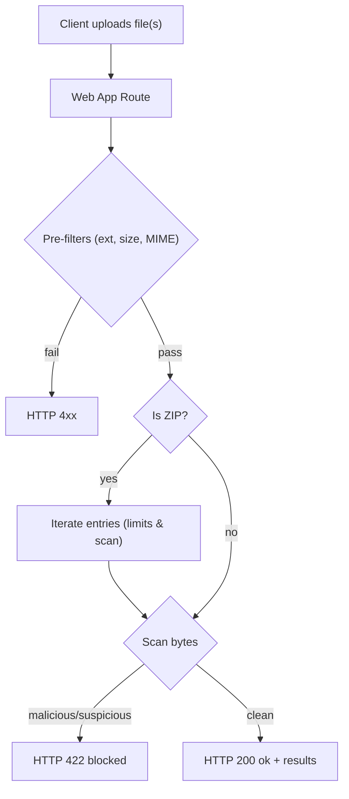

<div align="center">

<picture>
  <source media="(prefers-color-scheme: dark)" srcset="https://raw.githubusercontent.com/pompelmi/pompelmi/refs/heads/main/assets/logo.svg">
  <source media="(prefers-color-scheme: light)" srcset="https://raw.githubusercontent.com/pompelmi/pompelmi/refs/heads/main/assets/logo.svg">
  
</picture>

<h1>pompelmi</h1>

<p><strong>Secure file upload scanning for Node.js — private, in-process, zero cloud dependencies.</strong></p>

<p>
  Scan files <em>before</em> they touch disk &nbsp;•&nbsp;
  No cloud APIs, no daemon &nbsp;•&nbsp;
  TypeScript-first &nbsp;•&nbsp;
  Drop-in framework adapters
</p>

<p>
  <a href="https://www.npmjs.com/package/pompelmi"></a>
  <a href="https://www.npmjs.com/package/pompelmi"></a>
  <a href="https://github.com/pompelmi/pompelmi/blob/main/LICENSE"></a>
  
  <a href="https://github.com/pompelmi/pompelmi/actions/workflows/ci.yml"></a>
  <a href="https://codecov.io/gh/pompelmi/pompelmi"></a>
  
  
  <a href="https://snyk.io/test/github/pompelmi/pompelmi"></a>
  <a href="https://securityscorecards.dev/viewer/?uri=github.com/pompelmi/pompelmi"></a>
</p>

<p>
  <a href="https://pompelmi.github.io/pompelmi/"><strong>📚 Docs</strong></a> &nbsp;•&nbsp;
  <a href="#-installation"><strong>💾 Install</strong></a> &nbsp;•&nbsp;
  <a href="#-quickstart"><strong>⚡ Quickstart</strong></a> &nbsp;•&nbsp;
  <a href="#-framework-adapters"><strong>🧩 Adapters</strong></a> &nbsp;•&nbsp;
  <a href="#-yara"><strong>🧬 YARA</strong></a> &nbsp;•&nbsp;
  <a href="#-github-action"><strong>🤖 CI/CD</strong></a> &nbsp;•&nbsp;
  <a href="./examples/"><strong>💡 Examples</strong></a>
</p>

</div>

---

## Why pompelmi?

Most upload handlers check the file extension and content-type header — and stop there. Real threats arrive as ZIP bombs, polyglot files, macro-embedded documents, and files with spoofed MIME types.

**pompelmi scans file bytes in-process, before anything is written to disk or stored**, blocking threats at the earliest possible point — with no cloud API and no daemon.

|  | pompelmi | ClamAV | Cloud AV APIs |
|---|---|---|---|
| **Setup** | `npm install` | Daemon + config | API keys + integration |
| **Privacy** | ✅ In-process — data stays local | ✅ Local (separate daemon) | ❌ Files sent externally |
| **Latency** | ✅ Zero (no IPC, no network) | IPC overhead | Network round-trip |
| **Cost** | Free (MIT) | Free (GPL) | Per-scan billing |
| **Framework adapters** | ✅ Express, Koa, Next.js, NestJS, Fastify | ❌ | ❌ |
| **TypeScript** | ✅ First-class | community types | varies |
| **YARA** | ✅ Built-in | manual setup | limited |

---

## 📦 Installation

```bash
npm install pompelmi
```

> Node.js 18+. No daemon, no config files, no API keys required.

---

## ⚡ Quickstart

Scan a file and get a verdict in three lines:

```ts
import { scanFile } from 'pompelmi';

const result = await scanFile('path/to/upload.pdf');
// result.verdict → "clean" | "suspicious" | "malicious"

if (result.verdict !== 'clean') {
  throw new Error(`Blocked: ${result.verdict} — ${result.reasons}`);
}
```

Works standalone in any Node.js context — no framework required.

---

## 🎬 Demo


**Try it now:** browse the [examples/](./examples/) directory or run a sample locally:

```bash
npx tsx examples/scan-one-file.ts
```

---

## Why developers choose pompelmi

- **Privacy-first** — all scanning is in-process; no bytes leave your infrastructure, ever.
- **No daemon, no sidecar** — install like any npm package and start scanning immediately.
- **Blocks early** — runs before you write to disk, persist to storage, or pass files to other services.
- **Defense-in-depth** — magic-byte MIME sniffing, extension allow-lists, size caps, ZIP bomb guards, polyglot detection.
- **Composable** — chain heuristics, YARA rules, and custom scanners with `composeScanners`. Set `stopOn` and per-scanner timeouts.
- **Framework-friendly** — drop-in middleware for Express, Koa, Next.js, NestJS, Nuxt/Nitro, and Fastify.
- **TypeScript-first** — complete types, modern ESM/CJS builds, tree-shakeable, minimal core dependencies.
- **CI/CD ready** — GitHub Action to scan files and artifacts in pipelines.

---

## 🧩 Framework adapters

All adapters share the same policy options and scanning contract. Install only what you need.

| Framework | Package | Status |
|---|---|---|
| **Express** | `@pompelmi/express-middleware` | ✅ Stable |
| **Next.js** | `@pompelmi/next-upload` | ✅ Stable |
| **Koa** | `@pompelmi/koa-middleware` | ✅ Stable |
| **NestJS** | `@pompelmi/nestjs-integration` | ✅ Stable |
| **Nuxt / Nitro** | built-in `pompelmi` | ✅ [Guide](https://pompelmi.github.io/pompelmi/how-to/nuxt-nitro/) |
| **Fastify** | `@pompelmi/fastify-plugin` | 🔶 Alpha |
| **Remix / SvelteKit / hapi** | — | 🔜 Planned |

```bash
npm i @pompelmi/express-middleware    # Express
npm i @pompelmi/next-upload           # Next.js
npm i @pompelmi/koa-middleware        # Koa
npm i @pompelmi/nestjs-integration    # NestJS
npm i @pompelmi/fastify-plugin        # Fastify (alpha)
npm i -g @pompelmi/cli                # CLI / CI/CD
```

### Express

```ts
import express from 'express';
import multer from 'multer';
import { createUploadGuard } from '@pompelmi/express-middleware';
import { scanner, policy } from './lib/security';

const app = express();
app.post(
  '/upload',
  multer({ storage: multer.memoryStorage() }).any(),
  createUploadGuard({ ...policy, scanner }),
  (req, res) => res.json({ verdict: (req as any).pompelmi?.verdict })
);
```

### Next.js App Router

```ts
// app/api/upload/route.ts
import { createNextUploadHandler } from '@pompelmi/next-upload';
import { scanner, policy } from '@/lib/security';

export const runtime = 'nodejs';
export const POST = createNextUploadHandler({ ...policy, scanner });
```

### NestJS

```ts
// app.module.ts
import { PompelmiModule } from '@pompelmi/nestjs-integration';
import { CommonHeuristicsScanner } from 'pompelmi';

@Module({
  imports: [
    PompelmiModule.forRoot({
      includeExtensions: ['pdf', 'zip', 'png', 'jpg'],
      maxFileSizeBytes: 10 * 1024 * 1024,
      scanners: [CommonHeuristicsScanner],
    }),
  ],
})
export class AppModule {}
```

> 📖 **More examples:** Check the [examples/](./examples/) directory for complete working demos including Koa, Nuxt/Nitro, standalone, and more.

👉 **[View all adapter docs →](https://pompelmi.github.io/pompelmi/)** &nbsp;&nbsp; **[Browse all examples →](./examples/)**

---

## 🧱 Composing scanners

Build a layered scanner with heuristics, ZIP bomb protection, and optional YARA:

```ts
import { CommonHeuristicsScanner, createZipBombGuard, composeScanners } from 'pompelmi';

export const scanner = composeScanners(
  [
    ['zipGuard',   createZipBombGuard({ maxEntries: 512, maxCompressionRatio: 12 })],
    ['heuristics', CommonHeuristicsScanner],
    // ['yara',    YourYaraScanner],
  ],
  { parallel: false, stopOn: 'suspicious', timeoutMsPerScanner: 1500, tagSourceName: true }
);
```

`composeScanners` supports two call forms:
- **Named array** *(recommended)*: `composeScanners([['name', scanner], ...], opts?)`
- **Variadic** *(backward-compatible)*: `composeScanners(scannerA, scannerB, ...)`

### Upload flow


```mermaid
flowchart TD
  A["Client uploads file(s)"] --> B["Web App Route"]
  B --> C{"Pre-filters (ext, size, MIME)"}
  C -- fail --> X["HTTP 4xx"]
  C -- pass --> D{"Is ZIP?"}
  D -- yes --> E["Iterate entries (limits & scan)"]
  E --> F{"Verdict?"}
  D -- no --> F{"Scan bytes"}
  F -- malicious/suspicious --> Y["HTTP 422 blocked"]
  F -- clean --> Z["HTTP 200 ok + results"]
```

---

## ⚙️ Configuration

All adapters accept the same options:

| Option | Type | Description |
|---|---|---|
| `scanner` | `{ scan(bytes: Uint8Array): Promise<Match[]> }` | Your scanning engine. Return `[]` for clean. |
| `includeExtensions` | `string[]` | Allowed file extensions (case-insensitive). |
| `allowedMimeTypes` | `string[]` | Allowed MIME types after magic-byte sniffing. |
| `maxFileSizeBytes` | `number` | Per-file size cap; oversized files are rejected early. |
| `timeoutMs` | `number` | Per-file scan timeout. |
| `concurrency` | `number` | Max files scanned in parallel. |
| `failClosed` | `boolean` | Block uploads on scanner errors or timeouts. |
| `onScanEvent` | `(event) => void` | Hook for logging and metrics. |

**Example — images only, 5 MB max:**

```ts
{
  includeExtensions: ['png', 'jpg', 'jpeg', 'webp'],
  allowedMimeTypes: ['image/png', 'image/jpeg', 'image/webp'],
  maxFileSizeBytes: 5 * 1024 * 1024,
  failClosed: true,
}
```

---

## 📦 Import entrypoints

pompelmi ships multiple named entrypoints so you only bundle what you need:

| Entrypoint | Import | Environment | What it includes |
|---|---|---|---|
| **Default (Node.js)** | `import ... from 'pompelmi'` | Node.js | Full API — HIPAA, cache, threat-intel, ZIP streaming, YARA |
| **Browser-safe** | `import ... from 'pompelmi/browser'` | Browser / bundler | Core scan API, scanners, policy — no Node.js built-ins |
| **React** | `import ... from 'pompelmi/react'` | Browser / React | All browser-safe + `useFileScanner` hook (peer: react ≥18) |
| **Quarantine** | `import ... from 'pompelmi/quarantine'` | Node.js | Quarantine lifecycle — hold/review/promote/delete |
| **Hooks** | `import ... from 'pompelmi/hooks'` | Both | `onScanStart`, `onScanComplete`, `onThreatDetected`, `onQuarantine` |
| **Audit** | `import ... from 'pompelmi/audit'` | Node.js | Structured NDJSON audit trail for compliance/SIEM |
| **Policy packs** | `import ... from 'pompelmi/policy-packs'` | Both | Named pre-configured policies (`documents-only`, `images-only`, …) |

---

## 🔒 Policy packs

Named, pre-configured policies for common upload scenarios:

```ts
import { POLICY_PACKS, getPolicyPack } from 'pompelmi/policy-packs';

// Use a built-in pack:
const policy = POLICY_PACKS['strict-public-upload'];

// Or retrieve by name:
const policy = getPolicyPack('documents-only');
```

| Pack | Extensions | Max size | Best for |
|---|---|---|---|
| `documents-only` | PDF, Word, Excel, PowerPoint, CSV, TXT, MD | 25 MB | Document portals, data import |
| `images-only` | JPEG, PNG, GIF, WebP, AVIF, TIFF | 10 MB | Avatars, product images (SVG excluded) |
| `strict-public-upload` | JPEG, PNG, WebP, PDF only | 5 MB | Anonymous/untrusted upload surfaces |
| `conservative-default` | ZIP, images, PDF, CSV, DOCX, XLSX | 10 MB | General hardened default |
| `archives` | ZIP, tar, gz, 7z, rar | 100 MB | Archive endpoints (pair with `createZipBombGuard`) |

All packs are built on `definePolicy` and are fully overridable.

---

## 🗄️ Quarantine workflow

Hold suspicious files for manual review before accepting or permanently deleting them.

```ts
import { scanBytes } from 'pompelmi';
import { QuarantineManager, FilesystemQuarantineStorage } from 'pompelmi/quarantine';

// One-time setup — store quarantined files locally.
const quarantine = new QuarantineManager({
  storage: new FilesystemQuarantineStorage({ dir: './quarantine' }),
});

// In your upload handler:
const report = await scanBytes(fileBytes, { ctx: { filename: 'upload.pdf' } });

if (report.verdict !== 'clean') {
  const entry = await quarantine.quarantine(fileBytes, report, {
    originalName: 'upload.pdf',
    sizeBytes: fileBytes.length,
    uploadedBy: req.user?.id,
  });
  return res.status(202).json({ quarantineId: entry.id });
}
```

**Review API:**

```ts
// List pending entries:
const pending = await quarantine.listPending();

// Approve (promote to storage):
await quarantine.resolve(entryId, { decision: 'promote', reviewedBy: 'ops-team' });

// Delete permanently:
await quarantine.resolve(entryId, { decision: 'delete', reviewedBy: 'ops-team', reviewNote: 'Confirmed malware' });

// Generate an audit report:
const report = await quarantine.report({ status: 'pending' });
```

The `QuarantineStorage` interface is pluggable — implement it for S3, GCS, a database, or any other backend.  `FilesystemQuarantineStorage` is the local reference implementation.

---

## 🪝 Scan hooks

Observe the scan lifecycle without modifying the pipeline:

```ts
import { scanBytes } from 'pompelmi';
import { createScanHooks, withHooks } from 'pompelmi/hooks';

const hooks = createScanHooks({
  onScanComplete(ctx, report) {
    metrics.increment('scans.total');
    metrics.histogram('scan.duration_ms', report.durationMs ?? 0);
  },
  onThreatDetected(ctx, report) {
    alerting.notify({ file: ctx.filename, verdict: report.verdict });
  },
  onScanError(ctx, error) {
    logger.error({ file: ctx.filename, error });
  },
});

// Wrap your scan function once, then use it everywhere:
const scan = withHooks(scanBytes, hooks);
const report = await scan(fileBytes, { ctx: { filename: 'upload.zip' } });
```

---

## 🔍 Audit trail

Write a structured NDJSON audit record for every scan and quarantine event:

```ts
import { AuditTrail } from 'pompelmi/audit';

const audit = new AuditTrail({
  output: { dest: 'file', path: './audit.jsonl' },
});

// After each scan:
audit.logScanComplete(report, { filename: 'upload.pdf', uploadedBy: req.user?.id });

// After quarantine:
audit.logQuarantine(entry);

// After resolution:
audit.logQuarantineResolved(entry);
```

Each record is a single JSON line with `timestamp`, `event`, `verdict`, `matchCount`, `durationMs`, `sha256`, and more — ready for your SIEM or compliance tools.

---

## ✅ Production checklist
- [ ] Set `maxFileSizeBytes` — reject oversized files before scanning.
- [ ] Restrict `includeExtensions` and `allowedMimeTypes` to what your app truly needs (or use a [policy pack](#-policy-packs)).
- [ ] Set `failClosed: true` to block uploads on timeouts or scanner errors.
- [ ] Enable deep ZIP inspection; keep nesting depth low.
- [ ] Use `composeScanners` with `stopOn` to fail fast on early detections.
- [ ] Log scan events with [scan hooks](#-scan-hooks) and monitor for anomaly spikes.
- [ ] Wire up the [quarantine workflow](#-quarantine-workflow) for suspicious files rather than silently dropping them.
- [ ] Write an [audit trail](#-audit-trail) for compliance and incident response.
- [ ] Consider running scans in a separate process or container for defense-in-depth.
- [ ] Sanitize file names and paths before persisting uploads.
- [ ] Keep files in memory until policy passes — avoid writing untrusted bytes to disk first.

---

## 🧬 YARA

YARA lets you write custom pattern-matching rules and use them as a scanner engine. pompelmi treats YARA matches as signals you map to verdicts (`suspicious`, `malicious`).

> **Optional.** pompelmi works without YARA. Add it when you need custom detection rules.

### Minimal adapter

```ts
export const MyYaraScanner = {
  async scan(bytes: Uint8Array) {
    const matches = await compiledRules.scan(bytes, { timeout: 1500 });
    return matches.map(m => ({ rule: m.rule, meta: m.meta ?? {}, tags: m.tags ?? [] }));
  }
};
```

Plug it into your composed scanner:

```ts
import { composeScanners, CommonHeuristicsScanner } from 'pompelmi';

export const scanner = composeScanners(
  [
    ['heuristics', CommonHeuristicsScanner],
    ['yara',       MyYaraScanner],
  ],
  { parallel: false, stopOn: 'suspicious', timeoutMsPerScanner: 1500, tagSourceName: true }
);
```

Starter rules for common threats (EICAR, PDF-embedded JS, Office macros) are in [`rules/starter/`](./rules/).

**Suggested verdict mapping:**
- `malicious` — high-confidence rules (e.g., `EICAR_Test_File`)
- `suspicious` — heuristic rules (e.g., PDF JavaScript, macro keywords)
- `clean` — no matches

### Quick smoke test

```bash
# Create a minimal PDF with risky embedded actions
printf '%%PDF-1.7\n1 0 obj\n<< /OpenAction 1 0 R /AA << /JavaScript (alert(1)) >> >>\nendobj\n%%%%EOF\n' > risky.pdf

# Send it to your endpoint — expect HTTP 422
curl -F "file=@risky.pdf;type=application/pdf" http://localhost:3000/upload -i
```

👉 **[Full YARA guide in docs →](https://pompelmi.github.io/pompelmi/)**

---

## 🤖 GitHub Action

Scan files or build artifacts in CI with a single step:

```yaml
- uses: pompelmi/pompelmi/.github/actions/pompelmi-scan@v1
  with:
    path: .
    deep_zip: true
    fail_on_detect: true
```

| Input | Default | Description |
|---|---|---|
| `path` | `.` | Directory to scan. |
| `artifact` | `""` | Single file or archive to scan. |
| `yara_rules` | `""` | Glob path to `.yar` rule files. |
| `deep_zip` | `true` | Traverse nested archives. |
| `max_depth` | `3` | Max nesting depth. |
| `fail_on_detect` | `true` | Fail the job on any detection. |

---

## 💡 Use cases

- **Document upload portals** — verify PDFs, DOCX files, and archives before storage.
- **User-generated content platforms** — block malicious images, scripts, or embedded payloads.
- **Internal tooling and wikis** — protect collaboration tools from lateral-movement attacks.
- **Privacy-sensitive environments** — healthcare, legal, and finance platforms where files must stay on-prem.
- **CI/CD pipelines** — catch malicious artifacts before they enter your build or release chain.

---

## 🏢 Pompelmi Enterprise

> The open-source `pompelmi` core is **MIT-licensed and always will be** — actively maintained, freely available, no strings attached. Enterprise is a drop-in commercial plugin for teams that need compliance evidence, production observability, and operational tooling on top.

### What Enterprise adds

| Feature | Core (Free, MIT) | Enterprise |
|---|---|---|
| File scanning, heuristics, YARA | ✅ | ✅ |
| Framework adapters (Express, Next.js, NestJS…) | ✅ | ✅ |
| Quarantine workflow | ✅ | ✅ |
| Basic NDJSON audit trail | ✅ | ✅ |
| Policy packs & scan hooks | ✅ | ✅ |
| **SIEM-compatible structured audit logs** | — | ✅ |
| **Prometheus / Grafana metrics endpoint** | — | ✅ |
| **Embedded Web GUI dashboard** | — | ✅ |
| **Priority support & response SLA** | — | ✅ |

### Who it's for

- **Compliance teams** — produce tamper-evident, structured audit archives that satisfy SOC 2, HIPAA, ISO 27001, and PCI-DSS evidence requirements without exporting file bytes to any external service.
- **Security operations** — expose a live Prometheus metrics endpoint (blocked files, YARA hit rate, scan latency p99) and feed it directly into your existing Grafana dashboards.
- **Platform / DevSecOps teams** — spin up a zero-config local web GUI to monitor upload scan activity across deployments. No SaaS, no data egress, no configuration files.

### Drop-in integration (30 seconds)

```bash
npm install @myusername/pompelmi-enterprise
```

```ts
import { scanBytes } from 'pompelmi';
import { withEnterprise } from '@myusername/pompelmi-enterprise';

// Wraps your existing scan function — same API, enterprise features layered on top.
const scan = withEnterprise(scanBytes, {
  audit:     { dest: 'file', path: '/var/log/pompelmi/audit.jsonl' },
  metrics:   { endpoint: '/metrics' },   // Prometheus-scrape endpoint
  dashboard: { port: 4000 },             // Web GUI → http://localhost:4000
});

// Use exactly as before — no changes to the rest of your code.
const report = await scan(fileBytes, { ctx: { filename: 'upload.pdf' } });
```

<div align="center">

[](https://buy.polar.sh/polar_cl_sTQdCkfdsz6D0lyLRIKKB7MJCnmBm6mfsOmTr2l2fqn)

**[View full feature comparison and pricing →](https://pompelmi.github.io/pompelmi/enterprise)**

</div>

---

## 🔒 Security

- pompelmi **reads** bytes — it never executes uploaded files.
- ZIP scanning enforces entry count, per-entry size, total uncompressed size, and nesting depth limits to guard against archive bombs.
- YARA detection quality depends on the rules you provide; tune them to your threat model.
- For defense-in-depth, consider running scans in a separate process or container.
- **Changelog / releases:** [GitHub Releases](https://github.com/pompelmi/pompelmi/releases).
- **Vulnerability disclosure:** [GitHub Security Advisories](https://github.com/pompelmi/pompelmi/security/advisories). We coordinate a fix before public disclosure.

---

## 🏆 Recognition

Featured in:

- [HelpNet Security](https://www.helpnetsecurity.com/2026/02/02/pompelmi-open-source-secure-file-upload-scanning-node-js/)
- [Stack Overflow Blog](https://stackoverflow.blog/2026/02/23/defense-against-uploads-oss-file-scanner-pompelmi/)
- [Node Weekly #594](https://nodeweekly.com/issues/594)
- [Bytes Newsletter #429](https://bytes.dev/archives/429)
- [Detection Engineering Weekly #124](https://www.detectionengineering.net/p/det-eng-weekly-issue-124-the-defcon)
- [daily.dev](https://app.daily.dev/posts/pompelmi)

<p align="center">
  <a href="https://github.com/sorrycc/awesome-javascript"></a>
  <a href="https://github.com/dzharii/awesome-typescript"></a>
  <a href="https://github.com/sbilly/awesome-security"></a>
  <a href="https://github.com/sindresorhus/awesome-nodejs"></a>
</p>

<!-- MENTIONS:START -->
<!-- MENTIONS:END -->

---

## 💬 FAQ

**Does pompelmi send files to third parties?**
No. All scanning runs in-process inside your Node.js application. No bytes leave your infrastructure.

**Does it require a daemon or external service?**
No. Install it like any npm package — no daemon, no sidecar, no config files to write.

**Can I use YARA rules?**
Yes. Wrap your YARA engine behind the `{ scan(bytes) }` interface and pass it to `composeScanners`. Starter rules are in [`rules/starter/`](./rules/).

**Does it work with my framework?**
Stable adapters exist for Express, Koa, Next.js, and NestJS. A Fastify plugin is in alpha. The core library works standalone with any Node.js server.

**Why 422 for blocked files?**
It's a common convention that keeps policy violations distinct from transport errors. Use whatever HTTP status code fits your API contract.

**Are ZIP bombs handled?**
Yes. Archive scanning enforces limits on entry count, per-entry size, total uncompressed size, and nesting depth. Use `failClosed: true` in production.

**Is commercial support available?**
Yes. Limited async support for integration help, configuration review, and troubleshooting is available from the maintainer. Email [pompelmideveloper@yahoo.com](mailto:pompelmideveloper@yahoo.com).

---

## 💼 Commercial support

Limited commercial support is available on a **private, asynchronous, best-effort basis** from the maintainer. This may include:

- Integration assistance
- Configuration and policy review
- Prioritized troubleshooting
- Upload security guidance

Support is in writing only — no live calls or real-time support.

**To inquire**, email [pompelmideveloper@yahoo.com](mailto:pompelmideveloper@yahoo.com) with your framework, Node.js version, pompelmi version, and a short description of your goal or issue.

> Community support (GitHub Issues and Discussions) remains free and open. For vulnerability disclosure, see [SECURITY.md](./SECURITY.md).

---

## 🤝 Contributing

PRs and issues are welcome.

```bash
pnpm -r build
pnpm -r lint
pnpm vitest run --coverage --passWithNoTests
```

See [CONTRIBUTING.md](./CONTRIBUTING.md) for full guidelines.

<p align="center">
  <a href="https://github.com/pompelmi/pompelmi/graphs/contributors">
    
  </a>
</p>

<p align="center">
  <a href="https://github.com/sponsors/pompelmi">
    
  </a>
</p>

---

## 🌍 Translations

[🇮🇹 Italian](docs/i18n/README.it.md) • [🇫🇷 French](docs/i18n/README.fr.md) • [🇪🇸 Spanish](docs/i18n/README.es.md) • [🇩🇪 German](docs/i18n/README.de.md) • [🇯🇵 Japanese](docs/i18n/README.ja.md) • [🇨🇳 Chinese](docs/i18n/README.zh-CN.md) • [🇰🇷 Korean](docs/i18n/README.ko.md) • [🇧🇷 Portuguese](docs/i18n/README.pt-BR.md) • [🇷🇺 Russian](docs/i18n/README.ru.md) • [🇹🇷 Turkish](docs/i18n/README.tr.md)

The English README is the authoritative source. Contributions to translations are welcome via PR.

---

<p align="right"><a href="#pompelmi">↑ Back to top</a></p>

## 📜 License

[MIT](./LICENSE) © 2025–present pompelmi contributors
