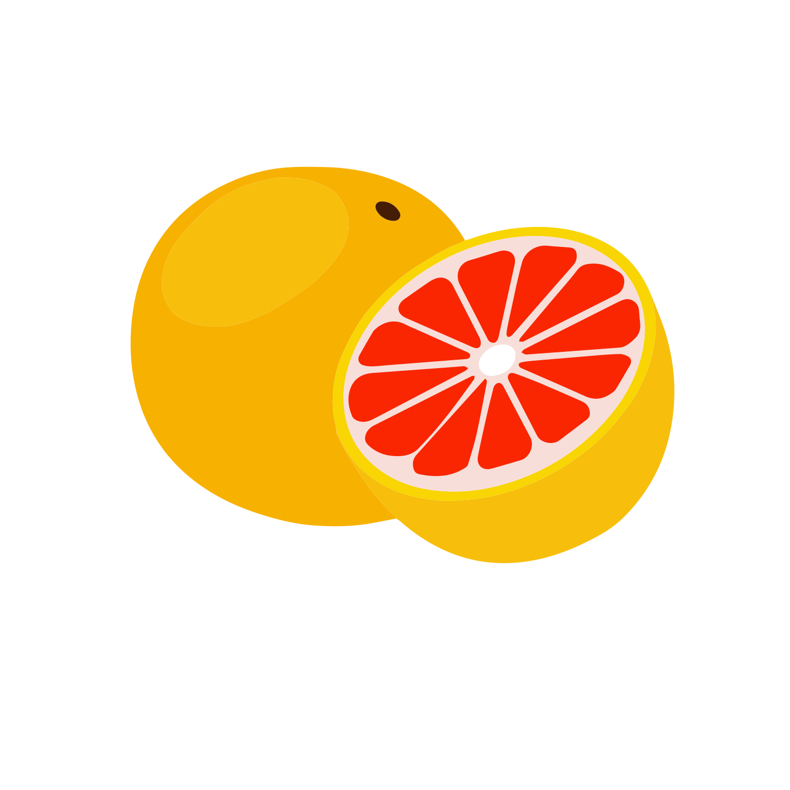

<div align="center">
  
  <h1>Pompelmi — in-process file upload security for Node.js</h1>
  <p>Scan and block risky uploads before storage — no cloud API, no daemon, no required data egress.</p>
  <p>
    <a href="https://www.npmjs.com/package/pompelmi"></a>
    <a href="https://github.com/pompelmi/pompelmi/actions/workflows/ci.yml"></a>
    <a href="https://codecov.io/gh/pompelmi/pompelmi"></a>
    <a href="https://github.com/pompelmi/pompelmi/stargazers"></a>
    <a href="https://www.npmjs.com/package/pompelmi"></a>
  </p>
  <p>
    <a href="https://github.com/sorrycc/awesome-javascript"></a>
    <a href="https://github.com/dzharii/awesome-typescript"></a>
    <a href="https://nodeweekly.com/issues/594"></a>
    <a href="https://bytes.dev/archives/429"></a>
  </p>
  <p>
    <a href="https://www.detectionengineering.net/p/det-eng-weekly-issue-124-the-defcon"></a>
    <a href="https://stackoverflow.blog/2026/02/23/defense-against-uploads-oss-file-scanner-pompelmi/"></a>
    <a href="https://stackoverflow.blog/newsletter/issue-319-dogfooding-your-sdlc/"></a>
    <a href="https://www.helpnetsecurity.com/2026/02/02/pompelmi-open-source-secure-file-upload-scanning-node-js/"></a>
  </p>
</div>

> **Why:** Upload endpoints are part of your attack surface. Pompelmi inspects untrusted files _before_ they hit storage or downstream processors.
> **How:** in-process scanning + policy packs (MIME sniffing, archive abuse checks, risky structures) with optional YARA.
> **Works with:** Express, Next.js, NestJS, Fastify, Koa (plus adapters in `packages/`).

## Demo


## Install

```bash
npm install pompelmi
```

Requires Node.js 18+.

## Try in 5 minutes

1. Install:

```bash
npm install pompelmi
```

2. Create `scan-test.mjs`:

```js
import { scanBytes } from "pompelmi";
import { readFileSync } from "node:fs";

const buffer = readFileSync("./package.json");

const report = await scanBytes(buffer, {
  filename: "package.json",
  mimeType: "application/json",
});

console.log("Verdict:", report.verdict);
console.log("Reasons:", report.reasons);
console.log("Duration:", report.durationMs, "ms");
```

3. Run it:

```bash
node scan-test.mjs
```

Next: see the demo under [examples/demo](./examples/demo) (upload route) or the docs [Getting started](https://pompelmi.github.io/pompelmi/getting-started/) guide.

## Quick Start

```ts
import { scanBytes, STRICT_PUBLIC_UPLOAD } from "pompelmi";

const report = await scanBytes(file.buffer, {
  filename: file.originalname,
  mimeType: file.mimetype,
  policy: STRICT_PUBLIC_UPLOAD,
  failClosed: true,
});

if (report.verdict !== "clean") {
  return res.status(422).json({
    error: "Upload blocked",
    verdict: report.verdict,
    reasons: report.reasons,
  });
}
```

## Next steps

- [Documentation](https://pompelmi.github.io/pompelmi/)
- [Examples index](./examples/README.md)
- [Demo example](./examples/demo)
- [Contributing](./CONTRIBUTING.md)
- [Security](./SECURITY.md)
- [Roadmap](./ROADMAP.md)

## What Problem It Solves

Upload endpoints are part of your attack surface. A renamed executable, a risky PDF, or a hostile archive can look harmless until it is stored, unpacked, served, or parsed by another system.

Pompelmi adds checks at the upload boundary for:

- MIME spoofing and magic-byte mismatches
- Archive abuse such as ZIP bombs, traversal, and deep nesting
- Polyglot files and risky document structures
- Optional YARA-based signature matching

The goal is simple: inspect first, store later.

## Why This Shape

- Plain Markdown, readable in GitHub and in a terminal
- Fast path first: install, example, then deeper links
- Minimal top-level detail, with docs and examples for everything else

## Ecosystem

- `pompelmi`
- `@pompelmi/express-middleware`
- `@pompelmi/koa-middleware`
- `@pompelmi/next-upload`
- `@pompelmi/nestjs-integration`
- `@pompelmi/fastify-plugin`
- `@pompelmi/ui-react`
- `@pompelmi/cli`

## Repository Layout

- `src/` core library
- `packages/` framework adapters and supporting packages
- `examples/` runnable examples
- `tests/` test coverage
- `website/` documentation site

## Development

```bash
pnpm install
pnpm test
pnpm build
```

<!-- MENTIONS:START -->

## 🌟 Featured In

*Last updated: March 20, 2026*

### 📋 Awesome Lists & Curated Collections

- [Awesome JavaScript](https://github.com/sorrycc/awesome-javascript) — sorrycc
- [Awesome TypeScript](https://github.com/dzharii/awesome-typescript) — dzharii

### 📰 Newsletters & Roundups

- [The Overflow Issue 319: Dogfooding your SDLC](https://stackoverflow.blog/newsletter/issue-319-dogfooding-your-sdlc/) — Stack Overflow (2026-03-04)
- [Hottest cybersecurity open-source tools of the month: February 2026](https://www.helpnetsecurity.com/2026/02/26/hottest-cybersecurity-open-source-tools-of-the-month-february-2026/) — Help Net Security (2026-02-26)
- [Bytes #429](https://bytes.dev/archives/429) — Bytes (2025-10-03)
- [Node Weekly Issue 594](https://nodeweekly.com/issues/594) — Node Weekly (2025-09-30)
- [Det. Eng. Weekly Issue #124 - The DEFCON hangover is real](https://www.detectionengineering.net/p/det-eng-weekly-issue-124-the-defcon) — Detection Engineering (2025-08-13)

### 🔗 Other Mentions

- [Defense against uploads: Q&A with OSS file scanner, pompelmi](https://stackoverflow.blog/2026/02/23/defense-against-uploads-oss-file-scanner-pompelmi/) — Stack Overflow (2026-02-23)
- [Pompelmi: Open-source secure file upload scanning for Node.js](https://www.helpnetsecurity.com/2026/02/02/pompelmi-open-source-secure-file-upload-scanning-node-js/) — Help Net Security (2026-02-02)


*Found 9 mentions. To update, run `npm run mentions:update`.*

<!-- MENTIONS:END -->

## License

[MIT](./LICENSE)
