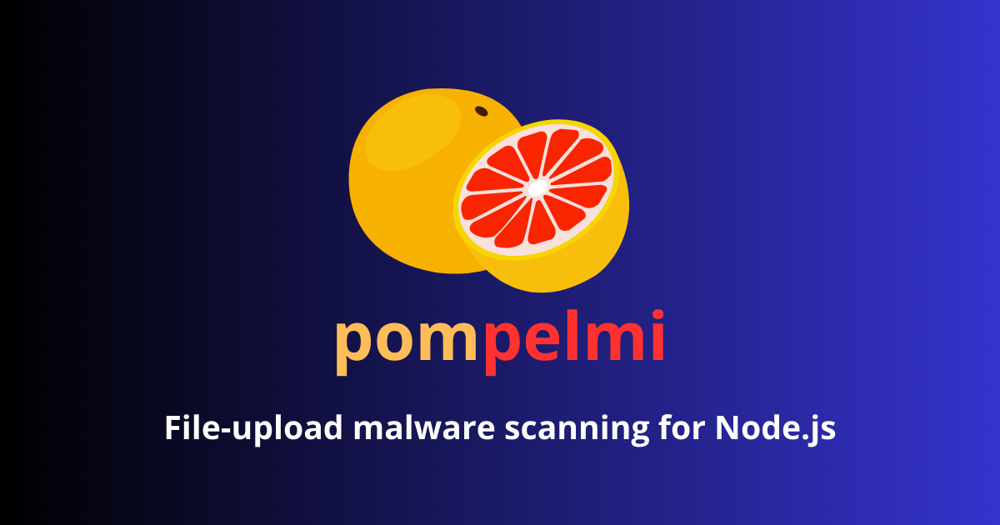

# Pompelmi

[](https://github.com/pompelmi/pompelmi/stargazers)
[](https://www.npmjs.com/package/pompelmi)
[](https://github.com/pompelmi/pompelmi/actions/workflows/ci.yml)

In-process file upload security for Node.js.

Your file upload endpoint is part of your attack surface.

Pompelmi is an open-source Node.js library that scans and blocks risky uploads before they hit storage or downstream processing. It runs in-process, with no cloud API, no daemon, and no required data egress.

Works with Express, Next.js, NestJS, Fastify, and Koa. The MIT-licensed core is the primary path in this repo.

## Why this matters

Most upload handlers stop at extension checks or client-provided MIME types. That leaves gaps for spoofed files, archive bombs, polyglots, and script-bearing documents.

Without Pompelmi:

`upload -> trust filename/MIME -> store -> parse or serve later`

With Pompelmi:

`upload -> inspect bytes + structure -> allow | quarantine | reject -> store/process`

## Key protections

- Extension, size, and declared MIME policy checks.
- Magic-byte validation for renamed or disguised files.
- Archive controls for ZIP bombs, traversal, and nesting depth.
- Heuristics for risky structures such as executables, polyglots, and script-bearing documents.
- Optional YARA matching when you need signature-based rules.

## Quick start

```bash
npm install pompelmi
```

```ts
import { scanBytes, STRICT_PUBLIC_UPLOAD } from 'pompelmi';

const report = await scanBytes(file.buffer, {
  filename: file.originalname,
  mimeType: file.mimetype,
  policy: STRICT_PUBLIC_UPLOAD,
  failClosed: true,
});

if (report.verdict !== 'clean') {
  return res.status(422).json({ error: 'Upload blocked', reasons: report.reasons });
}
```

Next steps:

- [Getting started](https://pompelmi.github.io/pompelmi/getting-started/)
- [Framework guides](https://pompelmi.github.io/pompelmi/how-to/express/)
- [Threat model and architecture](https://pompelmi.github.io/pompelmi/explaination/architecture/)

## Framework support

| Framework | Package or guide |
| --- | --- |
| Express | `@pompelmi/express-middleware` |
| Next.js | `@pompelmi/next-upload` |
| NestJS | `@pompelmi/nestjs-integration` |
| Koa | `@pompelmi/koa-middleware` |
| Fastify | `@pompelmi/fastify-plugin` |
| Nuxt/Nitro | guide in docs |

## Trust / production readiness

- MIT-licensed core, typed APIs, framework adapters, and composable policy packs.
- Structured verdicts, reasons, and rule matches for logging, quarantine, and review flows.
- Public docs, examples, changelog, tests, and a security disclosure policy.
- Local-first deployment model with no required cloud scanning dependency.
- Built as a defense-in-depth upload gate, not a full antivirus replacement.

Start here:

- [Production readiness](https://pompelmi.github.io/pompelmi/production-readiness/)
- [Threat model and architecture](https://pompelmi.github.io/pompelmi/explaination/architecture/)
- [Examples directory](./examples)
- [Security policy](./SECURITY.md)
- [Tests](./tests)

## FAQ

### Does Pompelmi send files to a cloud API?

No. Scanning runs in-process by default. File bytes do not need to leave your infrastructure.

### Does it require ClamAV, a sidecar, or another daemon?

No. Built-in heuristics work without a daemon. ClamAV and YARA integrations are optional.

### What does it help block?

It adds a layered upload gate before storage or downstream processing. That helps catch spoofed files, archive bombs, polyglots, and common risky document structures.

### Is this a complete antivirus replacement?

No. Pompelmi is an upload security layer and risk-reduction control. It should sit inside a broader defense-in-depth design.

### Can it help in privacy-sensitive or regulated environments?

It can support internal control objectives by reducing upload risk and producing structured scan outcomes. It is not itself a compliance certification.

## Commercial / enterprise

Commercial support and enterprise options are available for teams that need rollout help, advanced auditability, or additional operational features. The open-source MIT core remains the default path. See [Support options](https://pompelmi.github.io/pompelmi/support/) and [`@pompelmi/enterprise`](https://pompelmi.github.io/pompelmi/enterprise/).

## License

MIT. See [LICENSE](./LICENSE). Also: [Docs](https://pompelmi.github.io/pompelmi/), [GitHub](https://github.com/pompelmi/pompelmi), [npm](https://www.npmjs.com/package/pompelmi).
