# Pompelmi Documentation

**Fast, Private, and Powerful File Malware Scanning for Node.js**

---

## Table of Contents

1. [Introduction & Architecture](#1-introduction--architecture)
2. [Open Source Integration (The Library)](#2-open-source-integration-the-library)
3. [Advanced Topics](#3-advanced-topics)

---

## 1. Introduction & Architecture

### Why Pompelmi Exists

Pompelmi is a **privacy-first file malware scanner** designed for modern Node.js and TypeScript applications. Unlike traditional antivirus solutions that require external daemons or send files to third-party cloud services, Pompelmi performs all scanning **in-process**, ensuring that:

- **Your files never leave your infrastructure** – Perfect for GDPR, HIPAA, and other privacy-critical compliance requirements
- **Zero network latency** – No API calls or external dependencies slow down your application
- **Full control** – Customize scanning rules, integrate with your existing stack, and deploy anywhere Node.js runs

Pompelmi is built for developers who need to:
- **Scan file uploads before they hit disk** – Prevent malicious files from ever being stored
- **Block threats at the edge** – Classify files as `clean`, `suspicious`, or `malicious` in real-time
- **Deploy on-premise or in the cloud** – Works on VMs, containers, Kubernetes, and serverless platforms

### Architecture Overview

Pompelmi uses a **composable scanner architecture** that allows you to chain multiple detection engines together. Here's how it works:

```mermaid
flowchart TB
    User["👤 User Upload"] --> Adapter["🔌 Framework Adapter<br/>(Express/Koa/Next.js)"]
    Adapter --> PreFilter["🛡️ Pre-Filters<br/>Extension/MIME/Size"]
    PreFilter --> Core["⚙️ Core Engine<br/>composeScanners()"]
    Core --> ZipGuard["📦 ZIP Bomb Guard"]
    Core --> Heuristics["🔍 Heuristics Scanner<br/>(PDF/Office/PE)"]
    Core --> YARA["🧬 YARA Engine<br/>(Optional)"]
    ZipGuard --> Verdict["✅ Verdict<br/>clean | suspicious | malicious"]
    Heuristics --> Verdict
    YARA --> Verdict
    Verdict --> Response["📨 Response to Client"]
    
    style User fill:#e1f5ff
    style Adapter fill:#fff4e6
    style PreFilter fill:#e8f5e9
    style Core fill:#f3e5f5
    style Verdict fill:#ffebee
    style Response fill:#e0f2f1
```



**Key Components:**

1. **Framework Adapters** – Drop-in middleware for Express, Koa, Next.js, and Fastify
2. **Pre-Filters** – Fast validation of file extensions, MIME types, and size limits
3. **Core Engine** – The `composeScanners()` function orchestrates multiple scanners
4. **Scanner Modules:**
   - **ZIP Bomb Guard** – Detects compression bombs, nested archives, and path traversal
   - **CommonHeuristicsScanner** – Pattern-based detection for PDFs, Office macros, PE headers
   - **YARA Engine** – Signature-based detection with custom rules (optional)
5. **Verdict System** – Returns a unified result: `clean`, `suspicious`, or `malicious`

---

## 2. Open Source Integration (The Library)

### Installation

#### Core Library

Install the core Pompelmi library via your preferred package manager:

```bash
# npm
npm install pompelmi

# pnpm
pnpm add pompelmi

# yarn
yarn add pompelmi

# bun
bun add pompelmi
```

#### Framework Adapters (Optional)

Choose the adapter for your framework:

```bash
# Express.js
npm install @pompelmi/express-middleware

# Koa
npm install @pompelmi/koa-middleware

# Next.js (App Router)
npm install @pompelmi/next-upload

# Fastify (alpha)
npm install @pompelmi/fastify-plugin
```

**Requirements:**
- Node.js 18+ or newer
- Optional: `multer` for file upload handling (Express/Koa)
- Optional: YARA CLI if using custom YARA rules

---

### Quick Start

#### Minimal Node.js Script

The simplest way to scan a file:

```typescript
import { scanFile } from 'pompelmi';

// Scan a file from disk
const result = await scanFile('path/to/suspicious-file.pdf');

console.log(result.verdict); // "clean" | "suspicious" | "malicious"
console.log(result.matches); // Array of matched rules (if any)
```

**Running the example:**

```bash
npx tsx examples/scan-one-file.ts ./samples/sample.txt
```

#### Core API: Scanning Raw Bytes

For more control, scan raw file bytes:

```typescript
import { scan } from 'pompelmi';
import { readFileSync } from 'fs';

const fileBytes = readFileSync('upload.pdf');
const result = await scan(fileBytes);

if (result.verdict === 'malicious') {
  console.error('Threat detected:', result.matches);
}
```

---

### Middleware Examples

#### Express.js with `@pompelmi/express-middleware`

Complete example with Express and Multer:

```typescript
import express from 'express';
import multer from 'multer';
import { createUploadGuard } from '@pompelmi/express-middleware';
import {
  CommonHeuristicsScanner,
  createZipBombGuard,
  composeScanners,
} from 'pompelmi';

// 1. Define your security policy
const policy = {
  includeExtensions: ['png', 'jpg', 'jpeg', 'pdf', 'zip', 'txt'],
  allowedMimeTypes: [
    'image/png',
    'image/jpeg',
    'application/pdf',
    'application/zip',
    'text/plain',
  ],
  maxFileSizeBytes: 20 * 1024 * 1024, // 20MB
  failClosed: true, // Block on scanner errors
};

// 2. Compose scanners (stops on first suspicious file)
const scanner = composeScanners(
  [
    [
      'zipGuard',
      createZipBombGuard({
        maxEntries: 512,
        maxTotalUncompressedBytes: 100 * 1024 * 1024, // 100MB
        maxCompressionRatio: 12,
      }),
    ],
    ['heuristics', CommonHeuristicsScanner],
    // Add YARA here: ['yara', createYaraScanner({ rulesPath: './rules/*.yar' })],
  ],
  {
    parallel: false, // Run scanners sequentially
    stopOn: 'suspicious', // Stop at first suspicious match
    timeoutMsPerScanner: 1500,
  }
);

// 3. Setup Express app
const app = express();
const upload = multer({
  storage: multer.memoryStorage(),
  limits: { fileSize: policy.maxFileSizeBytes },
});

// 4. Protect your upload endpoint
app.post(
  '/upload',
  upload.any(),
  createUploadGuard({ ...policy, scanner }),
  (req, res) => {
    // Scan result is attached to req.pompelmi
    const scan = (req as any).pompelmi ?? null;
    res.json({
      success: true,
      verdict: scan?.verdict,
      filesScanned: scan?.files.length,
    });
  }
);

app.listen(3000, () => {
  console.log('🚀 Server running on http://localhost:3000');
});
```

**Testing the endpoint:**

```bash
curl -X POST http://localhost:3000/upload \
  -F "file=@suspicious.pdf" \
  -H "Content-Type: multipart/form-data"
```

---

#### Next.js App Router with `@pompelmi/next-upload`

For Next.js 13+ (App Router), create an API route:

**File: `app/api/upload/route.ts`**

```typescript
import { NextResponse } from 'next/server';
import { createNextUploadHandler } from '@pompelmi/next-upload';
import {
  CommonHeuristicsScanner,
  createZipBombGuard,
  composeScanners,
} from 'pompelmi';

// Runtime configuration
export const runtime = 'nodejs';
export const dynamic = 'force-dynamic';

// Security policy
const policy = {
  includeExtensions: ['png', 'jpg', 'jpeg', 'pdf', 'zip'],
  allowedMimeTypes: [
    'image/png',
    'image/jpeg',
    'application/pdf',
    'application/zip',
  ],
  maxFileSizeBytes: 10 * 1024 * 1024, // 10MB
  stopOn: 'suspicious' as const,
  failClosed: true,
};

// Scanner composition
const scanner = composeScanners(
  [
    [
      'zipGuard',
      createZipBombGuard({
        maxEntries: 256,
        maxTotalUncompressedBytes: 50 * 1024 * 1024,
        maxCompressionRatio: 10,
      }),
    ],
    ['heuristics', CommonHeuristicsScanner],
  ],
  { parallel: false, stopOn: 'suspicious' }
);

// Export POST handler
export const POST = createNextUploadHandler({ ...policy, scanner });
```

**Frontend upload (React):**

```typescript
// app/upload/page.tsx
'use client';

import { useState } from 'react';

export default function UploadPage() {
  const [result, setResult] = useState<string | null>(null);

  const handleUpload = async (e: React.FormEvent<HTMLFormElement>) => {
    e.preventDefault();
    const formData = new FormData(e.currentTarget);

    const res = await fetch('/api/upload', {
      method: 'POST',
      body: formData,
    });

    const data = await res.json();
    setResult(data.verdict || data.error);
  };

  return (
    <div>
      <h1>File Upload</h1>
      <form onSubmit={handleUpload}>
        <input type="file" name="file" required />
        <button type="submit">Upload & Scan</button>
      </form>
      {result && <p>Result: {result}</p>}
    </div>
  );
}
```

---

### Configuration

Pompelmi provides extensive configuration options to tailor scanning to your security requirements.

#### Policy Options

```typescript
interface UploadGuardOptions {
  // File validation
  includeExtensions?: string[];      // e.g., ['pdf', 'png', 'jpg']
  allowedMimeTypes?: string[];       // e.g., ['application/pdf', 'image/png']
  maxFileSizeBytes?: number;         // e.g., 20 * 1024 * 1024 (20MB)

  // Scanning behavior
  scanner?: ScannerFn;               // Composed scanner function
  stopOn?: 'suspicious' | 'malicious'; // Stop scanning on this severity
  failClosed?: boolean;              // Block on scanner errors (default: true)
  
  // Performance
  timeoutMs?: number;                // Total scan timeout (default: 5000ms)
  concurrency?: number;              // Parallel file scans (default: 4)
  
  // Observability
  onScanEvent?: (event: ScanEvent) => void; // Callback for scan events
}
```

#### Key Options Explained

**`maxFileSizeBytes`**  
Maximum allowed file size in bytes. Files exceeding this limit are rejected **before** scanning.

```typescript
maxFileSizeBytes: 50 * 1024 * 1024, // 50MB limit
```

**`includeExtensions`**  
Whitelist of allowed file extensions (case-insensitive). Only files with these extensions will be processed.

```typescript
includeExtensions: ['pdf', 'docx', 'xlsx', 'png', 'jpg', 'jpeg', 'zip'],
```

**`allowedMimeTypes`**  
Whitelist of allowed MIME types. Pompelmi performs **server-side MIME sniffing** using magic bytes, not trusting client-provided Content-Type headers.

```typescript
allowedMimeTypes: [
  'application/pdf',
  'application/vnd.openxmlformats-officedocument.wordprocessingml.document',
  'image/png',
  'image/jpeg',
],
```

**`failClosed`**  
If `true` (default), unexpected scanner errors (e.g., YARA timeout, parse failure) result in a **block**. If `false`, errors are logged and files are allowed through (fail-open).

```typescript
failClosed: true, // Secure default: block on errors
```

**`stopOn`**  
Determines when to stop scanning:
- `'suspicious'` – Stop at the first suspicious match (faster, recommended)
- `'malicious'` – Continue until a malicious match is found

```typescript
stopOn: 'suspicious', // Most efficient for real-time scanning
```

**`onScanEvent`**  
Optional callback for observability. Useful for logging, metrics, and alerting.

```typescript
onScanEvent: (event) => {
  console.log('[SCAN]', {
    file: event.filename,
    verdict: event.verdict,
    duration: event.durationMs,
    matches: event.matches,
  });
  
  // Send to monitoring service
  if (event.verdict === 'malicious') {
    sendAlert(event);
  }
},
```

---

#### Scanner Composition

The `composeScanners()` function allows you to chain multiple scanners:

```typescript
import { composeScanners, CommonHeuristicsScanner, createZipBombGuard } from 'pompelmi';

const scanner = composeScanners(
  [
    ['zipBomb', createZipBombGuard({ maxEntries: 512 })],
    ['heuristics', CommonHeuristicsScanner],
    // Add more scanners here
  ],
  {
    parallel: false,           // Run sequentially (default)
    stopOn: 'suspicious',      // Stop at first suspicious result
    timeoutMsPerScanner: 1500, // Per-scanner timeout
    tagSourceName: true,       // Tag results with scanner name
  }
);
```

---

## 3. Advanced Topics

### YARA Rules Integration

YARA is a powerful pattern-matching engine for malware detection. Pompelmi supports YARA through the `@pompelmi/yara` package.

#### Installation

```bash
npm install @pompelmi/yara
```

**Prerequisites:**
- YARA CLI must be installed on your system
- Ubuntu/Debian: `sudo apt-get install yara`
- macOS: `brew install yara`
- Windows: Download from [YARA releases](https://github.com/VirusTotal/yara/releases)

#### Basic Usage

```typescript
import { createYaraScanner } from '@pompelmi/yara';
import { composeScanners, CommonHeuristicsScanner } from 'pompelmi';

const yaraScanner = createYaraScanner({
  rulesPath: ['./rules/*.yar', './rules/custom/**/*.yar'],
  yaraPath: 'yara', // Path to YARA binary (default: 'yara')
  timeoutMs: 2000,  // Per-scan timeout
  treatMatchAs: 'suspicious', // or 'malicious'
});

const scanner = composeScanners(
  [
    ['yara', yaraScanner],
    ['heuristics', CommonHeuristicsScanner],
  ],
  { stopOn: 'suspicious' }
);
```

#### Writing Custom YARA Rules

Create a `.yar` file in your `rules/` directory:

**File: `rules/custom-threats.yar`**

```yara
rule Suspicious_PDF_JavaScript
{
    meta:
        description = "Detects PDFs with embedded JavaScript"
        severity = "suspicious"
        author = "Your Name"
    
    strings:
        $pdf_header = "%PDF"
        $js1 = "/JavaScript"
        $js2 = "/JS"
        $action = "/OpenAction"
    
    condition:
        $pdf_header at 0 and
        ($js1 or $js2) and
        $action
}

rule Office_Macro_AutoOpen
{
    meta:
        description = "Detects Office files with auto-execute macros"
        severity = "malicious"
    
    strings:
        $auto1 = "AutoOpen" nocase
        $auto2 = "Document_Open" nocase
        $shell = "CreateObject" nocase
    
    condition:
        ($auto1 or $auto2) and $shell
}

rule EICAR_Test_Signature
{
    meta:
        description = "EICAR antivirus test signature"
        severity = "malicious"
    
    strings:
        $eicar = "X5O!P%@AP[4\\PZX54(P^)7CC)7}$EICAR-STANDARD-ANTIVIRUS-TEST-FILE!$H+H*"
    
    condition:
        $eicar
}
```

#### External Variables

Pass variables to YARA rules at runtime:

```typescript
const yaraScanner = createYaraScanner({
  rulesPath: './rules/parameterized.yar',
  externalVars: {
    min_file_size: 1024,
    enable_strict_mode: true,
    company_name: 'MyCompany',
  },
});
```

**Using variables in rules:**

```yara
rule Large_File_Check
{
    condition:
        filesize > min_file_size
}
```

#### Performance Tuning

For high-throughput scenarios:

```typescript
const yaraScanner = createYaraScanner({
  rulesPath: './rules/**/*.yar',
  timeoutMs: 1000,              // Reduce timeout for faster failures
  ignoreRules: ['debug_rule'],  // Skip specific rules
});

// Use parallel scanning for multiple files
const scanner = composeScanners(
  [
    ['yara', yaraScanner],
    ['heuristics', CommonHeuristicsScanner],
  ],
  {
    parallel: true,      // Run scanners in parallel
    stopOn: 'suspicious',
    timeoutMsPerScanner: 1000,
  }
);
```

---

### ZIP Bomb Protection

ZIP bombs are malicious archives designed to crash systems by expanding to enormous sizes. Pompelmi includes a dedicated `createZipBombGuard` scanner.

#### How It Works

The ZIP Bomb Guard:
1. **Deep Inspection** – Recursively scans nested archives
2. **Ratio Tracking** – Monitors compression ratios (compressed vs uncompressed)
3. **Entry Limits** – Caps the number of files in an archive
4. **Path Traversal Prevention** – Blocks `../` sequences in file paths

#### Configuration

```typescript
import { createZipBombGuard } from 'pompelmi';

const zipGuard = createZipBombGuard({
  maxEntries: 1000,                       // Max files in archive
  maxTotalUncompressedBytes: 500 * 1024 * 1024, // 500MB uncompressed limit
  maxCompressionRatio: 15,                // Compressed:Uncompressed ratio
  allowNestedArchives: false,             // Block ZIPs inside ZIPs
  maxNestingDepth: 3,                     // Max archive nesting depth
});
```

#### Common Patterns

**Production-Ready ZIP Guard:**

```typescript
const zipGuard = createZipBombGuard({
  maxEntries: 512,
  maxTotalUncompressedBytes: 100 * 1024 * 1024, // 100MB
  maxCompressionRatio: 12,
  allowNestedArchives: false, // Strict: no nested ZIPs
});
```

**Lenient Configuration (for trusted sources):**

```typescript
const zipGuard = createZipBombGuard({
  maxEntries: 5000,
  maxTotalUncompressedBytes: 1 * 1024 * 1024 * 1024, // 1GB
  maxCompressionRatio: 20,
  allowNestedArchives: true,
  maxNestingDepth: 5,
});
```

#### Detected Threats

The ZIP Bomb Guard flags:
- **High compression ratios** (e.g., 1KB → 10GB)
- **Excessive file counts** (e.g., 1 million tiny files)
- **Path traversal attacks** (e.g., `../../etc/passwd`)
- **Nested bombs** (ZIPs within ZIPs within ZIPs)
- **Infinite loops** (symlinks that reference themselves)

**Example verdict:**

```json
{
  "verdict": "suspicious",
  "matches": [
    {
      "rule": "ZIP_BOMB_HIGH_RATIO",
      "reason": "Compression ratio 850:1 exceeds limit of 12:1",
      "scanner": "zipGuard",
      "meta": {
        "compressed_size": 1024,
        "uncompressed_size": 870400,
        "ratio": 850
      }
    }
  ]
}
```

---

### Deep Inspection Features

Pompelmi's **CommonHeuristicsScanner** includes built-in detection for:

#### PDF Analysis
- JavaScript execution blocks (`/JavaScript`, `/JS`)
- Auto-execute actions (`/OpenAction`, `/AA`)
- Form submissions to external URLs
- Embedded files and attachments

#### Office Document Analysis
- VBA macro signatures (`AutoOpen`, `Document_Open`)
- Shell execution (`CreateObject`, `WScript.Shell`)
- Suspicious function calls (`Shell()`, `Exec()`)

#### Executable Analysis
- PE (Portable Executable) header detection
- MZ signature validation
- Suspicious section names (`.inject`, `.packed`)

#### Configuration

```typescript
import { CommonHeuristicsScanner } from 'pompelmi';

// Default configuration (recommended)
const scanner = composeScanners([
  ['heuristics', CommonHeuristicsScanner],
]);

// Customize thresholds (advanced)
const customHeuristics = {
  async scan(bytes: Uint8Array) {
    // Implement custom logic
    const text = Buffer.from(bytes).toString('utf8');
    
    if (text.includes('eval(') && text.includes('atob(')) {
      return [
        {
          rule: 'SUSPICIOUS_JS_OBFUSCATION',
          severity: 'suspicious',
          tags: ['javascript', 'obfuscation'],
        },
      ];
    }
    
    return [];
  },
};
```

---

## Best Practices

### Security

1. **Always use `failClosed: true`** in production to block on scanner errors
2. **Validate file extensions AND MIME types** (never trust client input)
3. **Set conservative file size limits** (e.g., 20MB for documents)
4. **Enable ZIP bomb protection** for all user uploads
5. **Log scan results** for security auditing and incident response

### Performance

1. **Use `stopOn: 'suspicious'`** to short-circuit scanning
2. **Set per-scanner timeouts** to prevent blocking operations
3. **Consider parallel scanning** for high-throughput scenarios
4. **Cache YARA rule compilations** if using dynamic rules
5. **Monitor scan duration** and alert on anomalies

### Observability

```typescript
const scanner = composeScanners(
  [...scanners],
  {
    stopOn: 'suspicious',
    onScanEvent: (event) => {
      // Log to your monitoring service
      logger.info('File scanned', {
        filename: event.filename,
        verdict: event.verdict,
        duration_ms: event.durationMs,
        scanner: event.scanner,
      });
      
      // Alert on threats
      if (event.verdict === 'malicious') {
        alerting.send({
          title: 'Malware Detected',
          severity: 'high',
          details: event,
        });
      }
    },
  }
);
```

---

## Support & Resources

- **Documentation:** [https://pompelmi.github.io/pompelmi/](https://pompelmi.github.io/pompelmi/)
- **GitHub:** [https://github.com/pompelmi/pompelmi](https://github.com/pompelmi/pompelmi)
- **Issues:** [https://github.com/pompelmi/pompelmi/issues](https://github.com/pompelmi/pompelmi/issues)
- **Discussions:** [https://github.com/pompelmi/pompelmi/discussions](https://github.com/pompelmi/pompelmi/discussions)

---

## License

Pompelmi is MIT licensed. See [LICENSE](https://github.com/pompelmi/pompelmi/blob/main/LICENSE) for details.

---

**Built with ❤️ for the Node.js security community**
