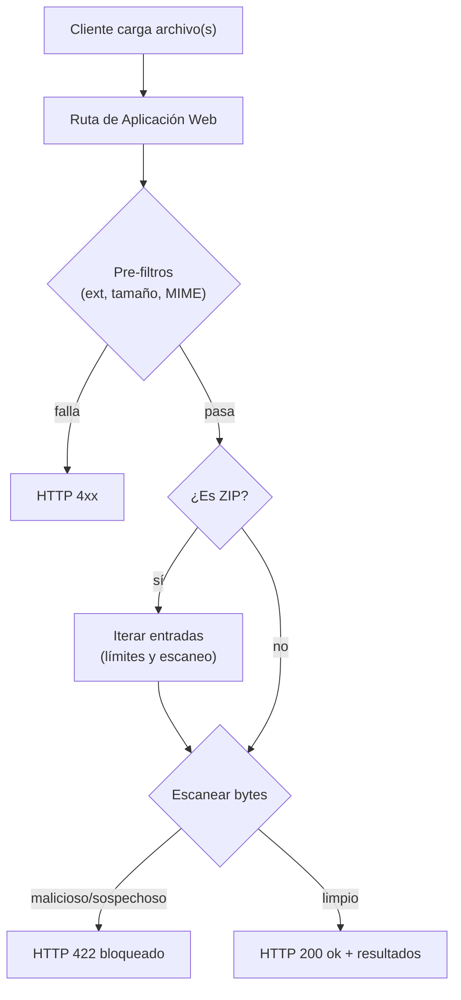
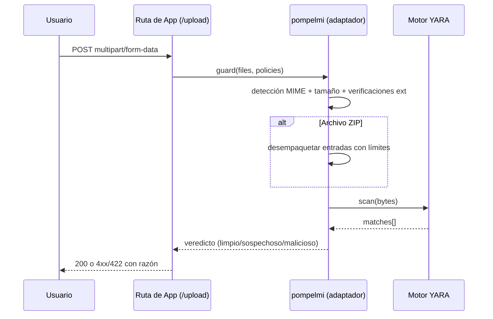
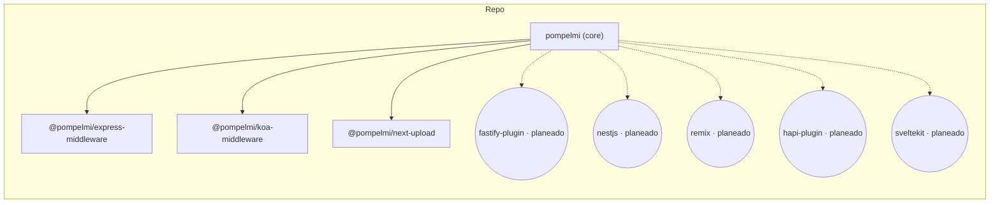

<!-- HERO START -->

---
## 💬 Lo Que Dicen los Desarrolladores

> "pompelmi hizo increíblemente fácil añadir escaneo de malware a nuestra API Express. ¡El soporte TypeScript es fantástico!"
> — Desarrollador usando pompelmi en producción

> "Finalmente, una solución de escaneo de archivos que no requiere enviar los datos de nuestros usuarios a terceros. Perfecto para cumplimiento GDPR."
> — Ingeniero de Seguridad en una startup de salud

> "La integración YARA es perfecta. Pasamos de prototipo a producción en menos de una semana."
> — Ingeniero DevSecOps

_¿Quieres compartir tu experiencia? [¡Abre una discusión](https://github.com/pompelmi/pompelmi/discussions)!_

---

## 🌟 Lo Que Hace Especial a pompelmi?

### 🎯 Experiencia del Desarrollador

Construido pensando en los desarrolladores desde el día uno. API simple, tipos TypeScript completos y excelente documentación significan que puedes integrar escaneo de archivos seguro en minutos, no días. Soporte para hot module replacement y mensajes de error detallados hacen que la depuración sea pan comido.

### 🚀 Rendimiento Primero

Optimizado para escenarios de alto rendimiento con concurrencia configurable, soporte de streaming y sobrecarga mínima de memoria. Procesa miles de archivos sin despeinarte. Los escaneos se ejecutan en proceso sin sobrecarga IPC.

### 🔐 Seguridad Sin Compromisos

Defensa en múltiples capas incluyendo verificación de tipo MIME (magic bytes), validación de extensión, límites de tamaño, protección contra bombas ZIP e integración YARA opcional. Cada capa es configurable para coincidir con tu modelo de amenazas.

### 🌍 Privacidad Garantizada

Tus datos nunca salen de tu infraestructura. Sin telemetría, sin dependencias de la nube, sin llamadas a APIs de terceros. Perfecto para industrias reguladas (salud, finanzas, gobierno) y aplicaciones conscientes de la privacidad.

---

## 💡 Casos de Uso

pompelmi es de confianza en diversas industrias y casos de uso:

### 🏥 Salud (Cumplimiento HIPAA)

Escanea cargas de documentos de pacientes sin enviar PHI a servicios de terceros. Mantén registros médicos y archivos de imágenes seguros en tu infraestructura.

### 🏦 Servicios Financieros (PCI DSS)

Valida cargas de documentos de clientes (verificación de ID, formularios de impuestos) sin exponer datos financieros sensibles a APIs externas.

### 🎓 Plataformas Educativas

Protege sistemas de gestión de aprendizaje de cargas de archivos maliciosos mientras mantienes la privacidad de los estudiantes.

### 🏢 Gestión de Documentos Empresariales

Escanea archivos en el momento de ingesta para plataformas de compartición de archivos corporativos, wikis y herramientas de colaboración.

### 🎨 Plataformas de Medios y Creatividad

Valida cargas de contenido generado por usuarios (imágenes, videos, documentos) antes del procesamiento y almacenamiento.

---

## 🔧 Instalación

**Perfecto para:** Despliegues on-premise, VMs, servidores dedicados, o cuando necesitas control y privacidad completos.

**Requisitos:**
- Node.js 18+
- Opcional: binarios ClamAV (para escaneo basado en firmas)
- Opcional: bibliotecas YARA (para reglas personalizadas)

<table>
<tr>
<td><b>npm</b></td>
<td><code>npm install pompelmi</code></td>
</tr>
<tr>
<td><b>pnpm</b></td>
<td><code>pnpm add pompelmi</code></td>
</tr>
<tr>
<td><b>yarn</b></td>
<td><code>yarn add pompelmi</code></td>
</tr>
<tr>
<td><b>bun</b></td>
<td><code>bun add pompelmi</code></td>
</tr>
</table>

#### 📦 Adaptadores de Framework Opcionales

```bash
# Express
npm i @pompelmi/express-middleware

# Koa
npm i @pompelmi/koa-middleware

# Next.js
npm i @pompelmi/next-upload

# Fastify (alfa)
npm i @pompelmi/fastify-plugin
```

> **Nota:** La biblioteca principal funciona standalone. Instala adaptadores solo si usas frameworks específicos.

> Deps de desarrollo opcionales usadas en los ejemplos:
>
> ```bash
> npm i -D tsx express multer @koa/router @koa/multer koa next
> ```

---

## ⚡ Inicio Rápido

**De un vistazo (política + escáneres)**

```ts
// Compone escáneres integrados (sin EICAR). Opcionalmente añade los tuyos/YARA.
import { CommonHeuristicsScanner, createZipBombGuard, composeScanners } from 'pompelmi';

export const policy = {
  includeExtensions: ['zip','png','jpg','jpeg','pdf'],
  allowedMimeTypes: ['application/zip','image/png','image/jpeg','application/pdf','text/plain'],
  maxFileSizeBytes: 20 * 1024 * 1024,
  timeoutMs: 5000,
  concurrency: 4,
  failClosed: true,
  onScanEvent: (ev: unknown) => console.log('[scan]', ev)
};

export const scanner = composeScanners(
  [
    ['zipGuard', createZipBombGuard({ maxEntries: 512, maxTotalUncompressedBytes: 100 * 1024 * 1024, maxCompressionRatio: 12 })],
    ['heuristics', CommonHeuristicsScanner],
    // ['yara', YourYaraScanner],
  ],
  { parallel: false, stopOn: 'suspicious', timeoutMsPerScanner: 1500, tagSourceName: true }
);
```

### Uso Mínimo en Node

```ts
import { scanFile } from 'pompelmi';

const res = await scanFile('path/to/file.zip'); // o cualquier archivo
console.log(res.verdict); // "clean" | "suspicious" | "malicious"
```

> Ver `examples/scan-one-file.ts` para un script ejecutable:
>
> ```bash
> pnpm tsx examples/scan-one-file.ts ./path/to/file
> ```

### Express

```ts
import express from 'express';
import multer from 'multer';
import { createUploadGuard } from '@pompelmi/express-middleware';
import { policy, scanner } from './security'; // el fragmento anterior

const app = express();
const upload = multer({ storage: multer.memoryStorage(), limits: { fileSize: policy.maxFileSizeBytes } });

app.post('/upload', upload.any(), createUploadGuard({ ...policy, scanner }), (req, res) => {
  res.json({ ok: true, scan: (req as any).pompelmi ?? null });
});

app.listen(3000, () => console.log('http://localhost:3000'));
```

### Koa

```ts
import Koa from 'koa';
import Router from '@koa/router';
import multer from '@koa/multer';
import { createKoaUploadGuard } from '@pompelmi/koa-middleware';
import { policy, scanner } from './security';

const app = new Koa();
const router = new Router();
const upload = multer({ storage: multer.memoryStorage(), limits: { fileSize: policy.maxFileSizeBytes } });

router.post('/upload', upload.any(), createKoaUploadGuard({ ...policy, scanner }), (ctx) => {
  ctx.body = { ok: true, scan: (ctx as any).pompelmi ?? null };
});

app.use(router.routes()).use(router.allowedMethods());
app.listen(3003, () => console.log('http://localhost:3003'));
```

### Next.js (App Router)

```ts
// app/api/upload/route.ts
import { createNextUploadHandler } from '@pompelmi/next-upload';
import { policy, scanner } from '@/lib/security';

export const runtime = 'nodejs';
export const dynamic = 'force-dynamic';

export const POST = createNextUploadHandler({ ...policy, scanner });
```

---

## 🤖 GitHub Action

Ejecuta **pompelmi** en CI para escanear archivos de repositorio o artefactos construidos.

**Uso mínimo**
```yaml
name: Security scan (pompelmi)
on: [push, pull_request]

jobs:
  scan:
    runs-on: ubuntu-latest
    steps:
      - uses: actions/checkout@v4

      - name: Scan repository with pompelmi
        uses: pompelmi/pompelmi/.github/actions/pompelmi-scan@v1
        with:
          path: .
          deep_zip: true
          fail_on_detect: true
```

**Escanear un único artefacto**
```yaml
- uses: pompelmi/pompelmi/.github/actions/pompelmi-scan@v1
  with:
    artifact: build.zip
    deep_zip: true
    fail_on_detect: true
```

**Entradas**
| Entrada | Por Defecto | Descripción |
| --- | --- | --- |
| `path` | `.` | Directorio a escanear. |
| `artifact` | `""` | Archivo/archivo único a escanear. |
| `yara_rules` | `""` | Ruta glob a reglas YARA (ej. `rules/*.yar`). |
| `deep_zip` | `true` | Habilitar inspección profunda de archivos anidados. |
| `max_depth` | `3` | Profundidad máxima de archivos anidados. |
| `fail_on_detect` | `true` | Fallar el trabajo si ocurren detecciones. |

> La Action vive en este repo en `.github/actions/pompelmi-scan`. Cuando se publique en el Marketplace, los consumidores pueden copiar los fragmentos anteriores tal cual.

---

## 🧩 Adaptadores

Usa el adaptador que coincida con tu framework web. Todos los adaptadores comparten las mismas opciones de política y contrato de escaneo.

<p align="center">
  
  
  
  
  
  
  
  
</p>

| Framework | Paquete | Estado |
| --- | --- | --- |
| Express | `@pompelmi/express-middleware` | ✅ alfa |
| Koa | `@pompelmi/koa-middleware` | ✅ alfa |
| Next.js (App Router) | `@pompelmi/next-upload` | ✅ alfa |
| Fastify | `@pompelmi/fastify-plugin` | 🚧 alfa |
| NestJS | nestjs | 📋 planeado |
| Remix | remix | 📋 planeado |
| hapi | hapi plugin | 📋 planeado |
| SvelteKit | sveltekit | 📋 planeado |

---

## 🗺️ Diagramas

### Flujo de escaneo de carga

<details>
<summary>Fuente Mermaid</summary>


</details>

### Secuencia (App ↔ pompelmi ↔ YARA)

<details>
<summary>Fuente Mermaid</summary>


</details>

### Componentes (monorepo)

<details>
<summary>Fuente Mermaid</summary>


</details>

---

## ⚙️ Configuración

Todos los adaptadores aceptan un conjunto común de opciones:

| Opción | Tipo (TS) | Propósito |
| --- | --- | --- |
| `scanner` | `{ scan(bytes: Uint8Array): Promise<Match[]> }` | Tu motor de escaneo. Devuelve `[]` cuando está limpio; no vacío para marcar. |
| `includeExtensions` | `string[]` | Lista de extensiones de archivo permitidas. Se evalúa sin distinguir mayúsculas. |
| `allowedMimeTypes` | `string[]` | Lista de tipos MIME permitidos después de detección de magic-byte. |
| `maxFileSizeBytes` | `number` | Límite de tamaño por archivo. Los archivos de gran tamaño se rechazan tempranamente. |
| `timeoutMs` | `number` | Timeout de escaneo por archivo; protege contra escáneres atascados. |
| `concurrency` | `number` | Cuántos archivos escanear en paralelo. |
| `failClosed` | `boolean` | Si `true`, errores/timeouts bloquean la carga. |
| `onScanEvent` | `(event: unknown) => void` | Hook de telemetría opcional para logging/métricas. |

**Recetas comunes**

Permitir solo imágenes de hasta 5 MB:

```ts
includeExtensions: ['png','jpg','jpeg','webp'],
allowedMimeTypes: ['image/png','image/jpeg','image/webp'],
maxFileSizeBytes: 5 * 1024 * 1024,
failClosed: true,
```

---

## ✅ Checklist de Producción

- [ ] **Limitar tamaño de archivo** agresivamente (`maxFileSizeBytes`).
- [ ] **Restringir extensiones y MIME** a lo que tu app realmente necesita.
- [ ] **Establecer `failClosed: true` en producción** para bloquear en timeouts/errores.
- [ ] **Manejar ZIPs con cuidado** (habilitar ZIP profundo, mantener anidamiento bajo, limitar tamaños de entrada).
- [ ] **Componer escáneres** con `composeScanners()` y habilitar `stopOn` para fallar rápido en detecciones tempranas.
- [ ] **Registrar eventos de escaneo** (`onScanEvent`) y monitorear picos.
- [ ] **Ejecutar escaneos en un proceso/contenedor separado** para defensa en profundidad cuando sea posible.
- [ ] **Sanitizar nombres de archivo y rutas** si persistes cargas.
- [ ] **Preferir almacenamiento en memoria + post-procesamiento**; evitar escribir bytes no confiables antes de que pase la política.
- [ ] **Añadir escaneo CI** con la GitHub Action para capturar archivos malos en repos/artefactos.

---

## 🧬 YARA: Primeros Pasos

YARA te permite detectar contenido sospechoso o malicioso usando reglas de coincidencia de patrones.  
**pompelmi** trata las coincidencias YARA como señales que puedes mapear a tus propios veredictos  
(ej., marcar reglas de alta confianza como `malicious`, heurísticas como `suspicious`).

> **Estado:** Opcional. Puedes ejecutar sin YARA. Si lo adoptas, mantén tus reglas pequeñas, con límite de tiempo y ajustadas a tu modelo de amenazas.

### Reglas iniciales

A continuación hay tres reglas de ejemplo que puedes adaptar:

`rules/starter/eicar.yar`
```yar
rule EICAR_Test_File
{
    meta:
        description = "EICAR antivirus test string (safe)"
        reference   = "https://www.eicar.org"
        confidence  = "high"
        verdict     = "malicious"
    strings:
        $eicar = "X5O!P%@AP[4\\PZX54(P^)7CC)7}$EICAR-STANDARD-ANTIVIRUS-TEST-FILE!$H+H*"
    condition:
        $eicar
}
```

`rules/starter/pdf_js.yar`
```yar
rule PDF_JavaScript_Embedded
{
    meta:
        description = "PDF contains embedded JavaScript (heuristic)"
        confidence  = "medium"
        verdict     = "suspicious"
    strings:
        $magic = { 25 50 44 46 } // "%PDF"
        $js1 = "/JavaScript" ascii
        $js2 = "/JS" ascii
        $open = "/OpenAction" ascii
        $aa = "/AA" ascii
    condition:
        uint32(0) == 0x25504446 and ( $js1 or $js2 ) and ( $open or $aa )
}
```

`rules/starter/office_macros.yar`
```yar
rule Office_Macro_Suspicious_Words
{
    meta:
        description = "Heuristic: suspicious VBA macro keywords"
        confidence  = "medium"
        verdict     = "suspicious"
    strings:
        $s1 = /Auto(Open|Close)/ nocase
        $s2 = "Document_Open" nocase ascii
        $s3 = "CreateObject(" nocase ascii
        $s4 = "WScript.Shell" nocase ascii
        $s5 = "Shell(" nocase ascii
        $s6 = "Sub Workbook_Open()" nocase ascii
    condition:
        2 of ($s*)
}
```

> Estos son **ejemplos**. Espera algunos falsos positivos; ajusta para tu app.

### Integración mínima (contrato de adaptador)

Si usas un binding de YARA (ej., `@automattic/yara`), envuélvelo detrás del contrato `scanner`:

```ts
// Ejemplo de adaptador de escáner YARA (pseudo-código)
import * as Y from '@automattic/yara';

// Compila tus reglas desde disco al arrancar (recomendado)
// const sources = await fs.readFile('rules/starter/*.yar', 'utf8');
// const compiled = await Y.compile(sources);

export const YourYaraScanner = {
  async scan(bytes: Uint8Array) {
    // const matches = await compiled.scan(bytes, { timeout: 1500 });
    const matches = []; // conecta tu motor aquí
    // Mapea a la estructura que tu app espera; devuelve [] cuando está limpio.
    return matches.map((m: any) => ({
      rule: m.rule,
      meta: m.meta ?? {},
      tags: m.tags ?? [],
    }));
  }
};
```

Luego inclúyelo en tu escáner compuesto:

```ts
import { composeScanners, CommonHeuristicsScanner } from 'pompelmi';
// import { YourYaraScanner } from './yara-scanner';

export const scanner = composeScanners(
  [
    ['heuristics', CommonHeuristicsScanner],
    // ['yara', YourYaraScanner],
  ],
  { parallel: false, stopOn: 'suspicious', timeoutMsPerScanner: 1500, tagSourceName: true }
);
```

### Sugerencia de política (mapear coincidencias → veredicto)

- **malicious**: reglas de alta confianza (ej., `EICAR_Test_File`)
- **suspicious**: reglas heurísticas (ej., JavaScript en PDF, palabras clave de macro)
- **clean**: sin coincidencias

Combina YARA con detección MIME, límites de seguridad ZIP y límites estrictos de tamaño/tiempo.

## 🧪 Prueba Rápida (sin EICAR)

Usa los ejemplos anteriores, luego envía un **PDF mínimo** que contenga tokens riesgosos (esto activa las heurísticas integradas).

**1) Crear un PDF pequeño con acciones riesgosas**

Linux:
```bash
printf '%%PDF-1.7\n1 0 obj\n<< /OpenAction 1 0 R /AA << /JavaScript (alert(1)) >> >>\nendobj\n%%EOF\n' > risky.pdf
```

macOS:
```bash
printf '%%PDF-1.7\n1 0 obj\n<< /OpenAction 1 0 R /AA << /JavaScript (alert(1)) >> >>\nendobj\n%%EOF\n' > risky.pdf
```

**2) Enviarlo a tu endpoint**

Express (predeterminado del Inicio Rápido):
```bash
curl -F "file=@risky.pdf;type=application/pdf" http://localhost:3000/upload -i
```

Deberías ver un HTTP **422 Unprocessable Entity** (bloqueado por política). Los archivos limpios devuelven **200 OK**. Las fallas de pre-filtro (tamaño/ext/MIME) deberían devolver un **4xx**. Adapta estas convenciones a tu app según sea necesario.

---

## 🔒 Notas de Seguridad

- La biblioteca **lee** bytes; nunca ejecuta archivos.
- Las detecciones YARA dependen de las **reglas que proporciones**; espera algunos falsos positivos/negativos.
- El escaneo ZIP aplica límites (entradas, tamaño por entrada, total descomprimido, anidamiento) para reducir el riesgo de bombas de archivo.
- Preferir ejecutar escaneos en un **proceso/contenedor dedicado** para defensa en profundidad.

---

## Lanzamientos y Seguridad

- **Changelog / lanzamientos:** ver [GitHub Releases](https://github.com/pompelmi/pompelmi/releases).
- **Divulgaciones de seguridad:** por favor usa [GitHub Security Advisories](https://github.com/pompelmi/pompelmi/security/advisories). Coordinaremos una corrección antes de la divulgación pública.
- **Usuarios de producción:** abre una [Discusión](https://github.com/pompelmi/pompelmi/discussions) para compartir requisitos o solicitar adaptadores.

## ⭐ Historial de Estrellas

[](https://star-history.com/#pompelmi/pompelmi&Date)

---

## 🏆 Comunidad y Reconocimiento

pompelmi ha sido destacado en publicaciones líderes para desarrolladores y es de confianza por equipos en todo el mundo para el manejo seguro de carga de archivos.

<p align="center">
  
  
  
</p>

### 🤝 Únete a la Comunidad

- 💬 [GitHub Discussions](https://github.com/pompelmi/pompelmi/discussions) — Haz preguntas, comparte ideas
- 🐛 [Issue Tracker](https://github.com/pompelmi/pompelmi/issues) — Reporta bugs, solicita características
- 📖 [Documentación](https://pompelmi.github.io/pompelmi/) — Guías completas y referencia de API
- 🔒 [Seguridad](https://github.com/pompelmi/pompelmi/security) — Reporta vulnerabilidades de seguridad de forma privada

---

## 💬 FAQ

**¿Necesito YARA?**  
No. `scanner` es pluggable. Los ejemplos usan un escáner mínimo para claridad; puedes llamar a un motor YARA o cualquier otro detector que prefieras.

**¿Dónde están los resultados?**  
En los ejemplos, el guard adjunta datos de escaneo al contexto de la solicitud (ej. `req.pompelmi` en Express, `ctx.pompelmi` en Koa). En Next.js, incluye los resultados en tu respuesta JSON como mejor te parezca.

**¿Por qué 422 para archivos bloqueados?**  
Usar **422** para señalar una violación de política lo mantiene distinto de errores de transporte; es un patrón común. Usa los códigos que mejor coincidan con tus directrices de API.

**¿Se manejan las bombas ZIP?**  
Los archivos se recorren con límites para reducir el riesgo de bombas de archivo. Mantén tus límites de tamaño conservadores y prefiere `failClosed: true` en producción.

---

## 🧪 Tests y Cobertura

Ejecuta tests localmente con cobertura:

```bash
pnpm vitest run --coverage --passWithNoTests
```

El badge rastrea la **biblioteca principal** (`src/**`). Los adaptadores y motores se reportan por separado por ahora y se plegarán en la cobertura global a medida que sus suites crezcan.

Si integras Codecov en CI, sube `coverage/lcov.info` y puedes usar este badge de Codecov:

```md
[](https://codecov.io/gh/pompelmi/pompelmi)
```

## 🤝 Contribuir

¡PRs y issues son bienvenidos! Comienza con:

```bash
pnpm -r build
pnpm -r lint
```

Ver [CONTRIBUTING.md](./CONTRIBUTING.md) para directrices detalladas.

### 🎖️ Colaboradores

¡Gracias a todos los increíbles colaboradores que han ayudado a hacer pompelmi mejor!

<!-- Añadir imágenes de colaboradores aquí en el futuro -->

---

## 🎓 Recursos de Aprendizaje

### 📚 Documentación

- [Documentación Oficial](https://pompelmi.github.io/pompelmi/) — Referencia completa de API y guías
- [Ejemplos](./examples/) — Ejemplos de integración del mundo real
- [Guía de Seguridad](./SECURITY.md) — Mejores prácticas de seguridad y política de divulgación

### 🎥 Tutoriales y Artículos

- **Seguridad en Carga de Archivos en Node.js** — Guía de mejores prácticas (próximamente)
- **Integrando YARA con pompelmi** — Configuración avanzada de detección (próximamente)
- **Cargas de Archivos de Confianza Cero** — Patrones de arquitectura (próximamente)

### 🛠️ Herramientas e Integraciones

- [GitHub Action](https://github.com/pompelmi/pompelmi/tree/main/.github/actions/pompelmi-scan) — Escaneo CI/CD
- [Imágenes Docker](https://hub.docker.com/r/pompelmi/pompelmi) — Escaneo en contenedores (próximamente)
- [Cloud Functions](https://github.com/pompelmi/cloud-functions) — Ejemplos serverless (próximamente)

---

## 📊 Estadísticas del Proyecto

<p align="center">
  
</p>

---

## 🙏 Agradecimientos

pompelmi se apoya en hombros de gigantes. Agradecimientos especiales a:

- El proyecto YARA por el poderoso reconocimiento de patrones
- La comunidad Node.js por excelentes herramientas
- Todos nuestros colaboradores y usuarios

---

## 📞 Soporte

¿Necesitas ayuda? ¡Estamos aquí para ti!

- 📖 [Documentación](https://pompelmi.github.io/pompelmi/)
- 💬 [GitHub Discussions](https://github.com/pompelmi/pompelmi/discussions)
- 🐛 [Issue Tracker](https://github.com/pompelmi/pompelmi/issues)
- 🔒 [Seguridad](https://github.com/pompelmi/pompelmi/security) (para vulnerabilidades)

Para soporte comercial y consultoría, contacta a los mantenedores.

---

<p align="right"><a href="#pompelmi">↑ Volver arriba</a></p>

## 📜 Licencia

[MIT](./LICENSE) © 2025‑presente colaboradores de pompelmi
