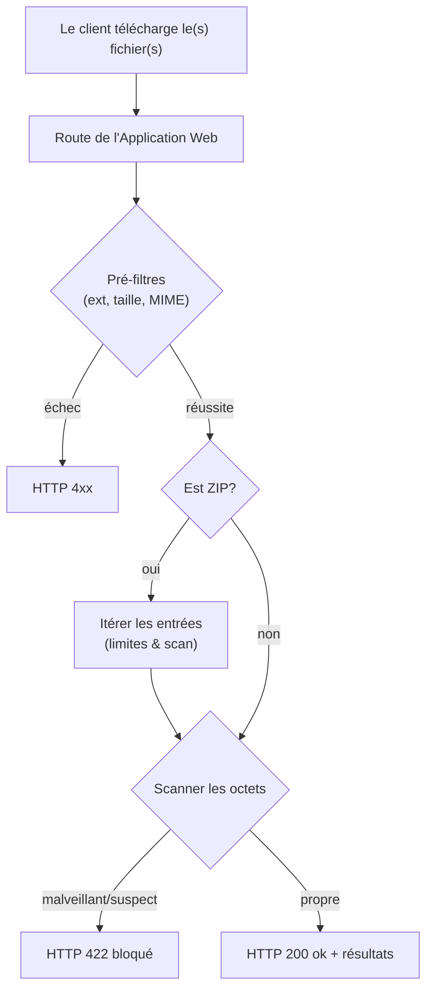
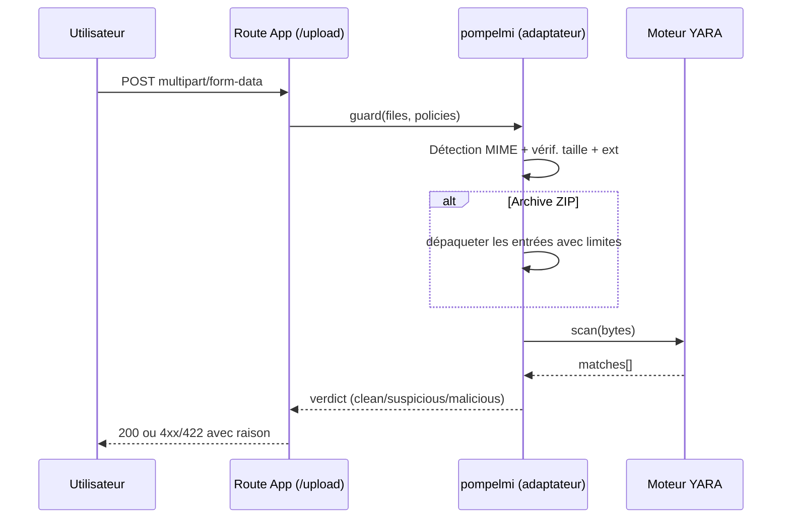
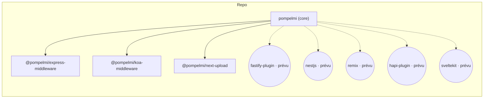

[English](../../README.md) | [Italiano](README.it.md) | **Français** | [Español](README.es.md) | [Deutsch](README.de.md) | [日本語](README.ja.md) | [简体中文](README.zh-CN.md) | [한국어](README.ko.md) | [Português (BR)](README.pt-BR.md) | [Русский](README.ru.md) | [Türkçe](README.tr.md)

💡 **Note de traduction :** Si vous souhaitez aider à améliorer les traductions, veuillez ouvrir une PR. Le README anglais est la source de vérité.

---

<!-- HERO START -->

<p align="center">

<br/>
<a href="https://www.producthunt.com/products/pompelmi?embed=true&utm_source=badge-pompelmi&utm_medium=badge" target="_blank"></a>
<br/>
  <a href="https://github.com/pompelmi/pompelmi" target="_blank" rel="noopener noreferrer">
    
  </a>
  <br/>
  <a href="https://www.detectionengineering.net/p/det-eng-weekly-issue-124-the-defcon"></a>
  <a href="https://nodeweekly.com/issues/594"></a>
  <a href="https://bytes.dev/archives/429"></a>
  <a href="https://dev.to/sonotommy/secure-nodejs-file-uploads-in-minutes-with-pompelmi-3jfe"></a>
  <br/>
  <a href="https://github.com/sorrycc/awesome-javascript"></a>
  <a href="https://github.com/dzharii/awesome-typescript"></a>
  <br/>
  
</p>

<h1 align="center">pompelmi</h1>

<p align="center">

<strong>Analyse rapide de fichiers téléchargés pour Node.js</strong> — intégration optionnelle de <strong>YARA</strong>, inspection approfondie des ZIP et adaptateurs prêts à l'emploi pour <em>Express</em>, <em>Koa</em> et <em>Next.js</em>. Privé par conception. Typé. Compact.
</p>

**Mots-clés :** sécurité des téléchargements de fichiers · détection de malware · YARA · middleware Node.js · Express · Koa · Next.js · protection contre les bombes ZIP

---

<p align="center">
  <a href="https://www.npmjs.com/package/pompelmi"></a>
  <a href="https://www.npmjs.com/package/pompelmi"></a>
  <a href="https://www.npmjs.com/package/pompelmi"></a>
  <a href="https://www.npmjs.com/package/pompelmi"></a>
  
  <a href="https://snyk.io/test/github/pompelmi/pompelmi"></a>
</p>

<p align="center">
  
  
  
  <a href="https://github.com/pompelmi/pompelmi/blob/main/LICENSE"></a>
</p>

<p align="center">
  <a href="https://github.com/pompelmi/pompelmi/actions/workflows/ci-release-publish.yml"></a>
  <a href="https://codecov.io/gh/pompelmi/pompelmi"></a>
  <a href="https://securityscorecards.dev/viewer/?uri=github.com/pompelmi/pompelmi"></a>
  <a href="https://bestpractices.coreinfrastructure.org/projects/9999"></a>
</p>

<p align="center">
  <a href="https://github.com/pompelmi/pompelmi/stargazers"></a>
  <a href="https://github.com/pompelmi/pompelmi/network/members"></a>
  <a href="https://github.com/pompelmi/pompelmi/watchers"></a>
  <a href="https://github.com/pompelmi/pompelmi/issues"></a>
  
  <a href="https://github.com/pompelmi/pompelmi/commits/main"></a>
  <a href="https://github.com/pompelmi/pompelmi/graphs/contributors"></a>
</p>

<p align="center">
  <strong>
    <a href="https://pompelmi.github.io/pompelmi/">📚 Documentation</a> •
    <a href="#installation">💾 Installation</a> •
    <a href="#d%C3%A9marrage-rapide">⚡ Démarrage Rapide</a> •
    <a href="#adaptateurs">🧩 Adaptateurs</a> •
    <a href="#d%C3%A9marrage-avec-yara">🧬 YARA</a> •
    <a href="#github-action">🤖 CI/CD</a> •
    <a href="#faq">❓ FAQ</a>
  </strong>
</p>

<p align="center"><em>Le badge de couverture reflète la bibliothèque principale (<code>src/**</code>) ; les adaptateurs sont mesurés séparément.</em></p>

<!-- HERO END -->

---

<div align="center">

### 🎯 Pourquoi Choisir pompelmi ?

</div>

| 🔒 Confidentialité d'Abord | ⚡ Ultra Rapide | 🎨 Convivial pour les Développeurs |
| --- | --- | --- |
| Toute l'analyse se fait en mémoire. Aucun appel cloud, aucune fuite de données. Vos fichiers ne quittent jamais votre infrastructure. | Analyse en mémoire avec zéro latence réseau. Concurrence configurable pour les scénarios à haut débit. | TypeScript en premier, zéro configuration par défaut, middleware prêt à l'emploi. Démarrez en moins de 5 minutes. |

---

## Table des Matières

- [Vue d'Ensemble](#vue-densemble)
- [Points Forts](#points-forts)
- [Pourquoi pompelmi](#pourquoi-pompelmi)
- [Comparaison](#comparaison)
- [Ce que Disent les Développeurs](#ce-que-disent-les-d%C3%A9veloppeurs)
- [Ce qui Rend pompelmi Spécial](#ce-qui-rend-pompelmi-sp%C3%A9cial)
- [Cas d'Usage](#cas-dusage)
- [Installation](#installation)
- [Démarrage Rapide](#d%C3%A9marrage-rapide)
  - [Usage minimal avec Node](#usage-minimal-avec-node)
  - [Express](#express)
  - [Koa](#koa)
  - [Next.js (App Router)](#nextjs-app-router)
- [Adaptateurs](#adaptateurs)
- [GitHub Action](#github-action)
- [Configuration](#configuration)
- [Démarrage avec YARA](#d%C3%A9marrage-avec-yara)
- [Notes de Sécurité](#notes-de-s%C3%A9curit%C3%A9)
- [Tests et Développement](#tests-et-d%C3%A9veloppement)
- [FAQ](#faq)
- [Contribution](#contribution)
- [Licence](#licence)

---

## 🚀 Vue d'Ensemble

**pompelmi** analyse les fichiers téléchargés non fiables **avant** qu'ils n'atteignent le disque. Une boîte à outils compacte et TypeScript-first pour Node.js avec des analyseurs composables, une inspection approfondie des ZIP et des moteurs de signatures optionnels.

### 🎯 Fonctionnalités Clés

**🔒 Privé par conception** — aucun appel sortant ; les octets ne quittent jamais votre processus

**🧩 Analyseurs composables** — mixez heuristiques + signatures ; définissez `stopOn` et des timeouts

**📦 Renforcement ZIP** — protection contre les traversées/bombes, indices de polyglot et macros

**🔌 Adaptateurs prêts à l'emploi** — Express, Koa, Fastify, Next.js

**📘 Typé et compact** — TypeScript moderne, surface minimale, tree-shakeable

**⚡ Zéro dépendance** — la bibliothèque principale a des dépendances minimales, installation rapide

## ✨ Points Forts

**🛡️ Bloquez les téléchargements risqués tôt** — classez les téléchargements comme _propres_, _suspects_ ou _malveillants_ et arrêtez-les à la périphérie.

**✅ Véritables protections** — liste blanche d'extensions, détection MIME côté serveur (magic bytes), limites de taille par fichier et traversée **ZIP profonde** avec limites anti-bombe.

**🔍 Analyseurs intégrés** — **CommonHeuristicsScanner** prêt à l'emploi (actions risquées PDF, macros Office, en-tête PE) et **Protection contre les bombes ZIP** ; ajoutez les vôtres ou YARA via un simple contrat `{ scan(bytes) }`.

**⚙️ Composition d'analyses** — exécutez plusieurs analyseurs en parallèle ou séquentiellement avec timeouts et court-circuit via `composeScanners()`.

**☁️ Zéro cloud** — les analyses s'exécutent en mémoire. Gardez les octets privés. Parfait pour la conformité GDPR/HIPAA.

**👨‍💻 Expérience développeur d'abord** — types TypeScript, builds ESM/CJS, API compacte, adaptateurs pour les frameworks web populaires.

> **Mots-clés SEO :** sécurité des téléchargements de fichiers, détection de malware, scanner antivirus, sécurité Node.js, middleware Express, intégration YARA, protection contre les bombes ZIP, validation de fichiers, assainissement des téléchargements, détection de menaces, scanner de sécurité, antivirus Node.js, bibliothèque d'analyse de fichiers, sécurité TypeScript, sécurité Next.js, middleware Koa, validation côté serveur, vérification d'intégrité des fichiers, prévention de malware, téléchargement de fichiers sécurisé

## 🧠 Pourquoi pompelmi ?

- **Analyse sur appareil, privée** – aucun appel sortant, aucun partage de données.
- **Blocage précoce** – s'exécute _avant_ que vous n'écriviez sur le disque ou ne persistiez quoi que ce soit.
- **S'adapte à votre stack** – adaptateurs prêts à l'emploi pour Express, Koa, Next.js (plugin Fastify en alpha).
- **Défense en profondeur** – limites de traversée ZIP, plafonds de ratio, détection MIME côté serveur, limites de taille.
- **Détection modulaire** – apportez votre propre moteur (par ex., YARA) via un simple contrat `{ scan(bytes) }`.

### Pour qui est-ce ?

- Les équipes qui ne peuvent pas envoyer de téléchargements vers des API antivirus tierces.
- Les applications nécessitant des décisions prévisibles à faible latence en ligne.
- Les développeurs qui veulent des blocs de construction simples et typés au lieu d'un daemon.

## 🔍 Comparaison

| Capacité | pompelmi | ClamAV / node‑clam | API Cloud AV |
| --- | --- | --- | --- |
| S'exécute entièrement en mémoire | ✅ | ❌ (daemon séparé) | ❌ (appels réseau) |
| Les octets restent privés | ✅ | ✅ | ❌ |
| Limites ZIP profondes et détection MIME | ✅ | ✅ (scan d'archives) | ❓ varie |
| Intégration YARA | ✅ optionnel | ❌* | ❓ varie |
| Adaptateurs de frameworks | ✅ Express/Koa/Next.js | ❌ | ❌ |
| Fonctionne en CI sur les artifacts | ✅ | ✅ | ❓ varie |
| Licence | MIT | GPL (moteur) | Propriétaire |

\* Vous pouvez exécuter YARA en parallèle de ClamAV, mais ce n'est pas intégré.

---
## 💬 Ce que Disent les Développeurs

> "pompelmi a rendu incroyablement facile l'ajout de l'analyse de malware à notre API Express. Le support TypeScript est fantastique !"
> — Développeur utilisant pompelmi en production

> "Enfin, une solution d'analyse de fichiers qui ne nécessite pas d'envoyer les données de nos utilisateurs à des tiers. Parfait pour la conformité GDPR."
> — Ingénieur sécurité dans une startup de santé

> "L'intégration YARA est transparente. Nous sommes passés du prototype à la production en moins d'une semaine."
> — Ingénieur DevSecOps

_Vous voulez partager votre expérience ? [Ouvrez une discussion](https://github.com/pompelmi/pompelmi/discussions) !_

---

## 🌟 Ce qui Rend pompelmi Spécial ?

### 🎯 Expérience Développeur

Conçu avec les développeurs à l'esprit dès le premier jour. API simple, types TypeScript complets et excellente documentation signifient que vous pouvez intégrer l'analyse sécurisée de fichiers en quelques minutes, pas des jours. Support du remplacement de modules à chaud et messages d'erreur détaillés facilitent le débogage.

### 🚀 Performance d'Abord

Optimisé pour les scénarios à haut débit avec concurrence configurable, support du streaming et surcharge mémoire minimale. Traitez des milliers de fichiers sans effort. Les scans s'exécutent en mémoire sans surcharge IPC.

### 🔐 Sécurité Sans Compromis

Défense multicouche incluant la vérification du type MIME (magic bytes), validation des extensions, limites de taille, protection contre les bombes ZIP et intégration optionnelle de YARA. Chaque couche est configurable pour correspondre à votre modèle de menace.

### 🌍 Confidentialité Garantie

Vos données ne quittent jamais votre infrastructure. Pas de télémétrie, pas de dépendances cloud, pas d'appels API tiers. Parfait pour les industries réglementées (santé, finance, gouvernement) et les applications soucieuses de la confidentialité.

---

## 💡 Cas d'Usage

pompelmi est approuvé dans diverses industries et cas d'usage :

### 🏥 Santé (Conformité HIPAA)

Scannez les téléchargements de documents patients sans envoyer de PHI à des services tiers. Gardez les dossiers médicaux et les fichiers d'imagerie sécurisés sur votre infrastructure.

### 🏦 Services Financiers (PCI DSS)

Validez les téléchargements de documents clients (vérification d'identité, formulaires fiscaux) sans exposer les données financières sensibles à des API externes.

### 🎓 Plateformes Éducatives

Protégez les systèmes de gestion de l'apprentissage contre les téléchargements de fichiers malveillants tout en maintenant la confidentialité des étudiants.

### 🏢 Gestion de Documents d'Entreprise

Scannez les fichiers au moment de l'ingestion pour les plateformes de partage de fichiers d'entreprise, wikis et outils de collaboration.

### 🎨 Plateformes Média et Créatives

Validez les téléchargements de contenu généré par les utilisateurs (images, vidéos, documents) avant le traitement et le stockage.

---

## 🔧 Installation

**Parfait pour :** Déploiements sur site, VM, serveurs dédiés ou lorsque vous avez besoin d'un contrôle et d'une confidentialité complets.

**Exigences :**
- Node.js 18+
- Optionnel : binaires ClamAV (pour l'analyse basée sur les signatures)
- Optionnel : bibliothèques YARA (pour les règles personnalisées)

<table>
<tr>
<td><b>npm</b></td>
<td><code>npm install pompelmi</code></td>
</tr>
<tr>
<td><b>pnpm</b></td>
<td><code>pnpm add pompelmi</code></td>
</tr>
<tr>
<td><b>yarn</b></td>
<td><code>yarn add pompelmi</code></td>
</tr>
<tr>
<td><b>bun</b></td>
<td><code>bun add pompelmi</code></td>
</tr>
</table>

#### 📦 Adaptateurs de Frameworks Optionnels

```bash
# Express
npm i @pompelmi/express-middleware

# Koa
npm i @pompelmi/koa-middleware

# Next.js
npm i @pompelmi/next-upload

# Fastify (alpha)
npm i @pompelmi/fastify-plugin
```

> **Note :** La bibliothèque principale fonctionne de manière autonome. Installez les adaptateurs uniquement si vous utilisez des frameworks spécifiques.

> Dépendances de développement optionnelles utilisées dans les exemples :
>
> ```bash
> npm i -D tsx express multer @koa/router @koa/multer koa next
> ```

---

## ⚡ Démarrage Rapide

**En un coup d'œil (politique + analyseurs)**

```ts
// Composez des analyseurs intégrés (pas d'EICAR). Ajoutez optionnellement les vôtres/YARA.
import { CommonHeuristicsScanner, createZipBombGuard, composeScanners } from 'pompelmi';

export const policy = {
  includeExtensions: ['zip','png','jpg','jpeg','pdf'],
  allowedMimeTypes: ['application/zip','image/png','image/jpeg','application/pdf','text/plain'],
  maxFileSizeBytes: 20 * 1024 * 1024,
  timeoutMs: 5000,
  concurrency: 4,
  failClosed: true,
  onScanEvent: (ev: unknown) => console.log('[scan]', ev)
};

export const scanner = composeScanners(
  [
    ['zipGuard', createZipBombGuard({ maxEntries: 512, maxTotalUncompressedBytes: 100 * 1024 * 1024, maxCompressionRatio: 12 })],
    ['heuristics', CommonHeuristicsScanner],
    // ['yara', YourYaraScanner],
  ],
  { parallel: false, stopOn: 'suspicious', timeoutMsPerScanner: 1500, tagSourceName: true }
);
```

### Usage minimal avec Node

```ts
import { scanFile } from 'pompelmi';

const res = await scanFile('path/to/file.zip'); // ou tout fichier
console.log(res.verdict); // "clean" | "suspicious" | "malicious"
```

> Voir `examples/scan-one-file.ts` pour un script exécutable :
>
> ```bash
> pnpm tsx examples/scan-one-file.ts ./path/to/file
> ```

### Express

```ts
import express from 'express';
import multer from 'multer';
import { createUploadGuard } from '@pompelmi/express-middleware';
import { policy, scanner } from './security'; // l'extrait ci-dessus

const app = express();
const upload = multer({ storage: multer.memoryStorage(), limits: { fileSize: policy.maxFileSizeBytes } });

app.post('/upload', upload.any(), createUploadGuard({ ...policy, scanner }), (req, res) => {
  res.json({ ok: true, scan: (req as any).pompelmi ?? null });
});

app.listen(3000, () => console.log('http://localhost:3000'));
```

### Koa

```ts
import Koa from 'koa';
import Router from '@koa/router';
import multer from '@koa/multer';
import { createKoaUploadGuard } from '@pompelmi/koa-middleware';
import { policy, scanner } from './security';

const app = new Koa();
const router = new Router();
const upload = multer({ storage: multer.memoryStorage(), limits: { fileSize: policy.maxFileSizeBytes } });

router.post('/upload', upload.any(), createKoaUploadGuard({ ...policy, scanner }), (ctx) => {
  ctx.body = { ok: true, scan: (ctx as any).pompelmi ?? null };
});

app.use(router.routes()).use(router.allowedMethods());
app.listen(3003, () => console.log('http://localhost:3003'));
```

### Next.js (App Router)

```ts
// app/api/upload/route.ts
import { createNextUploadHandler } from '@pompelmi/next-upload';
import { policy, scanner } from '@/lib/security';

export const runtime = 'nodejs';
export const dynamic = 'force-dynamic';

export const POST = createNextUploadHandler({ ...policy, scanner });
```

---

## 🤖 GitHub Action

Exécutez **pompelmi** en CI pour scanner les fichiers du référentiel ou les artifacts construits.

**Usage minimal**
```yaml
name: Security scan (pompelmi)
on: [push, pull_request]

jobs:
  scan:
    runs-on: ubuntu-latest
    steps:
      - uses: actions/checkout@v4

      - name: Scan repository with pompelmi
        uses: pompelmi/pompelmi/.github/actions/pompelmi-scan@v1
        with:
          path: .
          deep_zip: true
          fail_on_detect: true
```

**Scanner un seul artifact**
```yaml
- uses: pompelmi/pompelmi/.github/actions/pompelmi-scan@v1
  with:
    artifact: build.zip
    deep_zip: true
    fail_on_detect: true
```

**Entrées**
| Entrée | Défaut | Description |
| --- | --- | --- |
| `path` | `.` | Répertoire à scanner. |
| `artifact` | `""` | Fichier/archive unique à scanner. |
| `yara_rules` | `""` | Chemin glob vers les règles YARA (ex. `rules/*.yar`). |
| `deep_zip` | `true` | Activer l'inspection profonde des archives imbriquées. |
| `max_depth` | `3` | Profondeur maximale des archives imbriquées. |
| `fail_on_detect` | `true` | Échouer le job si des détections se produisent. |

> L'Action se trouve dans ce référentiel à `.github/actions/pompelmi-scan`. Une fois publiée sur le Marketplace, les consommateurs peuvent copier les extraits ci-dessus tels quels.

---

## 🧩 Adaptateurs

Utilisez l'adaptateur qui correspond à votre framework web. Tous les adaptateurs partagent les mêmes options de politique et le même contrat d'analyse.

<p align="center">
  
  
  
  
  
  
  
  
</p>

| Framework | Package | Statut |
| --- | --- | --- |
| Express | `@pompelmi/express-middleware` | ✅ alpha |
| Koa | `@pompelmi/koa-middleware` | ✅ alpha |
| Next.js (App Router) | `@pompelmi/next-upload` | ✅ alpha |
| Fastify | `@pompelmi/fastify-plugin` | 🚧 alpha |
| NestJS | nestjs | 📋 prévu |
| Remix | remix | 📋 prévu |
| hapi | hapi plugin | 📋 prévu |
| SvelteKit | sveltekit | 📋 prévu |

---

## 🗺️ Diagrammes

### Flux d'analyse de téléchargement

<details>
<summary>Source Mermaid</summary>


</details>

### Séquence (App ↔ pompelmi ↔ YARA)

<details>
<summary>Source Mermaid</summary>


</details>

### Composants (monorepo)

<details>
<summary>Source Mermaid</summary>


</details>

---

## ⚙️ Configuration

Tous les adaptateurs acceptent un ensemble commun d'options :

| Option | Type (TS) | Objectif |
| --- | --- | --- |
| `scanner` | `{ scan(bytes: Uint8Array): Promise<Match[]> }` | Votre moteur d'analyse. Retournez `[]` quand propre ; non vide pour signaler. |
| `includeExtensions` | `string[]` | Liste blanche des extensions de fichiers. Évaluée sans tenir compte de la casse. |
| `allowedMimeTypes` | `string[]` | Liste blanche des types MIME après détection par magic bytes. |
| `maxFileSizeBytes` | `number` | Limite de taille par fichier. Les fichiers trop volumineux sont rejetés tôt. |
| `timeoutMs` | `number` | Timeout de scan par fichier ; protège contre les analyseurs bloqués. |
| `concurrency` | `number` | Combien de fichiers scanner en parallèle. |
| `failClosed` | `boolean` | Si `true`, les erreurs/timeouts bloquent le téléchargement. |
| `onScanEvent` | `(event: unknown) => void` | Hook de télémétrie optionnel pour logging/métriques. |

**Recettes communes**

Autoriser uniquement les images jusqu'à 5 Mo :

```ts
includeExtensions: ['png','jpg','jpeg','webp'],
allowedMimeTypes: ['image/png','image/jpeg','image/webp'],
maxFileSizeBytes: 5 * 1024 * 1024,
failClosed: true,
```

---

## ✅ Liste de contrôle de production

- [ ] **Limiter la taille des fichiers** de manière agressive (`maxFileSizeBytes`).
- [ ] **Restreindre les extensions et MIME** à ce dont votre application a vraiment besoin.
- [ ] **Définir `failClosed: true` en production** pour bloquer sur les timeouts/erreurs.
- [ ] **Gérer les ZIP avec précaution** (activer ZIP profond, garder l'imbrication faible, plafonner les tailles d'entrée).
- [ ] **Composer les analyseurs** avec `composeScanners()` et activer `stopOn` pour échouer rapidement sur les détections précoces.
- [ ] **Logger les événements de scan** (`onScanEvent`) et surveiller les pics.
- [ ] **Exécuter les scans dans un processus/conteneur séparé** pour la défense en profondeur lorsque c'est possible.
- [ ] **Assainir les noms et chemins de fichiers** si vous persistez les téléchargements.
- [ ] **Préférer le stockage en mémoire + post-traitement** ; évitez d'écrire des octets non fiables avant la validation de la politique.
- [ ] **Ajouter le scan CI** avec la GitHub Action pour détecter les mauvais fichiers dans les référentiels/artifacts.

---

## 🧬 Démarrage avec YARA

YARA vous permet de détecter du contenu suspect ou malveillant en utilisant des règles de correspondance de motifs.  
**pompelmi** traite les correspondances YARA comme des signaux que vous pouvez mapper à vos propres verdicts  
(par exemple, marquer les règles de haute confiance comme `malicious`, les heuristiques comme `suspicious`).

> **Statut :** Optionnel. Vous pouvez exécuter sans YARA. Si vous l'adoptez, gardez vos règles petites, limitées dans le temps et adaptées à votre modèle de menace.

### Règles de démarrage

Voici trois exemples de règles que vous pouvez adapter :

`rules/starter/eicar.yar`
```yar
rule EICAR_Test_File
{
    meta:
        description = "Chaîne de test antivirus EICAR (sûre)"
        reference   = "https://www.eicar.org"
        confidence  = "high"
        verdict     = "malicious"
    strings:
        $eicar = "X5O!P%@AP[4\\PZX54(P^)7CC)7}$EICAR-STANDARD-ANTIVIRUS-TEST-FILE!$H+H*"
    condition:
        $eicar
}
```

`rules/starter/pdf_js.yar`
```yar
rule PDF_JavaScript_Embedded
{
    meta:
        description = "Le PDF contient du JavaScript embarqué (heuristique)"
        confidence  = "medium"
        verdict     = "suspicious"
    strings:
        $magic = { 25 50 44 46 } // "%PDF"
        $js1 = "/JavaScript" ascii
        $js2 = "/JS" ascii
        $open = "/OpenAction" ascii
        $aa = "/AA" ascii
    condition:
        uint32(0) == 0x25504446 and ( $js1 or $js2 ) and ( $open or $aa )
}
```

`rules/starter/office_macros.yar`
```yar
rule Office_Macro_Suspicious_Words
{
    meta:
        description = "Heuristique : mots-clés de macro VBA suspects"
        confidence  = "medium"
        verdict     = "suspicious"
    strings:
        $s1 = /Auto(Open|Close)/ nocase
        $s2 = "Document_Open" nocase ascii
        $s3 = "CreateObject(" nocase ascii
        $s4 = "WScript.Shell" nocase ascii
        $s5 = "Shell(" nocase ascii
        $s6 = "Sub Workbook_Open()" nocase ascii
    condition:
        2 of ($s*)
}
```

> Ce sont des **exemples**. Attendez-vous à quelques faux positifs ; ajustez à votre application.

### Intégration minimale (contrat d'adaptateur)

Si vous utilisez une liaison YARA (par ex., `@automattic/yara`), enveloppez-la derrière le contrat `scanner` :

```ts
// Exemple d'adaptateur de scanner YARA (pseudo-code)
import * as Y from '@automattic/yara';

// Compilez vos règles depuis le disque au démarrage (recommandé)
// const sources = await fs.readFile('rules/starter/*.yar', 'utf8');
// const compiled = await Y.compile(sources);

export const YourYaraScanner = {
  async scan(bytes: Uint8Array) {
    // const matches = await compiled.scan(bytes, { timeout: 1500 });
    const matches = []; // branchez votre moteur ici
    // Mapper à la structure attendue par votre application ; retournez [] quand propre.
    return matches.map((m: any) => ({
      rule: m.rule,
      meta: m.meta ?? {},
      tags: m.tags ?? [],
    }));
  }
};
```

Ensuite, incluez-le dans votre scanner composé :

```ts
import { composeScanners, CommonHeuristicsScanner } from 'pompelmi';
// import { YourYaraScanner } from './yara-scanner';

export const scanner = composeScanners(
  [
    ['heuristics', CommonHeuristicsScanner],
    // ['yara', YourYaraScanner],
  ],
  { parallel: false, stopOn: 'suspicious', timeoutMsPerScanner: 1500, tagSourceName: true }
);
```

### Suggestion de politique (mapper les correspondances → verdict)

- **malicious** : règles de haute confiance (par ex., `EICAR_Test_File`)
- **suspicious** : règles heuristiques (par ex., JavaScript PDF, mots-clés de macro)
- **clean** : aucune correspondance

Combinez YARA avec la détection MIME, les limites de sécurité ZIP et des limites strictes de taille/temps.

## 🧪 Test rapide (sans EICAR)

Utilisez les exemples ci-dessus, puis envoyez un **PDF minimal** qui contient des tokens risqués (cela déclenche les heuristiques intégrées).

**1) Créer un petit PDF avec des actions risquées**

Linux :
```bash
printf '%%PDF-1.7\n1 0 obj\n<< /OpenAction 1 0 R /AA << /JavaScript (alert(1)) >> >>\nendobj\n%%EOF\n' > risky.pdf
```

macOS :
```bash
printf '%%PDF-1.7\n1 0 obj\n<< /OpenAction 1 0 R /AA << /JavaScript (alert(1)) >> >>\nendobj\n%%EOF\n' > risky.pdf
```

**2) Envoyez-le à votre endpoint**

Express (par défaut du Démarrage Rapide) :
```bash
curl -F "file=@risky.pdf;type=application/pdf" http://localhost:3000/upload -i
```

Vous devriez voir un HTTP **422 Unprocessable Entity** (bloqué par la politique). Les fichiers propres renvoient **200 OK**. Les échecs de pré-filtre (taille/ext/MIME) devraient renvoyer un **4xx**. Adaptez ces conventions à votre application selon les besoins.

---

## 🔒 Notes de Sécurité

- La bibliothèque **lit** les octets ; elle n'exécute jamais les fichiers.
- Les détections YARA dépendent des **règles que vous fournissez** ; attendez-vous à quelques faux positifs/négatifs.
- L'analyse ZIP applique des limites (entrées, taille par entrée, total décompressé, imbrication) pour réduire le risque de bombe d'archive.
- Préférez exécuter les scans dans un **processus/conteneur dédié** pour la défense en profondeur.

---

## Versions & sécurité

- **Changelog / versions :** voir [GitHub Releases](https://github.com/pompelmi/pompelmi/releases).
- **Divulgations de sécurité :** veuillez utiliser [GitHub Security Advisories](https://github.com/pompelmi/pompelmi/security/advisories). Nous coordonnerons un correctif avant la divulgation publique.
- **Utilisateurs en production :** ouvrez une [Discussion](https://github.com/pompelmi/pompelmi/discussions) pour partager des exigences ou demander des adaptateurs.

## ⭐ Historique des étoiles

[](https://star-history.com/#pompelmi/pompelmi&Date)

---

## 🏆 Communauté & Reconnaissance

pompelmi a été présenté dans des publications majeures pour développeurs et est approuvé par des équipes du monde entier pour la gestion sécurisée des téléchargements de fichiers.

<p align="center">
  
  
  
</p>

### 🤝 Rejoignez la Communauté

- 💬 [GitHub Discussions](https://github.com/pompelmi/pompelmi/discussions) — Posez des questions, partagez des idées
- 🐛 [Issue Tracker](https://github.com/pompelmi/pompelmi/issues) — Rapportez des bugs, demandez des fonctionnalités
- 📖 [Documentation](https://pompelmi.github.io/pompelmi/) — Guides complets et référence API
- 🔒 [Sécurité](https://github.com/pompelmi/pompelmi/security) — Rapportez les vulnérabilités de sécurité en privé

---

## 💬 FAQ

**Ai-je besoin de YARA ?**  
Non. `scanner` est modulaire. Les exemples utilisent un analyseur minimal pour plus de clarté ; vous pouvez appeler un moteur YARA ou tout autre détecteur que vous préférez.

**Où résident les résultats ?**  
Dans les exemples, le garde attache les données de scan au contexte de la requête (par ex. `req.pompelmi` dans Express, `ctx.pompelmi` dans Koa). Dans Next.js, incluez les résultats dans votre réponse JSON comme vous le souhaitez.

**Pourquoi 422 pour les fichiers bloqués ?**  
Utiliser **422** pour signaler une violation de politique le distingue des erreurs de transport ; c'est un modèle commun. Utilisez les codes qui correspondent le mieux à vos directives API.

**Les bombes ZIP sont-elles gérées ?**  
Les archives sont traversées avec des limites pour réduire le risque de bombe d'archive. Gardez vos limites de taille conservatrices et préférez `failClosed: true` en production.

---

## 🧪 Tests et Développement

Exécutez les tests localement avec la couverture :

```bash
pnpm vitest run --coverage --passWithNoTests
```

Le badge suit la **bibliothèque principale** (`src/**`). Les adaptateurs et moteurs sont rapportés séparément pour l'instant et seront intégrés dans la couverture globale au fur et à mesure que leurs suites se développent.

Si vous intégrez Codecov en CI, téléchargez `coverage/lcov.info` et vous pouvez utiliser ce badge Codecov :

```md
[](https://codecov.io/gh/pompelmi/pompelmi)
```

## 🤝 Contribution

Les PR et issues sont les bienvenues ! Commencez par :

```bash
pnpm -r build
pnpm -r lint
```

Voir [CONTRIBUTING.md](./CONTRIBUTING.md) pour des directives détaillées.

### 🎖️ Contributeurs

Merci à tous les contributeurs incroyables qui ont aidé à améliorer pompelmi !

<!-- Ajouter les images des contributeurs ici à l'avenir -->

---

## 🎓 Ressources d'Apprentissage

### 📚 Documentation

- [Documentation Officielle](https://pompelmi.github.io/pompelmi/) — Référence API complète et guides
- [Exemples](./examples/) — Exemples d'intégration réels
- [Guide de Sécurité](./SECURITY.md) — Meilleures pratiques de sécurité et politique de divulgation

### 🎥 Tutoriels & Articles

- **Sécurité des Téléchargements de Fichiers dans Node.js** — Guide des meilleures pratiques (à venir)
- **Intégration de YARA avec pompelmi** — Configuration de détection avancée (à venir)
- **Téléchargements de Fichiers Zero-Trust** — Modèles d'architecture (à venir)

### 🛠️ Outils & Intégrations

- [GitHub Action](https://github.com/pompelmi/pompelmi/tree/main/.github/actions/pompelmi-scan) — Analyse CI/CD
- [Images Docker](https://hub.docker.com/r/pompelmi/pompelmi) — Analyse conteneurisée (à venir)
- [Cloud Functions](https://github.com/pompelmi/cloud-functions) — Exemples serverless (à venir)

---

## 📊 Statistiques du Projet

<p align="center">
  
</p>

---

## 🙏 Remerciements

pompelmi repose sur les épaules de géants. Remerciements particuliers à :

- Le projet YARA pour la correspondance de motifs puissante
- La communauté Node.js pour d'excellents outils
- Tous nos contributeurs et utilisateurs

---

## 📞 Support

Besoin d'aide ? Nous sommes là pour vous !

- 📖 [Documentation](https://pompelmi.github.io/pompelmi/)
- 💬 [GitHub Discussions](https://github.com/pompelmi/pompelmi/discussions)
- 🐛 [Issue Tracker](https://github.com/pompelmi/pompelmi/issues)
- 🔒 [Sécurité](https://github.com/pompelmi/pompelmi/security) (pour les vulnérabilités)

Pour le support commercial et le conseil, contactez les mainteneurs.

---

<p align="right"><a href="#pompelmi">↑ Retour en haut</a></p>

## 📜 Licence

[MIT](./LICENSE) © 2025‑présent contributeurs pompelmi
