```mermaid
flowchart LR
  subgraph Repo
    core["pompelmi (core)"]
    express["@pompelmi/express-middleware"]
    koa["@pompelmi/koa-middleware"]
    next["@pompelmi/next-upload"]
    fastify(("fastify-plugin · pianificato"))
    nest(("nestjs · pianificato"))
    remix(("remix · pianificato"))
    hapi(("hapi-plugin · pianificato"))
    svelte(("sveltekit · pianificato"))
  end
  core --> express
  core --> koa
  core --> next
  core -.-> fastify
  core -.-> nest
  core -.-> remix
  core -.-> hapi
  core -.-> svelte
```

<!-- Language Selector -->
<div align="center">

**Traduzioni:** [English](../../README.md) | **Italiano** | [Français](README.fr.md) | [Español](README.es.md) | [Deutsch](README.de.md) | [日本語](README.ja.md) | [简体中文](README.zh-CN.md) | [한국어](README.ko.md) | [Português (BR)](README.pt-BR.md) | [Русский](README.ru.md) | [Türkçe](README.tr.md)

</div>

---

> 💡 **Nota sulla traduzione:** Se desideri aiutare a migliorare le traduzioni, apri una PR. Il README inglese è la fonte di verità.

---

<!-- HERO START -->

<p align="center">

<br/>
<a href="https://www.producthunt.com/products/pompelmi?embed=true&utm_source=badge-pompelmi&utm_medium=badge" target="_blank"></a>
<br/>
  <a href="https://github.com/pompelmi/pompelmi" target="_blank" rel="noopener noreferrer">
    
  </a>
  <br/>
  <a href="https://www.detectionengineering.net/p/det-eng-weekly-issue-124-the-defcon"></a>
  <a href="https://nodeweekly.com/issues/594"></a>
  <a href="https://bytes.dev/archives/429"></a>
  <a href="https://dev.to/sonotommy/secure-nodejs-file-uploads-in-minutes-with-pompelmi-3jfe"></a>
  <br/>
  <a href="https://github.com/sorrycc/awesome-javascript"></a>
  <a href="https://github.com/dzharii/awesome-typescript"></a>
  <br/>
  
</p>

<h1 align="center">pompelmi</h1>

<p align="center">

<strong>Scansione veloce di file caricati per rilevare malware in Node.js</strong> — integrazione opzionale con <strong>YARA</strong>, ispezione approfondita ZIP e adattatori plug-and-play per <em>Express</em>, <em>Koa</em> e <em>Next.js</em>. Progettato per la privacy. Tipizzato. Compatto.
</p>

**Parole chiave:** sicurezza caricamento file · rilevamento malware · YARA · middleware Node.js · Express · Koa · Next.js · protezione ZIP bomb

---

<div align="center">

## ⚡ **Avvio Rapido (Cloud)**

**Usi Serverless o non puoi installare ClamAV?**  
Usa l'**[API Hosted Ufficiale su RapidAPI](https://rapidapi.com/SonoTommy/api/pompelmi-malware-scanner)** →

✅ **Zero Configurazione** • Nessun binario da installare  
✅ **Pronto per Serverless** • Funziona su AWS Lambda, Vercel, Netlify  
✅ **Auto-Scalabile** • Nessun overhead di RAM/CPU  
✅ **Protezione Integrata** • Rilevamento automatico ZIP-bomb

[**→ Inizia su RapidAPI**](https://rapidapi.com/SonoTommy/api/pompelmi-malware-scanner)

</div>

---

<p align="center">
  <a href="https://www.npmjs.com/package/pompelmi"></a>
  <a href="https://rapidapi.com/SonoTommy/api/pompelmi-malware-scanner"></a>
  <a href="https://www.npmjs.com/package/pompelmi"></a>
  <a href="https://www.npmjs.com/package/pompelmi"></a>
  <a href="https://www.npmjs.com/package/pompelmi"></a>
  
  <a href="https://snyk.io/test/github/pompelmi/pompelmi"></a>
</p>

<p align="center">
  
  
  
  <a href="https://github.com/pompelmi/pompelmi/blob/main/LICENSE"></a>
</p>

<p align="center">
  <a href="https://github.com/pompelmi/pompelmi/actions/workflows/ci-release-publish.yml"></a>
  <a href="https://codecov.io/gh/pompelmi/pompelmi"></a>
  <a href="https://securityscorecards.dev/viewer/?uri=github.com/pompelmi/pompelmi"></a>
  <a href="https://bestpractices.coreinfrastructure.org/projects/9999"></a>
</p>

<p align="center">
  <a href="https://github.com/pompelmi/pompelmi/stargazers"></a>
  <a href="https://github.com/pompelmi/pompelmi/network/members"></a>
  <a href="https://github.com/pompelmi/pompelmi/watchers"></a>
  <a href="https://github.com/pompelmi/pompelmi/issues"></a>
  
  <a href="https://github.com/pompelmi/pompelmi/commits/main"></a>
  <a href="https://github.com/pompelmi/pompelmi/graphs/contributors"></a>
</p>

<p align="center">
  <strong>
    <a href="https://pompelmi.github.io/pompelmi/">📚 Documentazione</a> •
    <a href="#installazione">💾 Installazione</a> •
    <a href="#avvio-rapido">⚡ Avvio Rapido</a> •
    <a href="#adattatori">🧩 Adattatori</a> •
    <a href="#yara-getting-started">🧬 YARA</a> •
    <a href="#github-action">🤖 CI/CD</a> •
    <a href="#faq">❓ FAQ</a>
  </strong>
</p>

<p align="center"><em>Il badge di copertura riflette la libreria core (<code>src/**</code>); gli adattatori sono misurati separatamente.</em></p>

<!-- HERO END -->

---

<div align="center">

### 🎯 Perché Scegliere pompelmi?

</div>

| 🔒 Privacy Prima di Tutto | ⚡ Veloce come un Fulmine | 🎨 Developer Friendly |
| --- | --- | --- |
| Tutta la scansione avviene in-process. Nessuna chiamata cloud, nessuna fuga di dati. I tuoi file non lasciano mai la tua infrastruttura. | Scansione in-process con latenza di rete zero. Concorrenza configurabile per scenari ad alto throughput. | TypeScript-first, default zero-config, middleware plug-and-play. Inizia in meno di 5 minuti. |

---

## Indice

- [Panoramica](#panoramica)
- [Caratteristiche](#caratteristiche)
- [Perché pompelmi](#perché-pompelmi)
- [Come si confronta](#come-si-confronta)
- [Cosa Dicono gli Sviluppatori](#cosa-dicono-gli-sviluppatori)
- [Cosa Rende pompelmi Speciale](#cosa-rende-pompelmi-speciale)
- [Casi d'Uso](#casi-duso)
- [Installazione](#installazione)
- [Avvio Rapido](#avvio-rapido)
  - [Utilizzo minimo in Node](#utilizzo-minimo-in-node)
  - [Express](#express)
  - [Koa](#koa)
  - [Next.js (App Router)](#nextjs-app-router)
- [Adattatori](#adattatori)
- [GitHub Action](#github-action)
- [Configurazione](#configurazione)
- [YARA Getting Started](#yara-getting-started)
- [Note di Sicurezza](#note-di-sicurezza)
- [Test e Sviluppo](#test-e-sviluppo)
- [FAQ](#faq)
- [Contribuire](#contribuire)
- [Licenza](#licenza)

---

## 🚀 Panoramica

**pompelmi** scansiona i caricamenti di file non attendibili **prima** che raggiungano il disco. Un toolkit compatto e TypeScript-first per Node.js con scanner componibili, ispezione ZIP approfondita e motori di firma opzionali.

### 🎯 Caratteristiche Chiave

**🔒 Progettato per la privacy** — nessuna chiamata in uscita; i byte non lasciano mai il tuo processo

**🧩 Scanner componibili** — combina euristica + firme; imposta `stopOn` e timeout

**📦 Protezione ZIP avanzata** — protezioni contro traversal/bomb, suggerimenti su polyglot e macro

**🔌 Adattatori plug-and-play** — Express, Koa, Fastify, Next.js

**📘 Tipizzato e compatto** — TS moderno, superficie minimale, tree-shakeable

**⚡ Zero dipendenze** — la libreria core ha dipendenze minime, installazione veloce

## ✨ Caratteristiche

**🛡️ Blocca i caricamenti rischiosi in anticipo** — classifica i caricamenti come _puliti_, _sospetti_ o _dannosi_ e bloccali ai margini.

**✅ Protezioni reali** — allow-list di estensioni, sniff MIME lato server (magic bytes), limiti di dimensione per file e ispezione **ZIP profonda** con limiti anti-bomb.

**🔍 Scanner integrati** — **CommonHeuristicsScanner** plug-and-play (azioni rischiose PDF, macro Office, header PE) e **Zip-bomb Guard**; aggiungi i tuoi o YARA tramite un contratto `{ scan(bytes) }` compatto.

**⚙️ Componi la scansione** — esegui più scanner in parallelo o sequenzialmente con timeout e cortocircuiti tramite `composeScanners()`.

**☁️ Zero cloud** — le scansioni vengono eseguite in-process. Mantieni i byte privati. Perfetto per la conformità GDPR/HIPAA.

**👨‍💻 DX first** — tipi TypeScript, build ESM/CJS, API compatta, adattatori per framework web popolari.

> **Parole chiave SEO:** sicurezza caricamento file, rilevamento malware, scanner virus, sicurezza Node.js, middleware Express, integrazione YARA, protezione ZIP bomb, validazione file, sanitizzazione upload, rilevamento minacce, scanner sicurezza, antivirus Node.js, libreria scansione file, sicurezza TypeScript, sicurezza Next.js, middleware Koa, validazione lato server, controllo integrità file, prevenzione malware, caricamento file sicuro

## 🧠 Perché pompelmi?

- **Scansione on-device e privata** – nessuna chiamata in uscita, nessuna condivisione dati.
- **Blocca in anticipo** – viene eseguito _prima_ di scrivere su disco o persistere qualcosa.
- **Si adatta al tuo stack** – adattatori plug-and-play per Express, Koa, Next.js (plugin Fastify in alpha).
- **Difesa in profondità** – limiti traversal ZIP, caps ratio, sniffing MIME lato server, caps dimensione.
- **Rilevamento collegabile** – porta il tuo motore (es. YARA) tramite un contratto `{ scan(bytes) }` compatto.

### Per chi è?

- Team che non possono inviare caricamenti a API AV di terze parti.
- App che necessitano di decisioni prevedibili e a bassa latenza inline.
- Sviluppatori che desiderano blocchi di costruzione semplici e tipizzati invece di un daemon.

## 🔍 Come si confronta

| Capacità | pompelmi | ClamAV / node‑clam | API AV Cloud |
| --- | --- | --- | --- |
| Esegue completamente in-process | ✅ | ❌ (daemon separato) | ❌ (chiamate di rete) |
| I byte rimangono privati | ✅ | ✅ | ❌ |
| Limiti ZIP profondi e sniff MIME | ✅ | ✅ (scansione archivio) | ❓ varia |
| Integrazione YARA | ✅ opzionale | ❌* | ❓ varia |
| Adattatori framework | ✅ Express/Koa/Next.js | ❌ | ❌ |
| Funziona in CI su artefatti | ✅ | ✅ | ❓ varia |
| Licenza | MIT | GPL (motore) | Proprietaria |

\* Puoi eseguire YARA insieme a ClamAV, ma non è integrato.

---
## ☁️ Libreria vs API Cloud

Scegliere tra la libreria locale e l'API Cloud ospitata? Ecco un confronto dettagliato:

| Funzionalità | **Libreria Locale** | **☁️ API Cloud** |
| --- | --- | --- |
| **Tempo di Setup** | Complesso (installa binari ClamAV/YARA) | **Istantaneo** (solo chiave API) |
| **Deployment** | Richiede dipendenze native | **Zero dipendenze** |
| **Uso RAM** | Alto (daemon ClamAV ~500MB+) | **Zero** (esegue sulla nostra infra) |
| **Uso CPU** | Alto durante le scansioni | **Zero** (offload) |
| **Supporto Serverless** | Difficile (problemi compilazione binari) | **Nativo** (solo HTTP) |
| **AWS Lambda** | Difficile (necessita layer custom) | **Perfetto** |
| **Vercel / Netlify** | Non supportato (no binari) | **Completamente supportato** |
| **Heroku** | Richiede buildpack | **Plug-and-play** |
| **Protezione ZIP-Bomb** | Configurazione manuale | **Auto-abilitata** |
| **Protezioni Traversal** | Setup manuale | **Integrate** |
| **Aggiornamenti Firme** | Manuale (freshclam ClamAV) | **Auto-aggiornate** |
| **Regole YARA** | Integrazione custom necessaria | **Gestite per te** |
| **Euristica** | Configura tu stesso | **Pre-configurata** |
| **Privacy Dati** | 100% on-premise | Scansioni via API |
| **GDPR/HIPAA** | ✅ Controllo completo | Dipende dal caso d'uso |
| **Latenza** | ~0ms (in-process) | ~100-500ms (rete) |
| **Throughput** | Limitato dal tuo server | **Auto-scalato** |
| **Manutenzione** | Tu gestisci gli aggiornamenti | **Noi ce ne occupiamo** |
| **Costo** | Infrastruttura + tempo DevOps | **Pay-per-scan** |
| **Ideale Per** | App on-premise, critiche per privacy | Serverless, prototipi veloci, SaaS |

### 🎯 Guida alla Decisione

**Scegli la Libreria Locale se:**
- Hai bisogno del 100% di privacy dei dati (sanità, finanza, governo)
- Esegui su VM o server dedicati con controllo completo
- Vuoi personalizzare regole YARA o aggiungere scanner custom
- Hai risorse DevOps per mantenere ClamAV/YARA

**Scegli l'API Cloud se:**
- Stai deployando su **AWS Lambda, Vercel o Netlify**
- Vuoi **spedire velocemente** senza overhead DevOps
- Hai bisogno di **auto-scaling** per picchi di traffico
- Vuoi **zero manutenzione** e firme sempre aggiornate

[**→ Prova l'API Cloud su RapidAPI**](https://rapidapi.com/SonoTommy/api/pompelmi-malware-scanner)

---
## 💬 Cosa Dicono gli Sviluppatori

> "pompelmi ha reso incredibilmente facile aggiungere la scansione malware alla nostra API Express. Il supporto TypeScript è fantastico!"
> — Sviluppatore che usa pompelmi in produzione

> "Finalmente, una soluzione di scansione file che non richiede l'invio dei dati dei nostri utenti a terze parti. Perfetto per la conformità GDPR."
> — Ingegnere della Sicurezza presso una startup healthcare

> "L'integrazione YARA è perfetta. Siamo passati dal prototipo alla produzione in meno di una settimana."
> — Ingegnere DevSecOps

_Vuoi condividere la tua esperienza? [Apri una discussione](https://github.com/pompelmi/pompelmi/discussions)!_

---

## 🌟 Cosa Rende pompelmi Speciale?

### 🎯 Esperienza Sviluppatore

Costruito pensando agli sviluppatori dal primo giorno. API semplice, tipi TypeScript completi e documentazione eccellente significano che puoi integrare la scansione sicura dei file in minuti, non giorni. Il supporto per hot module replacement e messaggi di errore dettagliati rendono il debugging un gioco da ragazzi.

### 🚀 Performance First

Ottimizzato per scenari ad alto throughput con concorrenza configurabile, supporto streaming e overhead di memoria minimo. Elabora migliaia di file senza sudare. Le scansioni vengono eseguite in-process senza overhead IPC.

### 🔐 Sicurezza Senza Compromessi

Difesa a più livelli che include verifica del tipo MIME (magic bytes), validazione estensioni, limiti di dimensione, protezione ZIP bomb e integrazione YARA opzionale. Ogni livello è configurabile per adattarsi al tuo modello di minaccia.

### 🌍 Privacy Garantita

I tuoi dati non lasciano mai la tua infrastruttura. Nessuna telemetria, nessuna dipendenza cloud, nessuna chiamata API di terze parti. Perfetto per settori regolamentati (sanità, finanza, governo) e applicazioni attente alla privacy.

---

## 💡 Casi d'Uso

pompelmi è affidabile in diversi settori e casi d'uso:

### 🏥 Sanità (Conformità HIPAA)

Scansiona i caricamenti di documenti dei pazienti senza inviare PHI a servizi di terze parti. Mantieni i file di imaging e le cartelle cliniche al sicuro sulla tua infrastruttura.

### 🏦 Servizi Finanziari (PCI DSS)

Valida i caricamenti di documenti dei clienti (verifica ID, moduli fiscali) senza esporre dati finanziari sensibili ad API esterne.

### 🎓 Piattaforme Educative

Proteggi i sistemi di gestione dell'apprendimento da caricamenti di file dannosi mantenendo la privacy degli studenti.

### 🏢 Gestione Documenti Enterprise

Scansiona i file al momento dell'ingestione per piattaforme di condivisione file aziendali, wiki e strumenti di collaborazione.

### 🎨 Piattaforme Media e Creative

Valida i caricamenti di contenuti generati dagli utenti (immagini, video, documenti) prima dell'elaborazione e dello storage.

---

## 🔧 Installazione

### 🚀 Opzione A: API Cloud (Consigliata per Serverless)

**Perfetta per:** AWS Lambda, Vercel, Netlify, Heroku o qualsiasi ambiente in cui installare binari nativi (come ClamAV) è difficile o impossibile.

**Vantaggi:**
- ✅ **Setup istantaneo** – Nessun binario, nessuna configurazione
- ✅ **Zero uso RAM/CPU** – Offload della scansione alla nostra infrastruttura
- ✅ **Auto-scalata** – Gestisci picchi di traffico senza provisioning
- ✅ **Protezioni integrate** – ZIP-bomb, traversal ed euristica inclusi

#### Step 1: Ottieni la Tua Chiave API

Registrati su **[RapidAPI](https://rapidapi.com/SonoTommy/api/pompelmi-malware-scanner)** e iscriviti per ottenere la tua chiave API.

#### Step 2: Scansiona File tramite HTTP

```javascript
// Usando fetch (Node 18+)
const scanFile = async (fileBuffer, filename) => {
  const formData = new FormData();
  formData.append('file', new Blob([fileBuffer]), filename);

  const response = await fetch('https://pompelmi-malware-scanner.p.rapidapi.com/scan', {
    method: 'POST',
    headers: {
      'X-RapidAPI-Key': process.env.RAPIDAPI_KEY,
      'X-RapidAPI-Host': 'pompelmi-malware-scanner.p.rapidapi.com'
    },
    body: formData
  });

  const result = await response.json();
  return result; // { verdict: 'clean' | 'suspicious' | 'malicious', ... }
};
```

```javascript
// Usando axios
const axios = require('axios');
const FormData = require('form-data');

const scanFile = async (fileBuffer, filename) => {
  const form = new FormData();
  form.append('file', fileBuffer, filename);

  const { data } = await axios.post(
    'https://pompelmi-malware-scanner.p.rapidapi.com/scan',
    form,
    {
      headers: {
        ...form.getHeaders(),
        'X-RapidAPI-Key': process.env.RAPIDAPI_KEY,
        'X-RapidAPI-Host': 'pompelmi-malware-scanner.p.rapidapi.com'
      }
    }
  );

  return data; // { verdict: 'clean' | 'suspicious' | 'malicious', ... }
};
```

[**→ Visualizza la Documentazione API Completa**](https://rapidapi.com/SonoTommy/api/pompelmi-malware-scanner)

---

### 🏠 Opzione B: Libreria Locale (Richiede Dipendenze Native)

**Perfetta per:** Deployment on-premise, VM, server dedicati o quando hai bisogno di controllo e privacy completi.

**Requisiti:**
- Node.js 18+
- Opzionale: binari ClamAV (per scansione basata su firme)
- Opzionale: librerie YARA (per regole custom)

<table>
<tr>
<td><b>npm</b></td>
<td><code>npm install pompelmi</code></td>
</tr>
<tr>
<td><b>pnpm</b></td>
<td><code>pnpm add pompelmi</code></td>
</tr>
<tr>
<td><b>yarn</b></td>
<td><code>yarn add pompelmi</code></td>
</tr>
<tr>
<td><b>bun</b></td>
<td><code>bun add pompelmi</code></td>
</tr>
</table>

#### 📦 Adattatori Framework Opzionali

```bash
# Express
npm i @pompelmi/express-middleware

# Koa
npm i @pompelmi/koa-middleware

# Next.js
npm i @pompelmi/next-upload

# Fastify (alpha)
npm i @pompelmi/fastify-plugin
```

> **Nota:** La libreria core funziona autonomamente. Installa gli adattatori solo se usi framework specifici.

> Dipendenze dev opzionali usate negli esempi:
>
> ```bash
> npm i -D tsx express multer @koa/router @koa/multer koa next
> ```

---

## ⚡ Avvio Rapido

**A colpo d'occhio (policy + scanner)**

```ts
// Componi scanner integrati (no EICAR). Opzionalmente aggiungi i tuoi/YARA.
import { CommonHeuristicsScanner, createZipBombGuard, composeScanners } from 'pompelmi';

export const policy = {
  includeExtensions: ['zip','png','jpg','jpeg','pdf'],
  allowedMimeTypes: ['application/zip','image/png','image/jpeg','application/pdf','text/plain'],
  maxFileSizeBytes: 20 * 1024 * 1024,
  timeoutMs: 5000,
  concurrency: 4,
  failClosed: true,
  onScanEvent: (ev: unknown) => console.log('[scan]', ev)
};

export const scanner = composeScanners(
  [
    ['zipGuard', createZipBombGuard({ maxEntries: 512, maxTotalUncompressedBytes: 100 * 1024 * 1024, maxCompressionRatio: 12 })],
    ['heuristics', CommonHeuristicsScanner],
    // ['yara', YourYaraScanner],
  ],
  { parallel: false, stopOn: 'suspicious', timeoutMsPerScanner: 1500, tagSourceName: true }
);
```

### Utilizzo minimo in Node

```ts
import { scanFile } from 'pompelmi';

const res = await scanFile('path/to/file.zip'); // o qualsiasi file
console.log(res.verdict); // "clean" | "suspicious" | "malicious"
```

> Vedi `examples/scan-one-file.ts` per uno script eseguibile:
>
> ```bash
> pnpm tsx examples/scan-one-file.ts ./path/to/file
> ```

### Express

```ts
import express from 'express';
import multer from 'multer';
import { createUploadGuard } from '@pompelmi/express-middleware';
import { policy, scanner } from './security'; // lo snippet sopra

const app = express();
const upload = multer({ storage: multer.memoryStorage(), limits: { fileSize: policy.maxFileSizeBytes } });

app.post('/upload', upload.any(), createUploadGuard({ ...policy, scanner }), (req, res) => {
  res.json({ ok: true, scan: (req as any).pompelmi ?? null });
});

app.listen(3000, () => console.log('http://localhost:3000'));
```

### Koa

```ts
import Koa from 'koa';
import Router from '@koa/router';
import multer from '@koa/multer';
import { createKoaUploadGuard } from '@pompelmi/koa-middleware';
import { policy, scanner } from './security';

const app = new Koa();
const router = new Router();
const upload = multer({ storage: multer.memoryStorage(), limits: { fileSize: policy.maxFileSizeBytes } });

router.post('/upload', upload.any(), createKoaUploadGuard({ ...policy, scanner }), (ctx) => {
  ctx.body = { ok: true, scan: (ctx as any).pompelmi ?? null };
});

app.use(router.routes()).use(router.allowedMethods());
app.listen(3003, () => console.log('http://localhost:3003'));
```

### Next.js (App Router)

```ts
// app/api/upload/route.ts
import { createNextUploadHandler } from '@pompelmi/next-upload';
import { policy, scanner } from '@/lib/security';

export const runtime = 'nodejs';
export const dynamic = 'force-dynamic';

export const POST = createNextUploadHandler({ ...policy, scanner });
```

---

## 🤖 GitHub Action

Esegui **pompelmi** in CI per scansionare file del repository o artefatti costruiti.

**Utilizzo minimo**
```yaml
name: Security scan (pompelmi)
on: [push, pull_request]

jobs:
  scan:
    runs-on: ubuntu-latest
    steps:
      - uses: actions/checkout@v4

      - name: Scan repository with pompelmi
        uses: pompelmi/pompelmi/.github/actions/pompelmi-scan@v1
        with:
          path: .
          deep_zip: true
          fail_on_detect: true
```

**Scansiona un singolo artefatto**
```yaml
- uses: pompelmi/pompelmi/.github/actions/pompelmi-scan@v1
  with:
    artifact: build.zip
    deep_zip: true
    fail_on_detect: true
```

**Input**
| Input | Default | Descrizione |
| --- | --- | --- |
| `path` | `.` | Directory da scansionare. |
| `artifact` | `""` | Singolo file/archivio da scansionare. |
| `yara_rules` | `""` | Path glob alle regole YARA (es. `rules/*.yar`). |
| `deep_zip` | `true` | Abilita ispezione archivi nested profondi. |
| `max_depth` | `3` | Profondità massima archivi nested. |
| `fail_on_detect` | `true` | Fallisce il job se si verificano rilevamenti. |

> L'Action vive in questo repo in `.github/actions/pompelmi-scan`. Quando pubblicato sul Marketplace, i consumatori possono copiare gli snippet sopra così come sono.

---

## 🧩 Adattatori

Usa l'adattatore che corrisponde al tuo framework web. Tutti gli adattatori condividono le stesse opzioni di policy e contratto di scansione.

<p align="center">
  
  
  
  
  
  
  
  
</p>

| Framework | Package | Stato |
| --- | --- | --- |
| Express | `@pompelmi/express-middleware` | ✅ alpha |
| Koa | `@pompelmi/koa-middleware` | ✅ alpha |
| Next.js (App Router) | `@pompelmi/next-upload` | ✅ alpha |
| Fastify | `@pompelmi/fastify-plugin` | 🚧 alpha |
| NestJS | nestjs | 📋 pianificato |
| Remix | remix | 📋 pianificato |
| hapi | hapi plugin | 📋 pianificato |
| SvelteKit | sveltekit | 📋 pianificato |

---

## 🗺️ Diagrammi

### Flusso scansione upload

<details>
<summary>Sorgente Mermaid</summary>


</details>

### Sequenza (App ↔ pompelmi ↔ YARA)

<details>
<summary>Sorgente Mermaid</summary>


</details>

### Componenti (monorepo)

<details>
<summary>Sorgente Mermaid</summary>


</details>

---

## ⚙️ Configurazione

Tutti gli adattatori accettano un set comune di opzioni:

| Opzione | Tipo (TS) | Scopo |
| --- | --- | --- |
| `scanner` | `{ scan(bytes: Uint8Array): Promise<Match[]> }` | Il tuo motore di scansione. Restituisci `[]` quando pulito; non-vuoto per segnalare. |
| `includeExtensions` | `string[]` | Allow-list di estensioni file. Valutato case-insensitively. |
| `allowedMimeTypes` | `string[]` | Allow-list di tipi MIME dopo sniffing magic-byte. |
| `maxFileSizeBytes` | `number` | Limite dimensione per file. File sovradimensionati vengono rifiutati anticipatamente. |
| `timeoutMs` | `number` | Timeout scansione per file; protegge contro scanner bloccati. |
| `concurrency` | `number` | Quanti file scansionare in parallelo. |
| `failClosed` | `boolean` | Se `true`, errori/timeout bloccano l'upload. |
| `onScanEvent` | `(event: unknown) => void` | Hook telemetria opzionale per logging/metriche. |

**Ricette comuni**

Consenti solo immagini fino a 5 MB:

```ts
includeExtensions: ['png','jpg','jpeg','webp'],
allowedMimeTypes: ['image/png','image/jpeg','image/webp'],
maxFileSizeBytes: 5 * 1024 * 1024,
failClosed: true,
```

---

## ✅ Checklist produzione

- [ ] **Limita la dimensione del file** in modo aggressivo (`maxFileSizeBytes`).
- [ ] **Limita estensioni e MIME** a ciò di cui la tua app ha veramente bisogno.
- [ ] **Imposta `failClosed: true` in produzione** per bloccare su timeout/errori.
- [ ] **Gestisci attentamente i ZIP** (abilita ZIP profondo, mantieni basso il nesting, limita dimensioni entry).
- [ ] **Componi gli scanner** con `composeScanners()` e abilita `stopOn` per fallire velocemente su rilevamenti precoci.
- [ ] **Registra gli eventi di scansione** (`onScanEvent`) e monitora i picchi.
- [ ] **Esegui le scansioni in un processo/container separato** per difesa in profondità quando possibile.
- [ ] **Sanifica nomi e percorsi file** se persisti i caricamenti.
- [ ] **Preferisci memory storage + post-elaborazione**; evita di scrivere byte non attendibili prima che la policy passi.
- [ ] **Aggiungi scansione CI** con la GitHub Action per catturare file dannosi in repo/artefatti.

---

## 🧬 YARA Getting Started

YARA ti consente di rilevare contenuti sospetti o dannosi utilizzando regole di pattern-matching.  
**pompelmi** tratta i match YARA come segnali che puoi mappare ai tuoi verdetti  
(es. segna regole ad alta confidenza come `malicious`, euristica come `suspicious`).

> **Stato:** Opzionale. Puoi eseguire senza YARA. Se lo adotti, mantieni le tue regole piccole, limitate nel tempo e sintonizzate sul tuo modello di minaccia.

### Regole starter

Di seguito tre regole di esempio che puoi adattare:

`rules/starter/eicar.yar`
```yar
rule EICAR_Test_File
{
    meta:
        description = "EICAR antivirus test string (safe)"
        reference   = "https://www.eicar.org"
        confidence  = "high"
        verdict     = "malicious"
    strings:
        $eicar = "X5O!P%@AP[4\\PZX54(P^)7CC)7}$EICAR-STANDARD-ANTIVIRUS-TEST-FILE!$H+H*"
    condition:
        $eicar
}
```

`rules/starter/pdf_js.yar`
```yar
rule PDF_JavaScript_Embedded
{
    meta:
        description = "PDF contains embedded JavaScript (heuristic)"
        confidence  = "medium"
        verdict     = "suspicious"
    strings:
        $magic = { 25 50 44 46 } // "%PDF"
        $js1 = "/JavaScript" ascii
        $js2 = "/JS" ascii
        $open = "/OpenAction" ascii
        $aa = "/AA" ascii
    condition:
        uint32(0) == 0x25504446 and ( $js1 or $js2 ) and ( $open or $aa )
}
```

`rules/starter/office_macros.yar`
```yar
rule Office_Macro_Suspicious_Words
{
    meta:
        description = "Heuristic: suspicious VBA macro keywords"
        confidence  = "medium"
        verdict     = "suspicious"
    strings:
        $s1 = /Auto(Open|Close)/ nocase
        $s2 = "Document_Open" nocase ascii
        $s3 = "CreateObject(" nocase ascii
        $s4 = "WScript.Shell" nocase ascii
        $s5 = "Shell(" nocase ascii
        $s6 = "Sub Workbook_Open()" nocase ascii
    condition:
        2 of ($s*)
}
```

> Questi sono **esempi**. Aspettati alcuni falsi positivi; sintonizza sulla tua app.

### Integrazione minima (contratto adattatore)

Se usi un binding YARA (es. `@automattic/yara`), avvolgilo dietro il contratto `scanner`:

```ts
// Esempio adattatore scanner YARA (pseudo-codice)
import * as Y from '@automattic/yara';

// Compila le tue regole dal disco all'avvio (consigliato)
// const sources = await fs.readFile('rules/starter/*.yar', 'utf8');
// const compiled = await Y.compile(sources);

export const YourYaraScanner = {
  async scan(bytes: Uint8Array) {
    // const matches = await compiled.scan(bytes, { timeout: 1500 });
    const matches = []; // collega qui il tuo motore
    // Mappa sulla struttura che la tua app si aspetta; restituisci [] quando pulito.
    return matches.map((m: any) => ({
      rule: m.rule,
      meta: m.meta ?? {},
      tags: m.tags ?? [],
    }));
  }
};
```

Quindi includilo nel tuo scanner composto:

```ts
import { composeScanners, CommonHeuristicsScanner } from 'pompelmi';
// import { YourYaraScanner } from './yara-scanner';

export const scanner = composeScanners(
  [
    ['heuristics', CommonHeuristicsScanner],
    // ['yara', YourYaraScanner],
  ],
  { parallel: false, stopOn: 'suspicious', timeoutMsPerScanner: 1500, tagSourceName: true }
);
```

### Suggerimento policy (mappatura match → verdict)

- **malicious**: regole ad alta confidenza (es. `EICAR_Test_File`)
- **suspicious**: regole euristiche (es. JavaScript PDF, parole chiave macro)
- **clean**: nessun match

Combina YARA con sniffing MIME, limiti di sicurezza ZIP e limiti rigorosi di dimensione/tempo.

## 🧪 Test rapido (no EICAR)

Usa gli esempi sopra, quindi invia un **PDF minimale** che contiene token rischiosi (questo attiva l'euristica integrata).

**1) Crea un PDF minimo con azioni rischiose**

Linux:
```bash
printf '%%PDF-1.7\n1 0 obj\n<< /OpenAction 1 0 R /AA << /JavaScript (alert(1)) >> >>\nendobj\n%%EOF\n' > risky.pdf
```

macOS:
```bash
printf '%%PDF-1.7\n1 0 obj\n<< /OpenAction 1 0 R /AA << /JavaScript (alert(1)) >> >>\nendobj\n%%EOF\n' > risky.pdf
```

**2) Invialo al tuo endpoint**

Express (default dall'Avvio Rapido):
```bash
curl -F "file=@risky.pdf;type=application/pdf" http://localhost:3000/upload -i
```

Dovresti vedere un HTTP **422 Unprocessable Entity** (bloccato dalla policy). I file puliti restituiscono **200 OK**. I fallimenti del pre-filtro (size/ext/MIME) dovrebbero restituire un **4xx**. Adatta queste convenzioni alla tua app secondo necessità.

---

## 🔒 Note di Sicurezza

- La libreria **legge** i byte; non esegue mai file.
- I rilevamenti YARA dipendono dalle **regole che fornisci**; aspettati alcuni falsi positivi/negativi.
- La scansione ZIP applica limiti (entry, dimensione per-entry, totale non compresso, nesting) per ridurre il rischio archive-bomb.
- Preferisci eseguire le scansioni in un **processo/container dedicato** per difesa in profondità.

---

## Rilasci e sicurezza

- **Changelog / rilasci:** vedi [GitHub Releases](https://github.com/pompelmi/pompelmi/releases).
- **Divulgazioni di sicurezza:** usa [GitHub Security Advisories](https://github.com/pompelmi/pompelmi/security/advisories). Coordineremo una correzione prima della divulgazione pubblica.
- **Utenti produzione:** apri una [Discussione](https://github.com/pompelmi/pompelmi/discussions) per condividere requisiti o richiedere adattatori.

## ⭐ Storico stelle

[](https://star-history.com/#pompelmi/pompelmi&Date)

---

## 🏆 Community e Riconoscimenti

pompelmi è stato presentato nelle principali pubblicazioni per sviluppatori ed è affidabile da team in tutto il mondo per la gestione sicura dei caricamenti di file.

<p align="center">
  
  
  
</p>

### 🤝 Unisciti alla Community

- 💬 [GitHub Discussions](https://github.com/pompelmi/pompelmi/discussions) — Fai domande, condividi idee
- 🐛 [Issue Tracker](https://github.com/pompelmi/pompelmi/issues) — Segnala bug, richiedi funzionalità
- 📖 [Documentazione](https://pompelmi.github.io/pompelmi/) — Guide complete e riferimento API
- 🔒 [Sicurezza](https://github.com/pompelmi/pompelmi/security) — Segnala vulnerabilità di sicurezza privatamente

---

## 💬 FAQ

**Ho bisogno di YARA?**  
No. `scanner` è collegabile. Gli esempi usano uno scanner minimale per chiarezza; puoi chiamare un motore YARA o qualsiasi altro rilevatore preferisci.

**Dove sono i risultati?**  
Negli esempi, il guard allega i dati di scansione al contesto della richiesta (es. `req.pompelmi` in Express, `ctx.pompelmi` in Koa). In Next.js, includi i risultati nella tua risposta JSON come preferisci.

**Perché 422 per i file bloccati?**  
Usare **422** per segnalare una violazione della policy lo mantiene distinto dagli errori di trasporto; è un pattern comune. Usa i codici che meglio corrispondono alle linee guida della tua API.

**Le ZIP bomb sono gestite?**  
Gli archivi vengono attraversati con limiti per ridurre il rischio archive-bomb. Mantieni i tuoi limiti di dimensione conservativi e preferisci `failClosed: true` in produzione.

---

## 🧪 Test e Copertura

Esegui i test localmente con copertura:

```bash
pnpm vitest run --coverage --passWithNoTests
```

Il badge traccia la **libreria core** (`src/**`). Gli adattatori e i motori sono riportati separatamente per ora e verranno incorporati nella copertura globale man mano che le loro suite crescono.

Se integri Codecov in CI, carica `coverage/lcov.info` e puoi usare questo badge Codecov:

```md
[](https://codecov.io/gh/pompelmi/pompelmi)
```

## 🤝 Contribuire

PR e issue benvenuti! Inizia con:

```bash
pnpm -r build
pnpm -r lint
```

Vedi [CONTRIBUTING.md](./CONTRIBUTING.md) per linee guida dettagliate.

### 🎖️ Contributori

Grazie a tutti i fantastici contributori che hanno aiutato a rendere pompelmi migliore!

<!-- Aggiungi immagini contributori qui in futuro -->

---

## 🎓 Risorse di Apprendimento

### 📚 Documentazione

- [Documentazione Ufficiale](https://pompelmi.github.io/pompelmi/) — Riferimento API completo e guide
- [Esempi](./examples/) — Esempi di integrazione nel mondo reale
- [Guida alla Sicurezza](./SECURITY.md) — Best practice di sicurezza e policy di divulgazione

### 🎥 Tutorial e Articoli

- **Sicurezza Caricamento File in Node.js** — Guida best practice (in arrivo)
- **Integrare YARA con pompelmi** — Setup rilevamento avanzato (in arrivo)
- **Caricamenti File Zero-Trust** — Pattern architetturali (in arrivo)

### 🛠️ Strumenti e Integrazioni

- [GitHub Action](https://github.com/pompelmi/pompelmi/tree/main/.github/actions/pompelmi-scan) — Scansione CI/CD
- [Immagini Docker](https://hub.docker.com/r/pompelmi/pompelmi) — Scansione containerizzata (in arrivo)
- [Cloud Functions](https://github.com/pompelmi/cloud-functions) — Esempi serverless (in arrivo)

---

## 📊 Statistiche Progetto

<p align="center">
  
</p>

---

## 🙏 Ringraziamenti

pompelmi si basa sulle spalle di giganti. Ringraziamenti speciali a:

- Il progetto YARA per il potente pattern matching
- La community Node.js per l'eccellente tooling
- Tutti i nostri contributori e utenti

---

## 📞 Supporto

Hai bisogno di aiuto? Siamo qui per te!

- 📖 [Documentazione](https://pompelmi.github.io/pompelmi/)
- 💬 [GitHub Discussions](https://github.com/pompelmi/pompelmi/discussions)
- 🐛 [Issue Tracker](https://github.com/pompelmi/pompelmi/issues)
- 🔒 [Sicurezza](https://github.com/pompelmi/pompelmi/security) (per vulnerabilità)

Per supporto commerciale e consulenza, contatta i maintainer.

---

<p align="right"><a href="#pompelmi">↑ Torna su</a></p>

## 📜 Licenza

[MIT](./LICENSE) © 2025‑present contributori pompelmi
