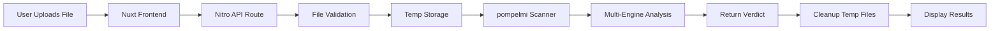

<div align="center">

# 🛡️ Nuxt/Nitro + pompelmi

### **Real-time Malware Scanning for Your Nuxt Applications**

[](https://nuxt.com)
[](https://www.typescriptlang.org/)
[](https://pompelmi.dev)
[](../../LICENSE)

*Protect your users with enterprise-grade malware detection in minutes, not days.*

[🚀 Quick Start](#-quick-start) • [📖 Documentation](#-how-it-works) • [💡 Examples](#-usage) • [🛠️ Configuration](#%EF%B8%8F-configuration)

---

</div>

## ✨ What's Inside

This example demonstrates a **production-ready** integration of pompelmi malware scanning into a Nuxt 3 application with Nitro server.

### 🎯 Key Features

<table>
<tr>
<td width="50%">

**🔒 Security First**
- Real-time malware detection
- Multi-engine threat analysis
- Verdict classification system
- Automatic file cleanup

</td>
<td width="50%">

**⚡ Performance Optimized**
- 25MB file size limit
- 30-second scan timeout
- Efficient temp file handling
- Memory-conscious design

</td>
</tr>
<tr>
<td width="50%">

**🎨 Developer Experience**
- TypeScript support
- Simple API endpoint
- Comprehensive error handling
- Easy to customize

</td>
<td width="50%">

**🚀 Production Ready**
- Automatic resource cleanup
- Detailed logging
- Error boundaries
- Rate limit ready

</td>
</tr>
</table>

## 📋 Prerequisites

Before you begin, ensure you have:

- **Node.js** `18.x` or higher (required for local scanning)
- **pnpm** (recommended) or npm/yarn
- Basic knowledge of Nuxt 3 and TypeScript

> **Note:** pompelmi requires a Node.js runtime environment. It cannot run on edge/serverless platforms without filesystem access.

## 🚀 Quick Start

Get up and running in under 60 seconds:

```bash
# 1️⃣ Install dependencies
pnpm install

# 2️⃣ Start development server
pnpm dev

# 3️⃣ Open your browser
# → http://localhost:3000
```

**That's it!** 🎉 Your malware scanning service is now running locally.

---

## 💡 Usage

### 🌐 Web Interface

<table>
<tr>
<td width="40"><b>1️⃣</b></td>
<td>Navigate to <code>http://localhost:3000</code></td>
</tr>
<tr>
<td width="40"><b>2️⃣</b></td>
<td>Click <b>"Choose a file..."</b> and select any file</td>
</tr>
<tr>
<td width="40"><b>3️⃣</b></td>
<td>Hit <b>"Scan File"</b> and watch the magic happen ✨</td>
</tr>
<tr>
<td width="40"><b>4️⃣</b></td>
<td>View instant results: <code>clean</code>, <code>suspicious</code>, or <code>malicious</code></td>
</tr>
</table>

### 🖥️ API Testing with cURL

Test the scanning API directly from your terminal:

#### 📤 Basic File Scan

```bash
curl -X POST http://localhost:3000/api/scan \
  -F "file=@./package.json"
```

<details>
<summary>📄 <b>Expected Response</b></summary>

```json
{
  "ok": true,
  "verdict": "clean",
  "scan": {
    "verdict": "clean",
    "duration": 42,
    "engines": {
      "heuristic": { "verdict": "clean" },
      "yara": { "verdict": "clean" }
    }
  }
}
```

</details>

#### 🧪 Advanced Test Cases

```bash
# ✅ Test with a clean file
curl -X POST http://localhost:3000/api/scan \
  -F "file=@./README.md"

# ⚠️ Test size limit (>25MB will be rejected)
curl -X POST http://localhost:3000/api/scan \
  -F "file=@/path/to/large/video.mp4"

# ❌ Test error handling (missing file)
curl -X POST http://localhost:3000/api/scan
```

---

## 📖 How It Works

### 🏗️ Architecture Overview



### 🎨 Frontend Component ([app.vue](./app.vue))

The Vue component provides an intuitive upload interface:

- 📎 **File Selection** - User-friendly file picker
- ⏳ **Loading States** - Visual feedback during scanning
- ✅ **Result Display** - Clear verdict presentation
- 🚨 **Error Handling** - Graceful error messages

### ⚙️ Backend API ([server/api/scan.post.ts](./server/api/scan.post.ts))

The Nitro API route orchestrates the scanning process:

1. 📥 **Parse** multipart form data
2. ✅ **Validate** file presence and size (< 25MB)
3. 📁 **Create** unique temporary directory
4. 💾 **Write** file buffer to temp location
5. 🔍 **Scan** with pompelmi engine
6. 📊 **Return** JSON verdict and details
7. 🧹 **Cleanup** temp files (guaranteed via `finally` block)

### 🎯 Verdict Classification

| Verdict | Emoji | Meaning | Action |
|---------|-------|---------|--------|
| **clean** | ✅ | No threats detected | Safe to process |
| **suspicious** | ⚠️ | Potential risk indicators | Review manually |
| **malicious** | 🚨 | Confirmed malware | Block immediately |

---

## ⚙️ Configuration

### 📏 File Size Limits

Adjust maximum upload size in [server/api/scan.post.ts](./server/api/scan.post.ts):

```typescript
const MAX_FILE_SIZE = 25 * 1024 * 1024 // 25 MB (default)
// Increase for larger files (be mindful of memory):
const MAX_FILE_SIZE = 100 * 1024 * 1024 // 100 MB
```

### ⏱️ Scan Timeouts

Configure API timeout in [nuxt.config.ts](./nuxt.config.ts):

```typescript
nitro: {
  routeRules: {
    '/api/scan': {
      timeout: 30000 // 30 seconds (default)
      // Increase for complex files:
      // timeout: 60000 // 60 seconds
    }
  }
}
```

### 🔧 Advanced Settings

<details>
<summary><b>Custom Temp Directory</b></summary>

```typescript
import { tmpdir } from 'os'
import { join } from 'path'

const customTempDir = join(tmpdir(), 'my-custom-scans')
```

</details>

<details>
<summary><b>Rate Limiting</b></summary>

```typescript
// Add to your Nitro config
rateLimit: {
  tokensPerInterval: 10,
  interval: 'minute'
}
```

</details>

---

## 💻 Runtime Requirements

### 🎯 Environment Needs

This example requires:

| Requirement | Why | Alternative |
|------------|-----|-------------|
| **Node.js Runtime** | Local file system access | Use cloud scanning API |
| **Write Access to `os.tmpdir()`** | Temporary file storage | Configure custom temp dir |
| **Sufficient Memory** | In-memory scanning | Adjust file size limits |

### ⚠️ Serverless/Edge Limitations

> **Important:** pompelmi's local scanning **does not work** on:
> - Vercel Edge Functions
> - Cloudflare Workers
> - AWS Lambda@Edge
>
> 💡 **Solution:** Use pompelmi's cloud API or deploy to Node.js-capable platforms (Vercel Node.js, AWS Lambda, Google Cloud Run)

---

## 🚀 Production Deployment

### ✅ Pre-Launch Checklist

Before going live, implement these critical safeguards:

- [ ] **🔒 Rate Limiting** - Prevent API abuse ([upstash/ratelimit](https://github.com/upstash/ratelimit))
- [ ] **🔐 Authentication** - Protect your endpoint (JWT, API keys)
- [ ] **📝 File Type Validation** - Whitelist/blacklist specific formats
- [ ] **📊 Error Monitoring** - Track issues ([Sentry](https://sentry.io))
- [ ] **📈 Logging** - Record verdicts and metrics (never log file contents!)
- [ ] **💾 Resource Monitoring** - Watch CPU/memory usage
- [ ] **⏰ Timeout Configuration** - Prevent hanging requests
- [ ] **🧹 Cleanup Testing** - Verify temp file removal

### 🎯 Performance Tips

```typescript
// Limit concurrent scans
const scanQueue = new PQueue({ concurrency: 3 })

// Add request timeout middleware
app.use('/api/scan', timeout('30s'))

// Monitor temp directory size
const cleanupSchedule = cron('0 */6 * * *', cleanTempDir)
```

---

## 🔧 Troubleshooting

<details>
<summary><b>❌ "No file uploaded" Error</b></summary>

**Problem:** The field name doesn't match expected value.

**Solution:** Ensure your form field is named `file`:

```bash
curl -X POST http://localhost:3000/api/scan \
  -F "file=@./myfile.txt"
#      ^^^^
#      Must be 'file'
```

</details>

<details>
<summary><b>⚠️ "File too large" Error</b></summary>

**Problem:** File exceeds 25MB default limit.

**Solutions:**
1. Use a smaller file
2. Increase `MAX_FILE_SIZE` in [server/api/scan.post.ts](./server/api/scan.post.ts)
3. Implement chunked uploads for large files

</details>

<details>
<summary><b>🔴 Port Already in Use</b></summary>

**Problem:** Default port 3000 is occupied.

**Solution:** Change the port:

```bash
PORT=3001 pnpm dev
```

</details>

<details>
<summary><b>📦 Module Not Found</b></summary>

**Problem:** Dependencies not installed.

**Solution:**

```bash
# Clean install
rm -rf node_modules pnpm-lock.yaml
pnpm install
```

</details>

<details>
<summary><b>🐌 Slow Scan Performance</b></summary>

**Possible Causes:**
- Large file size
- Complex file structure
- Limited system resources

**Solutions:**
- Reduce file size limits
- Increase timeout values
- Add progress indicators
- Implement scan queuing

</details>

---

## 📚 Learn More

### 📖 Documentation

| Resource | Description |
|----------|-------------|
| [📘 Integration Guide](../../docs/integrations/nuxt-nitro.md) | Complete Nuxt/Nitro setup guide |
| [🛡️ pompelmi Docs](https://pompelmi.dev) | Official pompelmi documentation |
| [💚 Nuxt 3 Docs](https://nuxt.com) | Nuxt framework documentation |
| [⚡ Nitro Docs](https://nitro.unjs.io) | Nitro server engine docs |

### 🎓 Related Examples

- [Express Middleware](../express/) - pompelmi with Express.js
- [Next.js Integration](../next-app-router/) - App Router example
- [Fastify Plugin](../../packages/fastify-plugin/) - High-performance setup

---

## 🤝 Contributing

Found a bug? Want to improve this example? Contributions are welcome!

1. 🍴 Fork the repository
2. 🌿 Create your feature branch (`git checkout -b feature/amazing-feature`)
3. 💬 Commit your changes (`git commit -m 'Add amazing feature'`)
4. 📤 Push to the branch (`git push origin feature/amazing-feature`)
5. 🎉 Open a Pull Request

---

## 📄 License

This example is licensed under the **MIT License** - see [LICENSE](../../LICENSE) for details.

---

<div align="center">

**Made with ❤️ by the pompelmi team**

[⭐ Star on GitHub](https://github.com/pompelmi/pompelmi) • [🐛 Report Bug](https://github.com/pompelmi/pompelmi/issues) • [💡 Request Feature](https://github.com/pompelmi/pompelmi/issues)

</div>
