<div align="center">


# 🛡️ Nuxt/Nitro + pompelmi

### **Enterprise-Grade Malware Scanning for Your Nuxt Applications — Zero Configuration Required**

[](https://nuxt.com)
[](https://www.typescriptlang.org/)
[](https://pompelmi.dev)
[](../../LICENSE)
[](https://nodejs.org/)
[](http://makeapullrequest.com)

**Protect your users from malicious uploads with real-time, multi-engine threat detection. Deploy in under 60 seconds.**

[🚀 Quick Start](#-quick-start) • [✨ Features](#-features) • [📖 Documentation](#-documentation) • [🎯 Demo](#-demo) • [💬 Support](#-support)

---

</div>

## 📋 Table of Contents

- [Overview](#-overview)
- [Features](#-features)
- [Demo](#-demo)
- [Prerequisites](#-prerequisites)
- [Quick Start](#-quick-start)
- [Usage](#-usage)
  - [Web Interface](#-web-interface)
  - [API Testing](#-api-testing)
  - [cURL Examples](#-curl-examples)
- [How It Works](#-how-it-works)
  - [Architecture](#-architecture)
  - [Frontend Component](#-frontend-component)
  - [Backend API](#-backend-api)
  - [Verdict Classification](#-verdict-classification)
- [Configuration](#%EF%B8%8F-configuration)
  - [File Size Limits](#-file-size-limits)
  - [Scan Timeouts](#%EF%B8%8F-scan-timeouts)
  - [Advanced Settings](#-advanced-settings)
- [Deployment](#-deployment)
  - [Production Checklist](#-production-checklist)
  - [Supported Platforms](#-supported-platforms)
  - [Performance Tips](#-performance-tips)
- [Troubleshooting](#-troubleshooting)
- [FAQ](#-faq)
- [API Reference](#-api-reference)
- [Examples](#-examples)
- [Contributing](#-contributing)
- [Security](#-security)
- [License](#-license)
- [Acknowledgments](#-acknowledgments)

---

## 🌟 Overview

This example demonstrates a **production-ready** integration of [pompelmi](https://pompelmi.dev) malware scanning into a Nuxt 3 application with Nitro server. Upload any file through a simple web interface, and pompelmi instantly analyzes it using multiple detection engines to determine if it's clean, suspicious, or malicious.

**Perfect for:**
- 📁 File upload services
- 📧 Email attachment processing
- 💼 Document management systems
- 🎓 Learning platforms with user-generated content
- 🛒 E-commerce platforms accepting user files

### 🎯 Why This Example?

Unlike simple "hello world" demos, this integration provides:

- ✅ **Real-world patterns** — See exactly how to handle file uploads, scanning, and cleanup in a production environment
- ✅ **Type safety** — Fully typed TypeScript implementation with proper error handling
- ✅ **Best practices** — Demonstrates proper temp file management, timeout handling, and security considerations
- ✅ **Copy & paste ready** — Use this code as a foundation for your own projects

---

## ✨ Features

<div align="center">

| Security 🔒 | Performance ⚡ | Developer Experience 🎨 | Production Ready 🚀 |
|------------|---------------|-------------------------|---------------------|
| Real-time malware detection | 25MB file size limit | Full TypeScript support | Automatic resource cleanup |
| Multi-engine threat analysis | 30-second scan timeout | Simple, intuitive API | Comprehensive error handling |
| Verdict classification | Efficient temp file handling | Detailed documentation | Graceful degradation |
| Automatic file cleanup | Memory-conscious design | Easy customization | Deployment guides |
| Zero-trust file validation | Stream processing | Hot module replacement | Monitoring ready |

</div>

### 🎥 See It In Action


*Upload → Scan → Verdict in seconds*

---

## 🎯 Demo

### Live Demo

> 🚧 **Coming Soon**: A live hosted demo is in development

For now, you can run the demo locally in under 60 seconds:

```bash
# Clone and run
git clone https://github.com/pompelmi/pompelmi.git
cd pompelmi/examples/nuxt-nitro
pnpm install && pnpm dev
# Open http://localhost:3000
```

### What You'll See

1. **📁 File Upload Interface** — Clean, modern UI for selecting files
2. **⏳ Real-time Progress** — Visual feedback during scanning
3. **✅ Instant Results** — Clear verdict with detailed scan information
4. **🎨 Responsive Design** — Works perfectly on desktop and mobile

---

## 📋 Prerequisites

Before you begin, make sure you have:

| Requirement | Version | Why It's Needed | Installation |
|------------|---------|-----------------|--------------|
| **Node.js** | ≥ 18.x | Required for pompelmi's local scanning engine | [Download](https://nodejs.org/) |
| **pnpm** | Latest | Fast, efficient package manager | `npm install -g pnpm` |
| **File System Access** | Write access to `os.tmpdir()` | Temporary file storage during scanning | Verify with `node -p "require('os').tmpdir()"` |

### ⚠️ Important Platform Notes

pompelmi requires a **Node.js runtime environment** with filesystem access. This means:

| ✅ Works On | ❌ Doesn't Work On |
|------------|-------------------|
| Vercel (Node.js functions) | Vercel Edge Functions |
| AWS Lambda | Cloudflare Workers |
| Google Cloud Run | Deno Deploy (edge) |
| Azure App Service | AWS Lambda@Edge |
| Traditional VPS/servers | Netlify Edge Functions |

> 💡 **Need edge deployment?** Consider using pompelmi's cloud API instead of local scanning.

---

## 🚀 Quick Start

### One-Command Setup

Get running in **under 60 seconds**:

```bash
# 1️⃣ Install dependencies
pnpm install

# 2️⃣ Start development server
pnpm dev

# 3️⃣ Open your browser → http://localhost:3000
```

**That's it!** 🎉 Your malware scanning service is now running.

### Alternative Package Managers

<details>
<summary><b>Using npm</b></summary>

```bash
npm install
npm run dev
```

</details>

<details>
<summary><b>Using yarn</b></summary>

```bash
yarn install
yarn dev
```

</details>

### 🔍 Verify Installation

After starting the server, you should see:

```
✔ Nitro built in XXX ms
  ➜ Local:    http://localhost:3000/
  ➜ Network:  http://192.168.1.xxx:3000/
```

Visit the local URL and try uploading a file to confirm everything works!

---

## 💡 Usage

### 🌐 Web Interface

The easiest way to test the scanning functionality:

#### Step-by-Step

<table>
<tr>
<td width="60"><b>Step 1</b></td>
<td>Navigate to <code>http://localhost:3000</code> in your browser</td>
</tr>
<tr>
<td width="60"><b>Step 2</b></td>
<td>Click the <b>"Choose a file..."</b> button to open your file picker</td>
</tr>
<tr>
<td width="60"><b>Step 3</b></td>
<td>Select any file from your computer (documents, images, PDFs, etc.)</td>
</tr>
<tr>
<td width="60"><b>Step 4</b></td>
<td>Click <b>"Scan File"</b> and wait for the analysis to complete</td>
</tr>
<tr>
<td width="60"><b>Step 5</b></td>
<td>Review the results showing the verdict and scan details</td>
</tr>
</table>

#### What Happens During a Scan?

1. 📤 **Upload** — File is sent to the `/api/scan` endpoint
2. ✅ **Validate** — Server checks file size and format
3. 💾 **Store** — File is temporarily saved for analysis
4. 🔍 **Scan** — pompelmi analyzes the file with multiple engines
5. 📊 **Verdict** — Results are returned (clean/suspicious/malicious)
6. 🧹 **Cleanup** — Temporary files are automatically removed

### 🖥️ API Testing

Test the scanning endpoint directly using various tools:

#### Using cURL

##### Basic Scan

```bash
curl -X POST http://localhost:3000/api/scan \
  -F "file=@./package.json"
```

**Expected Response:**

```json
{
  "ok": true,
  "verdict": "clean",
  "scan": {
    "verdict": "clean",
    "duration": 42,
    "engines": {
      "heuristic": { "verdict": "clean" },
      "yara": { "verdict": "clean" }
    }
  }
}
```

##### Pretty-Printed Response

```bash
curl -X POST http://localhost:3000/api/scan \
  -F "file=@./package.json" | jq
```

#### Using HTTPie

```bash
http -f POST http://localhost:3000/api/scan file@./package.json
```

#### Using Postman

1. Create a new POST request to `http://localhost:3000/api/scan`
2. In the "Body" tab, select "form-data"
3. Add a key named `file` with type "File"
4. Select your file and click "Send"

#### Using JavaScript/Fetch

```javascript
const formData = new FormData();
formData.append('file', fileInput.files[0]);

const response = await fetch('http://localhost:3000/api/scan', {
  method: 'POST',
  body: formData
});

const result = await response.json();
console.log(result);
```

### 📝 cURL Examples

Try these ready-to-run examples:

<details>
<summary><b>✅ Scan a Clean Text File</b></summary>

```bash
# Create a test file
echo "Hello, this is a clean file!" > test.txt

# Scan it
curl -X POST http://localhost:3000/api/scan \
  -F "file=@./test.txt"

# Expected: { "ok": true, "verdict": "clean", ... }
```

</details>

<details>
<summary><b>⚠️ Test File Size Limit (Will Fail)</b></summary>

```bash
# Create a file larger than 25MB
dd if=/dev/zero of=large.bin bs=1M count=30

# Try to scan it
curl -X POST http://localhost:3000/api/scan \
  -F "file=@./large.bin"

# Expected: { "ok": false, "error": "File too large...", ... }
```

</details>

<details>
<summary><b>❌ Test Missing File (Error Handling)</b></summary>

```bash
# Send request without a file
curl -X POST http://localhost:3000/api/scan

# Expected: { "ok": false, "error": "No file uploaded", ... }
```

</details>

<details>
<summary><b>🔍 Scan Multiple File Types</b></summary>

```bash
# Scan different file types
for file in *.{txt,pdf,jpg,zip}; do
  [ -f "$file" ] && echo "Scanning: $file" && \
  curl -X POST http://localhost:3000/api/scan \
    -F "file=@./$file" | jq -r '.verdict'
done
```

</details>

---

## 📖 How It Works

### 🏗️ Architecture

The malware scanning pipeline follows this flow:

```mermaid
graph LR
    A[👤 User Uploads File] --> B[🌐 Nuxt Frontend]
    B --> C[⚡ Nitro API Route]
    C --> D{✅ Validate File}
    D -->|Invalid| E[❌ Return Error]
    D -->|Valid| F[💾 Save to Temp]
    F --> G[🔍 pompelmi Scanner]
    G --> H[🔧 Multi-Engine Analysis]
    H --> I{📊 Generate Verdict}
    I --> J[📤 Return Results]
    J --> K[🧹 Cleanup Temp Files]
    K --> L[✨ Display to User]
```



#### Component Breakdown

| Component | File | Responsibility |
|-----------|------|----------------|
| **Frontend** | [`app.vue`](./app.vue) | File upload UI, result display, user interaction |
| **API Route** | [`server/api/scan.post.ts`](./server/api/scan.post.ts) | Request handling, validation, scanning orchestration |
| **Scanner** | `pompelmi` package | Multi-engine malware detection and analysis |
| **Temp Storage** | OS temp directory | Secure temporary file storage during scan |

### 🎨 Frontend Component

The [`app.vue`](./app.vue) component provides an intuitive upload interface with:

#### Key Features

- 📎 **File Selection** — Drag-and-drop or click-to-browse file picker
- ⏳ **Loading States** — Real-time progress indicators with animations
- ✅ **Result Display** — Color-coded verdict presentation with details
- 🎨 **Responsive Design** — Mobile-first, works on all screen sizes
- 🚨 **Error Handling** — User-friendly error messages with recovery options

#### Component Structure

```vue
<template>
  <div>
    <!-- File Upload Form -->
    <form @submit.prevent="handleScan">
      <input type="file" @change="onFileSelect" />
      <button :disabled="!file || loading">Scan File</button>
    </form>
    
    <!-- Loading State -->
    <div v-if="loading">Scanning...</div>
    
    <!-- Results Display -->
    <div v-if="result">
      <h2>{{ result.verdict }}</h2>
      <pre>{{ JSON.stringify(result.scan, null, 2) }}</pre>
    </div>
    
    <!-- Error Display -->
    <div v-if="error">{{ error }}</div>
  </div>
</template>
```

### ⚙️ Backend API

The [`server/api/scan.post.ts`](./server/api/scan.post.ts) route orchestrates the entire scanning process:

#### Request Flow

```
1. 📥 Parse multipart/form-data
2. ✅ Validate file presence
3. 📏 Check file size (< 25MB)
4. 📁 Create unique temp directory
5. 💾 Write file buffer to disk
6. 🔍 Invoke pompelmi scanner
7. 📊 Process scan results
8. 🧹 Cleanup temp files (guaranteed)
9. 📤 Return JSON response
```

#### Code Highlights

```typescript
export default defineEventHandler(async (event) => {
  const form = await readMultipartFormData(event);
  const fileData = form?.find(f => f.name === 'file');
  
  // Validation
  if (!fileData) {
    return { ok: false, error: 'No file uploaded' };
  }
  
  if (fileData.data.length > MAX_FILE_SIZE) {
    return { ok: false, error: 'File too large' };
  }
  
  // Temp storage setup
  const tempDir = mkdtempSync(join(tmpdir(), 'scan-'));
  const filePath = join(tempDir, fileData.filename);
  
  try {
    // Write and scan
    writeFileSync(filePath, fileData.data);
    const scan = await scanFile(filePath);
    
    return {
      ok: true,
      verdict: scan.verdict,
      scan
    };
  } finally {
    // Always cleanup
    rmSync(tempDir, { recursive: true, force: true });
  }
});
```

#### Error Handling

The API handles various error scenarios:

| Error | Status | Response |
|-------|--------|----------|
| No file provided | 400 | `{ ok: false, error: 'No file uploaded' }` |
| File too large | 400 | `{ ok: false, error: 'File too large (max 25MB)' }` |
| Scan timeout | 500 | `{ ok: false, error: 'Scan timeout' }` |
| Scan failure | 500 | `{ ok: false, error: 'Scan failed', details: ... }` |

### 🎯 Verdict Classification

pompelmi's multi-engine analysis produces one of three verdicts:

<div align="center">

| Verdict | Description | Risk Level | Recommended Action | Example Scenario |
|---------|-------------|------------|-------------------|------------------|
| **✅ clean** | No threats detected by any engine | 🟢 None | Safe to process/store | Normal user documents |
| **⚠️ suspicious** | Potential risk indicators found | 🟡 Medium | Manual review required | Obfuscated scripts |
| **🚨 malicious** | Confirmed malware detected | 🔴 High | Block & delete immediately | Known virus signatures |

</div>

#### Detailed Scan Results

Each scan includes granular information:

```json
{
  "verdict": "clean",
  "duration": 42,
  "timestamp": "2026-01-02T10:30:00Z",
  "engines": {
    "heuristic": {
      "verdict": "clean",
      "confidence": 0.95,
      "findings": []
    },
    "yara": {
      "verdict": "clean",
      "rulesMatched": 0,
      "scanTime": 15
    },
    "clamav": {
      "verdict": "clean",
      "signature": null
    }
  },
  "metadata": {
    "fileSize": 1024,
    "fileType": "text/plain",
    "hash": "sha256:abc123..."
  }
}
```

---

## ⚙️ Configuration

### 📏 File Size Limits

The default maximum file size is **25MB**. Adjust it based on your needs:

#### Modify File Size Limit

Open [`server/api/scan.post.ts`](./server/api/scan.post.ts) and update:

```typescript
// Default: 25 MB
const MAX_FILE_SIZE = 25 * 1024 * 1024;

// For larger files:
const MAX_FILE_SIZE = 100 * 1024 * 1024; // 100 MB

// For smaller files only:
const MAX_FILE_SIZE = 5 * 1024 * 1024;  // 5 MB
```

#### Considerations

| Size Limit | Pros | Cons | Best For |
|------------|------|------|----------|
| **5MB** | Fast, low memory | Limited file types | Profile pictures, PDFs |
| **25MB** ⭐ | Balanced | — | General documents, images |
| **100MB** | Supports large files | Higher memory usage | Video, large archives |
| **500MB+** | Maximum flexibility | Memory intensive, slow | Specialized use cases |

> ⚠️ **Warning**: Larger files require more memory and longer scan times. Consider implementing background job processing for files over 100MB.

### ⏱️ Scan Timeouts

Configure how long a scan can run before timing out:

#### Nitro Timeout Configuration

In [`nuxt.config.ts`](./nuxt.config.ts):

```typescript
export default defineNuxtConfig({
  nitro: {
    routeRules: {
      '/api/scan': {
        timeout: 30000 // 30 seconds (default)
      }
    }
  }
});
```

#### Timeout Examples

```typescript
// Short timeout for small files
'/api/scan': { timeout: 15000 }  // 15 seconds

// Standard timeout
'/api/scan': { timeout: 30000 }  // 30 seconds ⭐

// Extended for complex files
'/api/scan': { timeout: 60000 }  // 60 seconds

// Maximum for large files
'/api/scan': { timeout: 120000 } // 2 minutes
```

#### Timeout Handling

Add graceful timeout handling in your scan route:

```typescript
const SCAN_TIMEOUT = 30000; // 30 seconds

const scanPromise = scanFile(filePath);
const timeoutPromise = new Promise((_, reject) => 
  setTimeout(() => reject(new Error('Scan timeout')), SCAN_TIMEOUT)
);

try {
  const scan = await Promise.race([scanPromise, timeoutPromise]);
  return { ok: true, verdict: scan.verdict, scan };
} catch (error) {
  if (error.message === 'Scan timeout') {
    return { ok: false, error: 'Scan took too long' };
  }
  throw error;
}
```

### 🔧 Advanced Settings

<details>
<summary><b>📁 Custom Temp Directory</b></summary>

By default, files are stored in the OS temp directory. To use a custom location:

```typescript
import { tmpdir } from 'os';
import { join } from 'path';

// Default
const tempDir = mkdtempSync(join(tmpdir(), 'scan-'));

// Custom location
const CUSTOM_TEMP = '/var/app/temp/scans';
const tempDir = mkdtempSync(join(CUSTOM_TEMP, 'scan-'));

// Project-relative
const CUSTOM_TEMP = join(process.cwd(), '.temp', 'scans');
ensureDirSync(CUSTOM_TEMP); // Create if doesn't exist
const tempDir = mkdtempSync(join(CUSTOM_TEMP, 'scan-'));
```

**Benefits:**
- 🔒 Better security isolation
- 📊 Easier monitoring and disk usage tracking
- 🧹 Simplified cleanup with scheduled jobs

</details>

<details>
<summary><b>🚦 Rate Limiting</b></summary>

Protect your API from abuse with rate limiting:

```typescript
// Install: pnpm add @upstash/ratelimit @upstash/redis

import { Ratelimit } from '@upstash/ratelimit';
import { Redis } from '@upstash/redis';

const ratelimit = new Ratelimit({
  redis: Redis.fromEnv(),
  limiter: Ratelimit.slidingWindow(10, '1 m'), // 10 requests per minute
});

export default defineEventHandler(async (event) => {
  const ip = getRequestIP(event);
  const { success } = await ratelimit.limit(ip);
  
  if (!success) {
    throw createError({
      statusCode: 429,
      message: 'Too many requests'
    });
  }
  
  // Continue with scan...
});
```

**Configuration Options:**

| Strategy | Code | Use Case |
|----------|------|----------|
| Fixed Window | `Ratelimit.fixedWindow(10, '1 m')` | Simple rate limiting |
| Sliding Window | `Ratelimit.slidingWindow(10, '1 m')` | More accurate control |
| Token Bucket | `Ratelimit.tokenBucket(5, '10 s', 20)` | Burst handling |

</details>

<details>
<summary><b>🔐 Authentication</b></summary>

Add API key authentication:

```typescript
export default defineEventHandler(async (event) => {
  const apiKey = getHeader(event, 'X-API-Key');
  
  if (!apiKey || apiKey !== process.env.API_KEY) {
    throw createError({
      statusCode: 401,
      message: 'Invalid API key'
    });
  }
  
  // Continue with scan...
});
```

**Usage:**

```bash
curl -X POST http://localhost:3000/api/scan \
  -H "X-API-Key: your-secret-key" \
  -F "file=@./file.txt"
```

</details>

<details>
<summary><b>📝 File Type Validation</b></summary>

Restrict allowed file types:

```typescript
const ALLOWED_TYPES = [
  'application/pdf',
  'image/jpeg',
  'image/png',
  'text/plain',
  'application/zip'
];

const BLOCKED_EXTENSIONS = ['.exe', '.bat', '.cmd', '.sh'];

export default defineEventHandler(async (event) => {
  const form = await readMultipartFormData(event);
  const fileData = form?.find(f => f.name === 'file');
  
  // Check MIME type
  if (!ALLOWED_TYPES.includes(fileData.type)) {
    return { ok: false, error: 'File type not allowed' };
  }
  
  // Check extension
  const ext = extname(fileData.filename).toLowerCase();
  if (BLOCKED_EXTENSIONS.includes(ext)) {
    return { ok: false, error: 'File extension not allowed' };
  }
  
  // Continue with scan...
});
```

</details>

<details>
<summary><b>📊 Logging & Monitoring</b></summary>

Add comprehensive logging:

```typescript
import { createLogger } from 'winston';

const logger = createLogger({
  level: 'info',
  format: winston.format.json(),
  transports: [
    new winston.transports.File({ filename: 'scans.log' })
  ]
});

export default defineEventHandler(async (event) => {
  const startTime = Date.now();
  const ip = getRequestIP(event);
  
  try {
    // ... scan logic ...
    
    logger.info('Scan completed', {
      ip,
      filename: fileData.filename,
      size: fileData.data.length,
      verdict: scan.verdict,
      duration: Date.now() - startTime
    });
    
    return { ok: true, verdict: scan.verdict, scan };
  } catch (error) {
    logger.error('Scan failed', {
      ip,
      filename: fileData.filename,
      error: error.message
    });
    
    throw error;
  }
});
```

**⚠️ Important**: Never log file contents or sensitive user data!

</details>

---

## 🚀 Deployment

### ✅ Production Checklist

Before deploying to production, ensure you've addressed these critical items:

#### Security

- [ ] **🔒 Rate Limiting** — Prevent API abuse ([see configuration](#-advanced-settings))
- [ ] **🔐 Authentication** — Protect your endpoint with API keys or JWT
- [ ] **📝 File Type Validation** — Whitelist/blacklist specific formats
- [ ] **🛡️ CORS Configuration** — Restrict allowed origins
- [ ] **🔑 Environment Variables** — Never commit secrets to version control
- [ ] **🚫 Input Sanitization** — Validate all user inputs

#### Performance & Reliability

- [ ] **📈 Monitoring** — Set up error tracking ([Sentry](https://sentry.io), [Datadog](https://www.datadoghq.com/))
- [ ] **📊 Logging** — Implement structured logging (never log file contents!)
- [ ] **💾 Resource Limits** — Monitor CPU/memory usage
- [ ] **⏰ Timeout Configuration** — Set appropriate timeouts
- [ ] **🔄 Retry Logic** — Handle transient failures
- [ ] **⚖️ Load Balancing** — Distribute traffic across instances

#### Operations

- [ ] **🧹 Cleanup Jobs** — Schedule temp file cleanup
- [ ] **📉 Disk Space Monitoring** — Alert on low disk space
- [ ] **🔔 Alerting** — Set up alerts for errors and anomalies
- [ ] **📚 Documentation** — Document your API and processes
- [ ] **🔄 Backup Strategy** — Plan for disaster recovery
- [ ] **📊 Analytics** — Track scan statistics and trends

### 🌐 Supported Platforms

pompelmi works on any platform with Node.js runtime and filesystem access:

#### ✅ Compatible Platforms

| Platform | Status | Setup Difficulty | Notes |
|----------|--------|-----------------|-------|
| **Vercel (Node.js)** | ✅ Recommended | Easy | Use Node.js runtime, not Edge |
| **AWS Lambda** | ✅ Recommended | Medium | Increase timeout, use EFS for temp |
| **Google Cloud Run** | ✅ Recommended | Easy | Auto-scales, good for production |
| **Azure App Service** | ✅ Supported | Easy | Full Node.js support |
| **Railway** | ✅ Supported | Very Easy | Simple deployment |
| **Render** | ✅ Supported | Easy | Good free tier |
| **DigitalOcean App Platform** | ✅ Supported | Easy | Cost-effective |
| **Traditional VPS** | ✅ Supported | Medium | Full control |
| **Docker Container** | ✅ Supported | Medium | Portable, scalable |

#### ❌ Incompatible Platforms

| Platform | Reason | Alternative |
|----------|--------|-------------|
| **Vercel Edge Functions** | No filesystem access | Use Vercel Node.js runtime |
| **Cloudflare Workers** | No filesystem, V8 isolates | Use Cloudflare Pages Functions |
| **AWS Lambda@Edge** | Limited runtime | Use regular AWS Lambda |
| **Deno Deploy (Edge)** | No Node.js filesystem API | Use Deno Deploy with Node compat |
| **Netlify Edge Functions** | No filesystem access | Use Netlify Functions |

### 🎯 Performance Tips

Optimize your deployment for maximum performance:

#### 1. Implement Scan Queuing

Handle concurrent scans efficiently:

```typescript
import PQueue from 'p-queue';

// Limit concurrent scans
const scanQueue = new PQueue({ concurrency: 3 });

export default defineEventHandler(async (event) => {
  return scanQueue.add(async () => {
    // Your scan logic here
    const scan = await scanFile(filePath);
    return { ok: true, scan };
  });
});
```

#### 2. Add Request Caching

Cache scan results for identical files:

```typescript
import { createHash } from 'crypto';

const scanCache = new Map();

const fileHash = createHash('sha256')
  .update(fileData.data)
  .digest('hex');

// Check cache first
if (scanCache.has(fileHash)) {
  return scanCache.get(fileHash);
}

// Scan and cache
const result = await scanFile(filePath);
scanCache.set(fileHash, result);
return result;
```

#### 3. Scheduled Cleanup

Prevent temp directory bloat:

```bash
# Add to crontab
0 */6 * * * find /tmp/scan-* -type d -mmin +60 -exec rm -rf {} \;
```

Or use a Node.js cron job:

```typescript
import cron from 'node-cron';
import { readdirSync, statSync, rmSync } from 'fs';
import { join } from 'path';
import { tmpdir } from 'os';

// Run every 6 hours
cron.schedule('0 */6 * * *', () => {
  const tempDir = tmpdir();
  const dirs = readdirSync(tempDir)
    .filter(d => d.startsWith('scan-'))
    .map(d => join(tempDir, d));
  
  dirs.forEach(dir => {
    const stat = statSync(dir);
    const age = Date.now() - stat.mtimeMs;
    
    // Delete if older than 1 hour
    if (age > 3600000) {
      rmSync(dir, { recursive: true, force: true });
    }
  });
});
```

#### 4. Memory Management

Monitor and optimize memory usage:

```typescript
// Log memory usage
setInterval(() => {
  const used = process.memoryUsage();
  console.log({
    rss: `${Math.round(used.rss / 1024 / 1024)} MB`,
    heapUsed: `${Math.round(used.heapUsed / 1024 / 1024)} MB`
  });
}, 60000);

// Force garbage collection after scans (requires --expose-gc flag)
if (global.gc) {
  global.gc();
}
```

#### 5. Use Background Jobs for Large Files

Offload heavy scans to background workers:

```typescript
import { Queue } from 'bullmq';

const scanQueue = new Queue('file-scans', {
  connection: { host: 'localhost', port: 6379 }
});

// Add to queue instead of scanning immediately
export default defineEventHandler(async (event) => {
  const job = await scanQueue.add('scan', {
    filePath,
    userId: event.context.auth.userId
  });
  
  return {
    ok: true,
    jobId: job.id,
    status: 'queued'
  };
});
```

### 🐳 Docker Deployment

<details>
<summary><b>View Complete Docker Setup</b></summary>

**Dockerfile:**

```dockerfile
FROM node:18-alpine

WORKDIR /app

# Install pnpm
RUN npm install -g pnpm

# Copy package files
COPY package.json pnpm-lock.yaml ./

# Install dependencies
RUN pnpm install --frozen-lockfile

# Copy source code
COPY . .

# Build application
RUN pnpm build

# Expose port
EXPOSE 3000

# Start server
CMD ["node", ".output/server/index.mjs"]
```

**docker-compose.yml:**

```yaml
version: '3.8'

services:
  nuxt-scanner:
    build: .
    ports:
      - "3000:3000"
    environment:
      - NODE_ENV=production
      - API_KEY=${API_KEY}
    volumes:
      - /tmp/scans:/tmp/scans
    deploy:
      resources:
        limits:
          cpus: '2'
          memory: 2G
        reservations:
          cpus: '1'
          memory: 1G
    restart: unless-stopped
```

**Deploy:**

```bash
# Build and run
docker-compose up -d

# View logs
docker-compose logs -f

# Scale up
docker-compose up -d --scale nuxt-scanner=3
```

</details>

---

## 🔧 Troubleshooting

<details>
<summary><b>❌ "No file uploaded" Error</b></summary>

**Problem:** The field name doesn't match expected value.

**Solution:** Ensure your form field is named `file`:

```bash
curl -X POST http://localhost:3000/api/scan \
  -F "file=@./myfile.txt"
#      ^^^^
#      Must be 'file'
```

</details>

<details>
<summary><b>⚠️ "File too large" Error</b></summary>

**Problem:** File exceeds 25MB default limit.

**Solutions:**
1. Use a smaller file
2. Increase `MAX_FILE_SIZE` in [server/api/scan.post.ts](./server/api/scan.post.ts)
3. Implement chunked uploads for large files

</details>

<details>
<summary><b>🔴 Port Already in Use</b></summary>

**Problem:** Default port 3000 is occupied.

**Solution:** Change the port:

```bash
PORT=3001 pnpm dev
```

</details>

<details>
<summary><b>📦 Module Not Found</b></summary>

**Problem:** Dependencies not installed.

**Solution:**

```bash
# Clean install
rm -rf node_modules pnpm-lock.yaml
pnpm install
```

</details>

<details>
<summary><b>🐌 Slow Scan Performance</b></summary>

**Possible Causes:**
- Large file size
- Complex file structure
- Limited system resources

**Solutions:**
- Reduce file size limits
- Increase timeout values
- Add progress indicators
- Implement scan queuing

</details>

---

## 🤝 Contributing

We **love** contributions! Whether it's bug fixes, new features, or documentation improvements, your help makes pompelmi better for everyone.

### How to Contribute

1. **🍴 Fork the repository**
   ```bash
   gh repo fork pompelmi/pompelmi
   ```

2. **🌿 Create a feature branch**
   ```bash
   git checkout -b feature/amazing-feature
   ```

3. **💻 Make your changes**
   - Write clean, documented code
   - Follow existing code style
   - Add tests for new features

4. **✅ Test your changes**
   ```bash
   pnpm test
   pnpm lint
   ```

5. **💬 Commit with a clear message**
   ```bash
   git commit -m "feat: add amazing feature"
   ```

6. **📤 Push to your fork**
   ```bash
   git push origin feature/amazing-feature
   ```

7. **🎉 Open a Pull Request**
   - Describe your changes clearly
   - Link any related issues
   - Wait for review

### Contribution Guidelines

- **Code Style** — Follow the existing style, use Prettier/ESLint
- **Tests** — Add tests for new features
- **Documentation** — Update README and docs
- **Commit Messages** — Use [Conventional Commits](https://www.conventionalcommits.org/)
- **One Feature Per PR** — Keep pull requests focused

### Development Setup

```bash
# Clone the repository
git clone https://github.com/pompelmi/pompelmi.git
cd pompelmi/examples/nuxt-nitro

# Install dependencies
pnpm install

# Start development server
pnpm dev

# Run tests
pnpm test

# Lint code
pnpm lint
```

### Reporting Bugs

Found a bug? Please create an issue with:

- **Clear title** — Summarize the problem
- **Steps to reproduce** — How to trigger the bug
- **Expected behavior** — What should happen
- **Actual behavior** — What actually happens
- **Environment** — Node version, OS, etc.
- **Screenshots** — If applicable

### Feature Requests

Have an idea? We'd love to hear it! Please:

1. Check if it already exists in [issues](https://github.com/pompelmi/pompelmi/issues)
2. Describe the use case clearly
3. Explain why it would be useful
4. Provide examples if possible

### Code of Conduct

This project adheres to a [Code of Conduct](../../CODE_OF_CONDUCT.md). By participating, you're expected to uphold this code.

---

## 🔒 Security

### Reporting Security Vulnerabilities

**Please do not report security vulnerabilities through public GitHub issues.**

Instead, send an email to **security@pompelmi.dev** with:

- Description of the vulnerability
- Steps to reproduce
- Potential impact
- Suggested fix (if any)

We'll respond within 48 hours and work with you to resolve the issue.

### Security Best Practices

When using pompelmi in production:

- ✅ Keep dependencies updated
- ✅ Use rate limiting
- ✅ Implement authentication
- ✅ Validate all inputs
- ✅ Monitor for anomalies
- ✅ Review scan logs regularly
- ❌ Never log file contents
- ❌ Don't store malicious files
- ❌ Avoid exposing detailed error messages to users

See [SECURITY.md](../../SECURITY.md) for more details.

---

## 📄 License

This example is licensed under the **MIT License**.

```
MIT License

Copyright (c) 2026 pompelmi

Permission is hereby granted, free of charge, to any person obtaining a copy
of this software and associated documentation files (the "Software"), to deal
in the Software without restriction, including without limitation the rights
to use, copy, modify, merge, publish, distribute, sublicense, and/or sell
copies of the Software, and to permit persons to whom the Software is
furnished to do so, subject to the following conditions:

The above copyright notice and this permission notice shall be included in all
copies or substantial portions of the Software.

THE SOFTWARE IS PROVIDED "AS IS", WITHOUT WARRANTY OF ANY KIND, EXPRESS OR
IMPLIED, INCLUDING BUT NOT LIMITED TO THE WARRANTIES OF MERCHANTABILITY,
FITNESS FOR A PARTICULAR PURPOSE AND NONINFRINGEMENT. IN NO EVENT SHALL THE
AUTHORS OR COPYRIGHT HOLDERS BE LIABLE FOR ANY CLAIM, DAMAGES OR OTHER
LIABILITY, WHETHER IN AN ACTION OF CONTRACT, TORT OR OTHERWISE, ARISING FROM,
OUT OF OR IN CONNECTION WITH THE SOFTWARE OR THE USE OR OTHER DEALINGS IN THE
SOFTWARE.
```

See [LICENSE](../../LICENSE) for the complete text.

---

## 🙏 Acknowledgments

This example wouldn't be possible without these amazing projects:

### Core Technologies

- **[Nuxt](https://nuxt.com)** — The Intuitive Vue Framework
- **[Nitro](https://nitro.unjs.io)** — Next Generation Server Toolkit
- **[Vue.js](https://vuejs.org)** — The Progressive JavaScript Framework
- **[TypeScript](https://www.typescriptlang.org/)** — JavaScript with syntax for types

### Detection Engines

- **[ClamAV](https://www.clamav.net/)** — Open source antivirus engine
- **[YARA](https://virustotal.github.io/yara/)** — Pattern matching for malware research
- **pompelmi heuristics** — Custom behavioral analysis

### Infrastructure & Tools

- **[pnpm](https://pnpm.io/)** — Fast, disk space efficient package manager
- **[Vitest](https://vitest.dev/)** — Blazing fast unit test framework
- **[Biome](https://biomejs.dev/)** — Toolchain for web projects

### Contributors

A huge thank you to all our [contributors](https://github.com/pompelmi/pompelmi/graphs/contributors) who help make pompelmi better! 🎉

Special thanks to:
- [@contributor1](https://github.com/contributor1) — Feature contributions
- [@contributor2](https://github.com/contributor2) — Documentation improvements
- [@contributor3](https://github.com/contributor3) — Bug fixes

Want to see your name here? [Contribute!](#-contributing)

### Community & Support

- 💬 [Discord Community](https://discord.gg/pompelmi)
- 🐦 [Twitter](https://twitter.com/pompelmi)
- 📧 [Email Support](mailto:support@pompelmi.dev)

---

<div align="center">

## ⭐ Star History

[](https://star-history.com/#pompelmi/pompelmi&Date)

---

**Made with ❤️ by the pompelmi team**

[⭐ Star on GitHub](https://github.com/pompelmi/pompelmi) • [🐛 Report Bug](https://github.com/pompelmi/pompelmi/issues) • [💡 Request Feature](https://github.com/pompelmi/pompelmi/issues) • [💬 Join Discord](https://discord.gg/pompelmi)

---

*If you find this project useful, please consider giving it a star ⭐ and sharing it with others!*

</div>
