```mermaid
flowchart LR
  subgraph Repo
    core["pompelmi (core)"]
    express["@pompelmi/express-middleware"]
    koa["@pompelmi/koa-middleware"]
    next["@pompelmi/next-upload"]
    fastify(("fastify-plugin · pianificato"))
    nest(("nestjs · pianificato"))
    remix(("remix · pianificato"))
    hapi(("hapi-plugin · pianificato"))
    svelte(("sveltekit · pianificato"))
  end
  core --> express
  core --> koa
  core --> next
  core -.-> fastify
  core -.-> nest
  core -.-> remix
  core -.-> hapi
  core -.-> svelte
```

<!-- Language Selector -->
<div align="center">

**Traduzioni:** 
---
## 💬 Cosa Dicono gli Sviluppatori

> "pompelmi ha reso incredibilmente facile aggiungere la scansione malware alla nostra API Express. Il supporto TypeScript è fantastico!"
> — Sviluppatore che usa pompelmi in produzione

> "Finalmente, una soluzione di scansione file che non richiede l'invio dei dati dei nostri utenti a terze parti. Perfetto per la conformità GDPR."
> — Ingegnere della Sicurezza presso una startup healthcare

> "L'integrazione YARA è perfetta. Siamo passati dal prototipo alla produzione in meno di una settimana."
> — Ingegnere DevSecOps

_Vuoi condividere la tua esperienza? 
---

### 🏠 Opzione B: Libreria Locale (Richiede Dipendenze Native)

**Perfetta per:** Deployment on-premise, VM, server dedicati o quando hai bisogno di controllo e privacy completi.

**Requisiti:**
- Node.js 18+
- Opzionale: binari ClamAV (per scansione basata su firme)
- Opzionale: librerie YARA (per regole custom)

<table>
<tr>
<td><b>npm</b></td>
<td><code>npm install pompelmi</code></td>
</tr>
<tr>
<td><b>pnpm</b></td>
<td><code>pnpm add pompelmi</code></td>
</tr>
<tr>
<td><b>yarn</b></td>
<td><code>yarn add pompelmi</code></td>
</tr>
<tr>
<td><b>bun</b></td>
<td><code>bun add pompelmi</code></td>
</tr>
</table>

#### 📦 Adattatori Framework Opzionali

```bash
# Express
npm i @pompelmi/express-middleware

# Koa
npm i @pompelmi/koa-middleware

# Next.js
npm i @pompelmi/next-upload

# Fastify (alpha)
npm i @pompelmi/fastify-plugin
```

> **Nota:** La libreria core funziona autonomamente. Installa gli adattatori solo se usi framework specifici.

> Dipendenze dev opzionali usate negli esempi:
>
> ```bash
> npm i -D tsx express multer @koa/router @koa/multer koa next
> ```

---

## ⚡ Avvio Rapido

**A colpo d'occhio (policy + scanner)**

```ts
// Componi scanner integrati (no EICAR). Opzionalmente aggiungi i tuoi/YARA.
import { CommonHeuristicsScanner, createZipBombGuard, composeScanners } from 'pompelmi';

export const policy = {
  includeExtensions: ['zip','png','jpg','jpeg','pdf'],
  allowedMimeTypes: ['application/zip','image/png','image/jpeg','application/pdf','text/plain'],
  maxFileSizeBytes: 20 * 1024 * 1024,
  timeoutMs: 5000,
  concurrency: 4,
  failClosed: true,
  onScanEvent: (ev: unknown) => console.log('[scan]', ev)
};

export const scanner = composeScanners(
  [
    ['zipGuard', createZipBombGuard({ maxEntries: 512, maxTotalUncompressedBytes: 100 * 1024 * 1024, maxCompressionRatio: 12 })],
    ['heuristics', CommonHeuristicsScanner],
    // ['yara', YourYaraScanner],
  ],
  { parallel: false, stopOn: 'suspicious', timeoutMsPerScanner: 1500, tagSourceName: true }
);
```

### Utilizzo minimo in Node

```ts
import { scanFile } from 'pompelmi';

const res = await scanFile('path/to/file.zip'); // o qualsiasi file
console.log(res.verdict); // "clean" | "suspicious" | "malicious"
```

> Vedi `examples/scan-one-file.ts` per uno script eseguibile:
>
> ```bash
> pnpm tsx examples/scan-one-file.ts ./path/to/file
> ```

### Express

```ts
import express from 'express';
import multer from 'multer';
import { createUploadGuard } from '@pompelmi/express-middleware';
import { policy, scanner } from './security'; // lo snippet sopra

const app = express();
const upload = multer({ storage: multer.memoryStorage(), limits: { fileSize: policy.maxFileSizeBytes } });

app.post('/upload', upload.any(), createUploadGuard({ ...policy, scanner }), (req, res) => {
  res.json({ ok: true, scan: (req as any).pompelmi ?? null });
});

app.listen(3000, () => console.log('http://localhost:3000'));
```

### Koa

```ts
import Koa from 'koa';
import Router from '@koa/router';
import multer from '@koa/multer';
import { createKoaUploadGuard } from '@pompelmi/koa-middleware';
import { policy, scanner } from './security';

const app = new Koa();
const router = new Router();
const upload = multer({ storage: multer.memoryStorage(), limits: { fileSize: policy.maxFileSizeBytes } });

router.post('/upload', upload.any(), createKoaUploadGuard({ ...policy, scanner }), (ctx) => {
  ctx.body = { ok: true, scan: (ctx as any).pompelmi ?? null };
});

app.use(router.routes()).use(router.allowedMethods());
app.listen(3003, () => console.log('http://localhost:3003'));
```

### Next.js (App Router)

```ts
// app/api/upload/route.ts
import { createNextUploadHandler } from '@pompelmi/next-upload';
import { policy, scanner } from '@/lib/security';

export const runtime = 'nodejs';
export const dynamic = 'force-dynamic';

export const POST = createNextUploadHandler({ ...policy, scanner });
```

---

## 🤖 GitHub Action

Esegui **pompelmi** in CI per scansionare file del repository o artefatti costruiti.

**Utilizzo minimo**
```yaml
name: Security scan (pompelmi)
on: [push, pull_request]

jobs:
  scan:
    runs-on: ubuntu-latest
    steps:
      - uses: actions/checkout@v4

      - name: Scan repository with pompelmi
        uses: pompelmi/pompelmi/.github/actions/pompelmi-scan@v1
        with:
          path: .
          deep_zip: true
          fail_on_detect: true
```

**Scansiona un singolo artefatto**
```yaml
- uses: pompelmi/pompelmi/.github/actions/pompelmi-scan@v1
  with:
    artifact: build.zip
    deep_zip: true
    fail_on_detect: true
```

**Input**
| Input | Default | Descrizione |
| --- | --- | --- |
| `path` | `.` | Directory da scansionare. |
| `artifact` | `""` | Singolo file/archivio da scansionare. |
| `yara_rules` | `""` | Path glob alle regole YARA (es. `rules/*.yar`). |
| `deep_zip` | `true` | Abilita ispezione archivi nested profondi. |
| `max_depth` | `3` | Profondità massima archivi nested. |
| `fail_on_detect` | `true` | Fallisce il job se si verificano rilevamenti. |

> L'Action vive in questo repo in `.github/actions/pompelmi-scan`. Quando pubblicato sul Marketplace, i consumatori possono copiare gli snippet sopra così come sono.

---

## 🧩 Adattatori

Usa l'adattatore che corrisponde al tuo framework web. Tutti gli adattatori condividono le stesse opzioni di policy e contratto di scansione.

<p align="center">
  
  
  
  
  
  
  
  
</p>

| Framework | Package | Stato |
| --- | --- | --- |
| Express | `@pompelmi/express-middleware` | ✅ alpha |
| Koa | `@pompelmi/koa-middleware` | ✅ alpha |
| Next.js (App Router) | `@pompelmi/next-upload` | ✅ alpha |
| Fastify | `@pompelmi/fastify-plugin` | 🚧 alpha |
| NestJS | nestjs | 📋 pianificato |
| Remix | remix | 📋 pianificato |
| hapi | hapi plugin | 📋 pianificato |
| SvelteKit | sveltekit | 📋 pianificato |

---

## 🗺️ Diagrammi

### Flusso scansione upload

<details>
<summary>Sorgente Mermaid</summary>


</details>

### Sequenza (App ↔ pompelmi ↔ YARA)

<details>
<summary>Sorgente Mermaid</summary>


</details>

### Componenti (monorepo)

<details>
<summary>Sorgente Mermaid</summary>


</details>

---

## ⚙️ Configurazione

Tutti gli adattatori accettano un set comune di opzioni:

| Opzione | Tipo (TS) | Scopo |
| --- | --- | --- |
| `scanner` | `{ scan(bytes: Uint8Array): Promise<Match[]> }` | Il tuo motore di scansione. Restituisci `[]` quando pulito; non-vuoto per segnalare. |
| `includeExtensions` | `string[]` | Allow-list di estensioni file. Valutato case-insensitively. |
| `allowedMimeTypes` | `string[]` | Allow-list di tipi MIME dopo sniffing magic-byte. |
| `maxFileSizeBytes` | `number` | Limite dimensione per file. File sovradimensionati vengono rifiutati anticipatamente. |
| `timeoutMs` | `number` | Timeout scansione per file; protegge contro scanner bloccati. |
| `concurrency` | `number` | Quanti file scansionare in parallelo. |
| `failClosed` | `boolean` | Se `true`, errori/timeout bloccano l'upload. |
| `onScanEvent` | `(event: unknown) => void` | Hook telemetria opzionale per logging/metriche. |

**Ricette comuni**

Consenti solo immagini fino a 5 MB:

```ts
includeExtensions: ['png','jpg','jpeg','webp'],
allowedMimeTypes: ['image/png','image/jpeg','image/webp'],
maxFileSizeBytes: 5 * 1024 * 1024,
failClosed: true,
```

---

## ✅ Checklist produzione

- [ ] **Limita la dimensione del file** in modo aggressivo (`maxFileSizeBytes`).
- [ ] **Limita estensioni e MIME** a ciò di cui la tua app ha veramente bisogno.
- [ ] **Imposta `failClosed: true` in produzione** per bloccare su timeout/errori.
- [ ] **Gestisci attentamente i ZIP** (abilita ZIP profondo, mantieni basso il nesting, limita dimensioni entry).
- [ ] **Componi gli scanner** con `composeScanners()` e abilita `stopOn` per fallire velocemente su rilevamenti precoci.
- [ ] **Registra gli eventi di scansione** (`onScanEvent`) e monitora i picchi.
- [ ] **Esegui le scansioni in un processo/container separato** per difesa in profondità quando possibile.
- [ ] **Sanifica nomi e percorsi file** se persisti i caricamenti.
- [ ] **Preferisci memory storage + post-elaborazione**; evita di scrivere byte non attendibili prima che la policy passi.
- [ ] **Aggiungi scansione CI** con la GitHub Action per catturare file dannosi in repo/artefatti.

---

## 🧬 YARA Getting Started

YARA ti consente di rilevare contenuti sospetti o dannosi utilizzando regole di pattern-matching.  
**pompelmi** tratta i match YARA come segnali che puoi mappare ai tuoi verdetti  
(es. segna regole ad alta confidenza come `malicious`, euristica come `suspicious`).

> **Stato:** Opzionale. Puoi eseguire senza YARA. Se lo adotti, mantieni le tue regole piccole, limitate nel tempo e sintonizzate sul tuo modello di minaccia.

### Regole starter

Di seguito tre regole di esempio che puoi adattare:

`rules/starter/eicar.yar`
```yar
rule EICAR_Test_File
{
    meta:
        description = "EICAR antivirus test string (safe)"
        reference   = "https://www.eicar.org"
        confidence  = "high"
        verdict     = "malicious"
    strings:
        $eicar = "X5O!P%@AP[4\\PZX54(P^)7CC)7}$EICAR-STANDARD-ANTIVIRUS-TEST-FILE!$H+H*"
    condition:
        $eicar
}
```

`rules/starter/pdf_js.yar`
```yar
rule PDF_JavaScript_Embedded
{
    meta:
        description = "PDF contains embedded JavaScript (heuristic)"
        confidence  = "medium"
        verdict     = "suspicious"
    strings:
        $magic = { 25 50 44 46 } // "%PDF"
        $js1 = "/JavaScript" ascii
        $js2 = "/JS" ascii
        $open = "/OpenAction" ascii
        $aa = "/AA" ascii
    condition:
        uint32(0) == 0x25504446 and ( $js1 or $js2 ) and ( $open or $aa )
}
```

`rules/starter/office_macros.yar`
```yar
rule Office_Macro_Suspicious_Words
{
    meta:
        description = "Heuristic: suspicious VBA macro keywords"
        confidence  = "medium"
        verdict     = "suspicious"
    strings:
        $s1 = /Auto(Open|Close)/ nocase
        $s2 = "Document_Open" nocase ascii
        $s3 = "CreateObject(" nocase ascii
        $s4 = "WScript.Shell" nocase ascii
        $s5 = "Shell(" nocase ascii
        $s6 = "Sub Workbook_Open()" nocase ascii
    condition:
        2 of ($s*)
}
```

> Questi sono **esempi**. Aspettati alcuni falsi positivi; sintonizza sulla tua app.

### Integrazione minima (contratto adattatore)

Se usi un binding YARA (es. `@automattic/yara`), avvolgilo dietro il contratto `scanner`:

```ts
// Esempio adattatore scanner YARA (pseudo-codice)
import * as Y from '@automattic/yara';

// Compila le tue regole dal disco all'avvio (consigliato)
// const sources = await fs.readFile('rules/starter/*.yar', 'utf8');
// const compiled = await Y.compile(sources);

export const YourYaraScanner = {
  async scan(bytes: Uint8Array) {
    // const matches = await compiled.scan(bytes, { timeout: 1500 });
    const matches = []; // collega qui il tuo motore
    // Mappa sulla struttura che la tua app si aspetta; restituisci [] quando pulito.
    return matches.map((m: any) => ({
      rule: m.rule,
      meta: m.meta ?? {},
      tags: m.tags ?? [],
    }));
  }
};
```

Quindi includilo nel tuo scanner composto:

```ts
import { composeScanners, CommonHeuristicsScanner } from 'pompelmi';
// import { YourYaraScanner } from './yara-scanner';

export const scanner = composeScanners(
  [
    ['heuristics', CommonHeuristicsScanner],
    // ['yara', YourYaraScanner],
  ],
  { parallel: false, stopOn: 'suspicious', timeoutMsPerScanner: 1500, tagSourceName: true }
);
```

### Suggerimento policy (mappatura match → verdict)

- **malicious**: regole ad alta confidenza (es. `EICAR_Test_File`)
- **suspicious**: regole euristiche (es. JavaScript PDF, parole chiave macro)
- **clean**: nessun match

Combina YARA con sniffing MIME, limiti di sicurezza ZIP e limiti rigorosi di dimensione/tempo.

## 🧪 Test rapido (no EICAR)

Usa gli esempi sopra, quindi invia un **PDF minimale** che contiene token rischiosi (questo attiva l'euristica integrata).

**1) Crea un PDF minimo con azioni rischiose**

Linux:
```bash
printf '%%PDF-1.7\n1 0 obj\n<< /OpenAction 1 0 R /AA << /JavaScript (alert(1)) >> >>\nendobj\n%%EOF\n' > risky.pdf
```

macOS:
```bash
printf '%%PDF-1.7\n1 0 obj\n<< /OpenAction 1 0 R /AA << /JavaScript (alert(1)) >> >>\nendobj\n%%EOF\n' > risky.pdf
```

**2) Invialo al tuo endpoint**

Express (default dall'Avvio Rapido):
```bash
curl -F "file=@risky.pdf;type=application/pdf" http://localhost:3000/upload -i
```

Dovresti vedere un HTTP **422 Unprocessable Entity** (bloccato dalla policy). I file puliti restituiscono **200 OK**. I fallimenti del pre-filtro (size/ext/MIME) dovrebbero restituire un **4xx**. Adatta queste convenzioni alla tua app secondo necessità.

---

## 🔒 Note di Sicurezza

- La libreria **legge** i byte; non esegue mai file.
- I rilevamenti YARA dipendono dalle **regole che fornisci**; aspettati alcuni falsi positivi/negativi.
- La scansione ZIP applica limiti (entry, dimensione per-entry, totale non compresso, nesting) per ridurre il rischio archive-bomb.
- Preferisci eseguire le scansioni in un **processo/container dedicato** per difesa in profondità.

---

## Rilasci e sicurezza

- **Changelog / rilasci:** vedi [GitHub Releases](https://github.com/pompelmi/pompelmi/releases).
- **Divulgazioni di sicurezza:** usa [GitHub Security Advisories](https://github.com/pompelmi/pompelmi/security/advisories). Coordineremo una correzione prima della divulgazione pubblica.
- **Utenti produzione:** apri una [Discussione](https://github.com/pompelmi/pompelmi/discussions) per condividere requisiti o richiedere adattatori.

## ⭐ Storico stelle

[](https://star-history.com/#pompelmi/pompelmi&Date)

---

## 🏆 Community e Riconoscimenti

pompelmi è stato presentato nelle principali pubblicazioni per sviluppatori ed è affidabile da team in tutto il mondo per la gestione sicura dei caricamenti di file.

<p align="center">
  
  
  
</p>

### 🤝 Unisciti alla Community

- 💬 [GitHub Discussions](https://github.com/pompelmi/pompelmi/discussions) — Fai domande, condividi idee
- 🐛 [Issue Tracker](https://github.com/pompelmi/pompelmi/issues) — Segnala bug, richiedi funzionalità
- 📖 [Documentazione](https://pompelmi.github.io/pompelmi/) — Guide complete e riferimento API
- 🔒 [Sicurezza](https://github.com/pompelmi/pompelmi/security) — Segnala vulnerabilità di sicurezza privatamente

---

## 💬 FAQ

**Ho bisogno di YARA?**  
No. `scanner` è collegabile. Gli esempi usano uno scanner minimale per chiarezza; puoi chiamare un motore YARA o qualsiasi altro rilevatore preferisci.

**Dove sono i risultati?**  
Negli esempi, il guard allega i dati di scansione al contesto della richiesta (es. `req.pompelmi` in Express, `ctx.pompelmi` in Koa). In Next.js, includi i risultati nella tua risposta JSON come preferisci.

**Perché 422 per i file bloccati?**  
Usare **422** per segnalare una violazione della policy lo mantiene distinto dagli errori di trasporto; è un pattern comune. Usa i codici che meglio corrispondono alle linee guida della tua API.

**Le ZIP bomb sono gestite?**  
Gli archivi vengono attraversati con limiti per ridurre il rischio archive-bomb. Mantieni i tuoi limiti di dimensione conservativi e preferisci `failClosed: true` in produzione.

---

## 🧪 Test e Copertura

Esegui i test localmente con copertura:

```bash
pnpm vitest run --coverage --passWithNoTests
```

Il badge traccia la **libreria core** (`src/**`). Gli adattatori e i motori sono riportati separatamente per ora e verranno incorporati nella copertura globale man mano che le loro suite crescono.

Se integri Codecov in CI, carica `coverage/lcov.info` e puoi usare questo badge Codecov:

```md
[](https://codecov.io/gh/pompelmi/pompelmi)
```

## 🤝 Contribuire

PR e issue benvenuti! Inizia con:

```bash
pnpm -r build
pnpm -r lint
```

Vedi [CONTRIBUTING.md](./CONTRIBUTING.md) per linee guida dettagliate.

### 🎖️ Contributori

Grazie a tutti i fantastici contributori che hanno aiutato a rendere pompelmi migliore!

<!-- Aggiungi immagini contributori qui in futuro -->

---

## 🎓 Risorse di Apprendimento

### 📚 Documentazione

- [Documentazione Ufficiale](https://pompelmi.github.io/pompelmi/) — Riferimento API completo e guide
- [Esempi](./examples/) — Esempi di integrazione nel mondo reale
- [Guida alla Sicurezza](./SECURITY.md) — Best practice di sicurezza e policy di divulgazione

### 🎥 Tutorial e Articoli

- **Sicurezza Caricamento File in Node.js** — Guida best practice (in arrivo)
- **Integrare YARA con pompelmi** — Setup rilevamento avanzato (in arrivo)
- **Caricamenti File Zero-Trust** — Pattern architetturali (in arrivo)

### 🛠️ Strumenti e Integrazioni

- [GitHub Action](https://github.com/pompelmi/pompelmi/tree/main/.github/actions/pompelmi-scan) — Scansione CI/CD
- [Immagini Docker](https://hub.docker.com/r/pompelmi/pompelmi) — Scansione containerizzata (in arrivo)
- [Cloud Functions](https://github.com/pompelmi/cloud-functions) — Esempi serverless (in arrivo)

---

## 📊 Statistiche Progetto

<p align="center">
  
</p>

---

## 🙏 Ringraziamenti

pompelmi si basa sulle spalle di giganti. Ringraziamenti speciali a:

- Il progetto YARA per il potente pattern matching
- La community Node.js per l'eccellente tooling
- Tutti i nostri contributori e utenti

---

## 📞 Supporto

Hai bisogno di aiuto? Siamo qui per te!

- 📖 [Documentazione](https://pompelmi.github.io/pompelmi/)
- 💬 [GitHub Discussions](https://github.com/pompelmi/pompelmi/discussions)
- 🐛 [Issue Tracker](https://github.com/pompelmi/pompelmi/issues)
- 🔒 [Sicurezza](https://github.com/pompelmi/pompelmi/security) (per vulnerabilità)

Per supporto commerciale e consulenza, contatta i maintainer.

---

<p align="right"><a href="#pompelmi">↑ Torna su</a></p>

## 📜 Licenza

[MIT](./LICENSE) © 2025‑present contributori pompelmi
